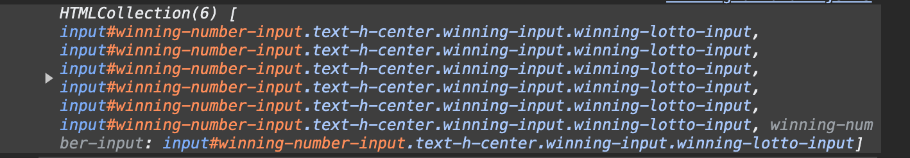
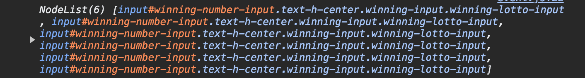
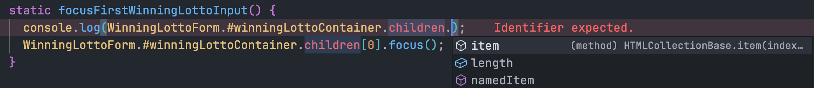

## 서론

로또 step2 미션을 진행하면서, 여러개의 DOM을 한번에 참조해야 하는 상황이 생겼다.

1. 당첨 번호를 입력할 때, 제일 처음에 입력 할 당첨 번호 input에 focus를 해줘야 하는 상황

```js
static focusFirstWinningLottoInput() {
  WinningLottoForm.#winningLottoContainer.children[0].focus();
}
```

2. 사용자가 입력한 당첨 번호를 확인해야 하는 상황

```js
const getWinningLottoNumbers = () => {
  const winningLottoInputs = document.querySelectorAll(
    ELEMENT_SELECTOR.winningLottoInput
  )
  //...
}
```

`children`과 `querySelectorAll`를 사용하면서 이 두개의 반환값은 뭘까? 궁금했었고 children은 `HTMLCollection`이며, querySelectorAll은 `NodeList`임을 확인할 수 있었다.

- HTMLCollection



- NodeList



이 두개의 차이점에 대해서 예전에 자바스크립트 딥다이브를 읽으면서 공부했던 적이 있었지만, 잘 기억이 나지 않아 이번 기회에 다시 학습해보고자 한다.

## HTMLCollection

HTMLCollection은 문서(HMTL) 내부에서 선택한 요소만을 정렬된 순서대로 모아둔 집합 나타내며 위 예시 처럼 여러 DOM에 접근해야할 때 사용할 수 있다.



유사 배열 객체이기 때문에,

- length 프로퍼티를 가진다
- 인덱스를 통해서 접근할 수 있다.
- 이터러블 하기 때문에 for...of 로 순회할 수 있다.

하지만 배열은 아니기 때문에 map, reduce, filter와 같이 배열 프로토타입 메서드는 사용할 수 없다. HTMLCollection의 가장 큰 특징은 **살아 있다(live-collection)는 것이다.**

### 살아있는 HTMLCollection

HTMLCollection를 반환하는 메서드는

- `getElementsByTagName`
- `getElementsByClassName`
- `children` 프로퍼티

3가지가 있다.

HTMLCollection이 살아있는 객체라는 것의 의미는 **DOM의 변경사항을 실시간(live)로 반영**한다는 것이다. 아래의 예시를 통해 “살아있다”는 것의 의미를 이해해보자.

```html
<style>
  .blue {
    color: blue;
  }

  .red {
    color: red;
  }
</style>
<body>
  <div id="app">
    <h1 class="blue">Harry</h1>
    <h1 class="blue">Hyun</h1>
    <h1 class="blue">Hyunwoong</h1>
  </div>
  <script type="module" src="./src/study/index.js"></script>
</body>
```


클래스 이름이 blue 이며, 텍스트의 색이 파란색임을 확인할 수 있다. `for...of` 로 HTMLCollection을 순회하면서 텍스트의 색을 빨간색으로 변경해보자.

```js
const names = document.getElementsByTagName("h1")
const names = document.getElementsByClassName("blue")
const names = document.getElementById("app").children

for (let i = 0; i < names.length; i++) {
  names[i].className = "red"
}
```

`getElementsByClassName` 메서드를 호출함으로써, 문서(HTML)내에 선택한 요소(blue)들을 정렬된 순서로 모아둔 집합을 얻을 수 있고 순회하며 클래스 이름을 red로 변경했기 때문에 모든 텍스트의 색이 빨간색으로 변경될 것이라 예상된다. 하지만,


예상과는 다르게 2번 째 텍스트는 색이 그대로 파란색임을 확인할 수 있는데, 클래스 이름이 변경된 사항을 실시간으로 반영해서 names의 구성이 달라지기 때문에 발생한 현상이다.

- `i = 0`

첫 번째 요소(Harry)의 클래스 이름이 red로 변경된다.
더이상 클래스 이름이 blue가 아니기 때문에 names에서 제거된다.
첫 번째 반복문이 종료되면 names의 구성은 [Hyun, Hyunwoong]가 된다.

- `i = 1`

[Hyun, Hyunwoong]으로 구성된 집합에서 인덱스가 1인 요소는 Hyunwoong이기 때문에 해당 요소의 클래스 이름이 red로 변경된다.
더이상 클래스 이름이 blue가 아니기 때문에 names에서 제거된다.
두 번째 반복문이 종료되면 names의 구성은 [Hyun]가 된다.

- `i = 2`

[Hyun] 집합의 길이는 1이고 인덱스가 2인 요소가 존재하지 않기 때문에 클래스 이름이 변경되는 동작이 발생하지 않는다.
위와 같은 내용으로 반복문을 순회하면서 DOM의 변경사항을 실시간으로 반영한다는 특징이 있다

## NodeList

NodeList는 문서(HMTL) 내부에서 선택한 요소와 텍스트, 주석, 속성등 모든 노드를 정렬된 순서대로 모아둔 집합 나타낸다.

HTMLCollection과 대비되는 특징으로는

- 경우에 따라 live-collection이 될 수도 non-live-collection이 될 수도 있다.
- forEach를 사용할 수 있다. 이 때, forEach는 배열 프로토타입 메서드가 아닌 NodeList가 독자적으로 가지는 메서드이다.

### 1. 살아있는 NodeList

살아있는 NodeList를 반환하는 것은 `Node.childNodes`가 있다.

```html
<body>
  <div id="app">
    <h1>🎱 행운의 로또</h1>
    <!-- 주석 -->
    <h1>💌 행운의 편지</h1>
    <h1>🍀 행운의 네잎클로버</h1>
  </div>
  <script type="module" src="./src/study/index.js"></script>
</body>
```

```js
const luckyText = document.getElementById("app").childNodes
console.log(luckyText)
```


`Node.childNodes` 프로퍼티가 반환하는 살아있는 NodeList는 위 사진에서도 확인할 수 있듯이 선택한 HTML 요소 뿐만 아니라 **텍스트(\n)와 주석 등 모든 노드를 정렬된 순서대로 모은 집합**이다. HTMLCollection 처럼 DOM의 변경사항을 실시간으로 반영한다.

```js
const app = document.getElementById("app")

const luckyText = app.childNodes

console.log(luckyText.length) // 9

const H1 = document.createElement("h1")
H1.innerHTML = "🚀 행운의 로켓"
app.appendChild(H1)

console.log(luckyText.length) // 10
```

위 예시에서도 확인할 수 있듯이, `🚀 행운의 로켓` 을 추가하면 해당 변경사항이 바로 DOM에 반영이 되기 때문에 luckyText의 길이가 9에서 10으로 증가한 것을 바로 확인할 수 있다.

### 2. 살아있지 않은 NodeList

살아있는 NodeList를 반환하는 메서드는 `querySelectorAll`가 있다.

```html
<body>
  <div id="app">
    <h1 class="blue">🎱 행운의 로또</h1>
    <!-- 주석 -->
    <h1 class="blue">💌 행운의 편지</h1>
    <h1 class="blue">🍀 행운의 네잎클로버</h1>
  </div>
  <script type="module" src="./src/study/index.js"></script>
</body>
```

```js
const blueTitleList = document.querySelectorAll(".blue")
console.log(blueTitleList)
```


`querySelectorAll` 메서드가 반환하는 살아있지 않은 NodeList는 childNodes 프로퍼티를 통해 참조할 수 있는 NodeList와 다르게 **텍스트, 주석, 속성들을 포함하지 않고 선택한 HTML 요소만을 가지는 집합**임을 확인할 수 있다.

```js
blueTitleList.forEach(node => {
  node.className = "red"
})
```

forEach 메서드를 활용해서 모든 요소의 클래스 이름을 red로 변경하면 **변경사항이 바로 DOM에 반영되지 않기 때문에, 모든 요소의 텍스트 색을 빨간색으로 변경할 수 있다.**


```js
const blueTitleList = document.querySelectorAll(".blue")

console.log(blueTitleList.length) // 3

const H1 = document.createElement("h1")
H1.innerHTML = "🚀 행운의 로켓"
H1.className = "blue"
app.appendChild(H1)

console.log(blueTitleList.length) // 3
```

또, 새로운 노드를 추가하는 변경사항도 DOM에 바로 반영되지 않기 때문에 새로운 노드를 추가해도 길이는 유지된다.

## 결과를 예측할 수 없는 상황 예방하기

HTMLCollection 예시에서 3개의 텍스트의 색이 모두 빨간색으로 변경될 것으로 예상 됐지만, 실시간으로 변경을 감지하는 특징으로 인해 예상과는 다른 결과가 나타났다. NodeList도 경우에 따라서 실시간으로 변경을 감지하므로 결과를 예측할 수 없는 상황이 충분히 발생할 수 있다. 이런 상황을 예방하기 위해서, 여러개의 DOM을 더 편하게 다루기 위해서 배열로 치환한 후 사용할 수 있다. 배열로 치환하면 항상 정적임을 보장할 수 있다.

```js
const names = document.getElementsByClassName("blue")

;[...names].forEach(name => {
  name.className = "red"
})

Array.from(names).forEach(name => {
  name.className = "red"
})
```

스프레드나 `Array.from` 을 사용해서 배열로 치환한 후 클래스 이름을 red로 변경하면 모든 텍스트의 색이 빨간색으로 잘 변경이 되는 것을 확인할 수 있다.

```js
const getWinningLottoNumbers = () => {
  const winningLottoInputs = document.querySelectorAll(
    ELEMENT_SELECTOR.winningLottoInput
  )

  return [...winningLottoInputs].map(winningNumber => {
    return winningNumber.value
  })
}
```

나 역시 이번 미션을 진행할 때, 입력한 당첨 번호를 가져오는 함수를 구현할 때 선언적으로 작성하고싶어 map 메서드를 활용하기 위해서 배열로 치환했었다. 😊
