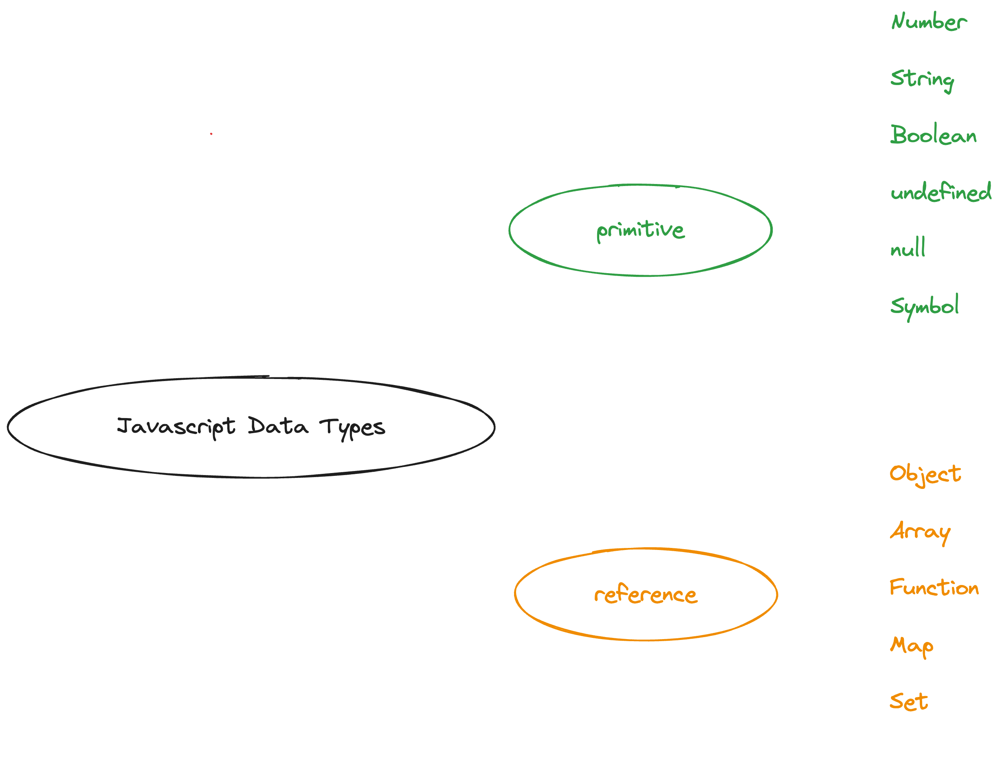

## 💭 변수

프로그래밍 언어는 기억하고 싶은 값을 메모리에 저장하고, 저장된 값을 읽어 들여 재사용하기 위해서 변수라는 매커니즘을 제공한다.  
변수는, 하나의 값을 저장하고 재사용하기 위해서 확보한 메모리 공간에 붙인 상징적인 이름을 말한다.

### 변수가 필요한 이유

변수를 왜 사용해야 할까? 변수를 사용해야 하는 이유에 대해서 공감해보기 위해 변수 없이 프로그래밍하는 상황을 생각해보자.

```text
10 + 20
```


10 + 20 연산이 성공적으로 잘 수행되었고, 연산 결과도 메모리에 잘 저장되었지만 한 가지 문제가 있다. 30 이라는 값이 어디에 저장되어 있는지를 모르기 때문에 30을 재사용할 수 없다는 것이다.

`0x12f` 메모리 주소에 직접 접근하면, 30을 재사용할 수 있겠지만

- 운영체제가 사용중인 영역에 접근해서 값을 변경할 경우, 전체 시스템에 치명적인 오류를 발생시킬 확률이 매우 높아진다.
- 메모리 주소는 코드가 실행될 때마다 메모리 상황에 따라 임의로 결정된다. 코드가 실행되기 이전에는 값이 저장된 메모리 주소를 알 수 없으며, 알려주지도 않는다.

위와 같은 이유들로 인해서, 자바스크립트는 개발자가 직접 메모리 주소에 접근할 수 있는 것을 허용하기 보다는 “변수”라는 매커니즘을 제공한다. 상징적인 이름인 변수는 자바스크립트의 인터프리터에 의해 값이 저장된 메모리 주소로 치환되어 실행된다.

### 변수 사용하기

```js
const result = 10 + 20
```


위 자바스크립트 코드에서, result 는 30을 저장하기 위해서 확보한 메모리 공간을 식별하는 역할을 한다.  
result 처럼 메모리 공간에 저장된 값을 식별할 수 있는 고유한 이름을 변수 이름(식별자)라고 하며, 변수에 저장된 값을 변수 값이라고 한다.

### 식별자

변수 이름은 식별자라고도 한다. 식별자는 어떤 값을 구별해서 식별할 수 있는 고유한 이름을 말한다. 값(위 예시에서는 30)은 메모리 공간 상에 저장되어 있고, 식별자는 메모리 공간에 저장되어 있는 여러 값들 중 한 값을 구별해서 식별해낼 수 있어야 한다. 이를 위해서 식별자는 어떤 값이 저장되어 있는 메모리 주소를 기억한다.

위 예시에서 result 는 값 30이 저장되어 있는 메모리 주소인 0x12f를 기억한다. 식별자는 값(30) 자체가 아니라, 값이 메모리 공간 상에 저장되어 있는 주소와 매핑 관계를 가지며, 이 매핑 관계 정보 또한 메모리 공간 어딘가에 저장된다.


### 값의 할당

```js
var something // 변수 선언
something = 30 // 값의 할당
```

```js
var something = 30 // 변수 선언 및 값의 할당
```

값을 저장하고 재사용하기 위해서 변수(식별자)를 사용할 때, 변수의 존재를 코드를 실행할 자바스크립트 엔진에 알려야 한다.  
이 때, 변수 선언을 통해서 알리게 되며 코드가 실행되는 런타임 이전에 먼저 실행된다.

반면, 값을 저장하는 할당은 코드가 순차적으로 실행되는 런타임에 실행된다. 변수 선언과 값의 할당을 구분해서 하든, 하나의 문으로 단축 표현해서 하든 선언은 런타임 이전, 값 할당은 런타임 이후에 실행된다.


위 그림에서도 확인할 수 있듯, 변수를 통해 메모리 공간에 값을 저장하고 식별자가 해당 메모리 공간의 주소를 기억하게 되는 과정을 변수 선언 → 값의 할당 두 가지 과정으로 나누어서 생각해볼 수 있다.

### 값의 재할당

```js
var something = 30 // 변수 선언 및 값의 할당

something = 80
```

var 키워드로 선언한 변수는 재할당할 수 있다. 재할당은 현재 변수에 저장된 값을 버리고, 새로운 값을 저장하는 것을 말한다.  
값을 재할당할 수 없다면, 변수가 아니라 상수라고 한다. 상수는 재할당이 불가능한 변수이다.


`something` 변수에 값 80을 재할당 하면, 메모리 공간에서는 위 그림과 같이 식별자가 가르키는 메모리 공간의 주소가 변경된다. 기존에 30이 저장되어 있던 메모리 공간을 비우고, 그 공간에 다시 80을 할당하는 것이 아니라, 변경된 값 80을 저장하기 위해서 새로운 메모리 공간을 확보하고 식별자가 그 공간의 주소를 가르키도록 한다. 이를 통해서 불변성이 유지될 수 있도록 한다. 자바스크립트의 데이터 타입과 함께 불변성에 대해서 알아보자.

## 💭 자바스크립트 데이터 타입



자바스크립트에서 모든 값은 데이터 타입을 가지며, 데이터 타입을 크게 원시 타입과 객체 타입으로 구분할 수 있다.

### 원시 값

자바스크립트의 데이터 타입 중 원시 타입의 값은 위 이미지에서도 확인할 수 있듯, Number, String, Boolean, undefined, null, Symbol이 있다.

원시 타입의 값, 즉 원시값의 가장 중요한 특징은 변경 불가능한 값이라는 것이다. 한번 생성된 원시값은 읽기 전용 값으로써 변경할 수 없다.

```js
var something = 10
something = 20

console.log(something) // 20
```

something 변수에 숫자 10을 할당했다. 이 후, 숫자 20을 할당하고 콘솔에 출력해보면 20이 출력되는 것을 확인할 수 있다. 숫자는 원시 타입의 값이며, 변경 불가능한 값이라고 했는데 변경이 된 것처럼 보인다. 무엇이 변경 불가능하다는 것일까?

`변경이 불가능한 값`이라는 개념을 이해하기 위해서, 우선 변수와 값을 구분해서 생각해야 한다. 변수는 값을 저장하기 위해서 확보한 메모리 공간을 말하거나 메모리 공간을 식별하기 위해서 붙인 상징적인 이름이다. 반면, 값은 변수에 저장된 데이터를 말한다.


“원시 값은 변경이 불가능하다”라는 말은, 변수 값을 변경할 수 없다는 것이 아니라 어떤 메모리 공간에 저장되어 있는 원시 값 자체를 변경할 수 없다는 것을 말한다. 변수는 위 예시처럼 재할당을 통해서 언제든 변수 값을 변경할 수 있다. 원시 값은 어떤 일이 있어도 변경이 불가능하기 때문에, 데이터의 신뢰성을 보장한다.


만약, 원시 값이 변경 가능 하다면 위 이미지와 같이 메모리 공간에 저장되어 있는 값이 변경될 것이다.

정리하자면, 원시 값은 변경이 불가능하기 때문에 값을 직접 변경할 수 없다. 변수 값 변경을 위해서 값을 재할당하면 새로운 원시 값을 저장하기 위한 메모리 공간을 추가로 확보하고 변수가 참조하던 메모리 공간의 주소를 변경한다. 이러한 특징을 불변성이라고 한다.

원시 값을 할당 받은 변수가 변수 값을 변경할 수 있는 유일한 방법은 재할당이다. 변수 값을 변경할 수 있는 방법을 단 한 가지로 둔 이유는, 변수 값의 변경을 추적하기 쉽도록하기 위해서이다.

### 값에 의한 전달

```js
var age = 26

var copiedAge = age

copiedAge = 20

console.log(copiedAge) // 20
console.log(age) // 26
```

`age` 변수에 원시 값인 26을 할당하고, `copiedAge` 에는 age 변수를 할당했다. 이 후, copiedAge를 20으로 변경하고 각 변수를 콘솔에 출력해서 확인해보면 age 변수는 copiedAge 변수 값 재할당에 영향을 받지 않고 기존 값인 26이 그대로 출력되는 것을 확인할 수 있다.

```js
var copiedAge = age
```

해당 줄에서 어떤 일이 발생하는지를 파악해보면, 왜 copiedAge 변수 값 재할당에 영향을 받지 않는지에 대해서 이해할 수 있다.  
우선 age 변수에 원시 값 26이 할당되었으므로, copiedAge 에도 동일하게 26이 할당될 것이다. 이 때, 새로운 값 26이 생성되어서 copiedAge 변수에 할당된다. 변수에 원시 값을 갖는 변수를 할당하면 원시 값이 복사되어 전달되는데, 이를 값에 의한 전달이라고 한다. 새로운 값 26이 생성되면, 이 값을 저장하기 위한 새로운 메모리 공간이 추가적으로 필요하게 되고 해당 공간의 주소는 기존 age 변수 값 26이 저장되어 있는 메모리 공간의 주소와는 별개의 독립된 주소이다.

엄격하게 말하면, 변수에는 값이 전달되는 것이 아니라 메모리 주소가 전달되며 변수와 같은 식별자는 값이 아니라 메모리 주소를 기억한다. copiedAge 변수(식별자)는 새로운 값 26이 생성되어 저장된 메모리 공간 상의 주소를 기억하게 된다.


따라서, copiedAge 변수 값을 20으로 재할당한다 하더라도 age 변수는 영향을 받지 않게되어 변수 값이 변경되지 않는다.

### 객체

자바스크립트에서 객체는

- 프로퍼티의 개수가 정해져 있지 않아, 계속해서 프로퍼티를 생성할 수 있다.
- 프로퍼티는 동적으로 추가, 삭제가 가능하다.
- 프로퍼티가 가지는 값에 제약이 존재하지 않는다. 원시값이 될 수도, 객체 타입의 값이 될 수도 있다.

위와 같은 특징을 가지며, 원시 값과는 달리 확보해야할 메모리 크기를 사전에 정의할 수 없다.

위와 같은 특징으로 인해서, 객체를 관리하는 방식은 원시 값을 관리하는 방식에 비해서 상당히 복잡하고 비용이 많이든다. 객체도 원시 값 처럼 변경(재할당)이 있을 때마다 복사하고 새롭게 생성한다면 신뢰성을 보장할 수는 있지만 객체의 크기가 매우 클 수 있으며, 프로퍼티 값이 또 다른 객체일 수 있어 복사의 비용이 상당히 많이 든다. 즉, 한정된 메모리 공간을 효율적으로 소비하기 힘들고 성능이 나빠질 수 있다.

따라서, 메모리를 보다 효율적으로 사용하기 위해서 변경이 있을 때마다 복사한 객체를 저장할 새로운 메모리 공간을 확보하는 것이 아닌 객체를 변경 가능한 값으로 설계했다.

`한정된 메모리를 효율적으로 사용하기 >>> 데이터의 신뢰성 유지하기` 로 볼 수 있다.

변수에 객체를 할당하면

```js
var age = 26
```

원시 값을 할당한 변수(식별자)는 메모리 공간 상에서 원시 값(26)이 저장된 주소를 기억하고 있으며, 이 주소를 통해서 원시 값에 접근할 수 있다. 즉, 원시 값을 할당한 변수는 원시 값 자체를 값으로 갖는다.

```js
var harry = {
  age: 26,
}
```

반면, 객체를 할당한 변수가 기억하는 메모리 공간 상의 주소를 통해 메모리 공간에 접근하면 저장된 객체가 아닌 객체를 가르키고 있는 참조 값에 접근할 수 있다. 여기서, 참조 값은 객체가 메모리 공간 상에 저장된 주소 그 자체다.


위 이미지처럼, 객체를 할당한 변수를 참조하면 메모리에 저장되어 있는 참조 값(주소)를 통해 실제 객체에 접근한다. 원시 값을 할당한 변수의 경우 “age 변수는 26이라는 숫자형 값을 갖는다.” 또는 “age 변수의 값은 26이다.”라고 표현한다.

하지만, 객체를 할당한 변수의 경우 “harry 변수는 객체를 참조하고 있다.” “harry 변수는 객체를 가르키고 있다.”라고 표현한다. 변수가 기억하는 메모리 공간 상의 주소에 무엇이 저장되어 있는지에 따라 원시 값인지 객체인지 구분할 수 있다.

원시 값은 변경 불가능한 값이므로 재할당 이외에 변수 값을 변경할 수는 없다. 하지만, 객체는 변경 가능하며 재할당 하지 않고도 객체를 직접 변경할 수 있다. 재할당 없이 프로퍼티를 추가/삭제가 가능하며, 프로퍼티 값을 갱신할 수 있다. 객체가 변경 가능하다는 것은, 메모리에 저장된 객체를 직접 변경할 수 있다는 것을 말한다.

```js
var harry = {
  age: 26,
}

harry.address = "busan"
```


harry 객체에 address 프로퍼티를 추가하면, 메모리에 저장되어 있던 harry 객체를 직접 수정할 수 있다. 그리고 harry 객체를 변경할 때, 재할당하지 않았으므로 harry 변수에 저장되어 있던 참조 값도 변하지 않는다.

정리하자면,

- 객체를 할당한 변수는 객체가 저장된 메모리 공간의 주소를 참조한다(가르킨다).
- 객체는 재할당을 하지 않고도, 값을 변경할 수 있다. 즉, 메모리에 저장된 객체를 직접 수정할 수 있다.

하지만, 위와 같은 특징들로 인해서 부작용이 생길 수도 있는데 바로 원시 값과는 다르게 여러 식별자가 하나의 객체를 공유할 수 있다는 점이다.

### 참조에 의한 전달

```js
var harry = {
  age: 26,
}

var copiedHarry = harry
```

객체를 참조하고(가르키고) 있는 변수(harry)를 다른 변수(copiedHarry)에 할당하면, 원본 객체의 참조 값이 복사되어 전달되는데 이를 참조에 의한 전달이라고 한다.


위 이미지와 같이, 원본 객체를 가르키고 있던 참조 값(0x30f)가 복사되어 전달된다. 따라서, 원본 harry와 사본 copiedHarry 모두 동일한 객체를 가르키게 된다. 이것이 여러 식별자가 하나의 객체를 공유한다는 것을 의미한다.

```js
var harry = {
  age: 26,
}

var copiedHarry = harry

copiedHarry.age = 20

console.log(harry.age) // 20
```

따라서 원본에서든 사본에서든, 객체의 프로퍼티를 추가/삭제 하거나 프로퍼티 값을 변경하면 서로 영향을 주고 받는다.

자바스크립트에서 “값에 의한 전달”이든 “참조에 의한 전달”이든 기존 메모리 공간에 저장되어 있던 값을 복사해서 전달한다는 것은 같다. 다만, 기존 메모리 공간에 원시 값이 저장되어 있었느냐 참조 값이 저장되어 있었느냐의 차이만 있을 뿐이다.

## 😎 퀴즈

```js
const myAge = 26

const harryAge = 26

console.log(myAge === harryAge) // ?

const myHarry = {
  age: 26,
}

const yourHarry = {
  age: 26,
}
```

console.log(myHarry === yourHarry); // ?
위 콘솔의 출력 결과를 예측해보자.

```js
console.log(myAge === harryAge)
```


자바스크립트의 `===` 연산자는 변수에 저장되어 있는 값을 타입 변환하지 않고 비교한다. 원시 값을 할당한 변수는 원시 값 자체를 가지고 있고 === 연산자를 통해서 비교하면, 원시 값을 비교한다. 두 변수에 저장된 26은 Number 타입이며, 값도 같기 때문에 true가 출력된다.

```js
console.log(myHarry === yourHarry)
```


객체를 할당한 변수는 참조 값을 가지고 있고 === 연산자를 통해서 비교하면, 참조 값을 비교한다. 객체 리터럴({})는 평가될 때마다 새로운 객체를 생성하기 때문에 myHarry 변수와 yourHarry 변수가 가르키는 객체는 모두 구성은 같지만 다른 메모리 공간에 저장되는 별개의 객체이다. 따라서, 두 변수의 참조 값도 다르게 되며 비교 했을 때 false 가 출력된다

## 📚 정리

- 변수는 값을 저장하고, 재사용하기 위해서 메모리 공간 상에 붙인 상징적인 이름이다.
- 변수 이름(식별자)은 값이 저장된 메모리 공간 상의 주소를 기억한다.
- 변수 값은 재할당을 통해서 언제든 변경할 수 있다.
- 원시 값은 변경 불가능하며, 이는 메모리 공간에 저장되어 있는 원시 값 자체가 변경이 불가능하다는 의미이다.
- 객체는 변경 가능하며, 이는 메모리 공간에 저장되어 있는 객체를 직접 변경할 수 있다는 의미이다.
- 변수 이름(식별자)이 가르키는 메모리 공간에 원시 값이 저장되어 있었느냐, 참조 값이 저장되어 있었느냐에 따라서 “값에 의한 전달”과 “참조에 의한 전달”을 구분할 수 있다.
