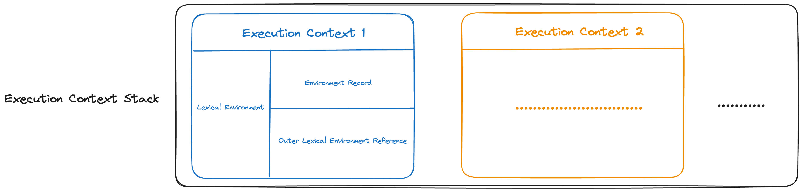
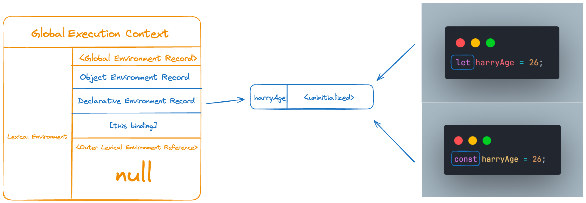

## 🍀 실행 컨텍스트

실행 컨텍스트는 자바스크립트 엔진이 코드를 실행하기 위해서 필요로 하는 정보(환경)들이 담겨있는 객체이다. 코드를 실행할 때, 특정 환경에 있는 환경 정보들을 모은 실행 컨텍스트를 콜스택에 쌓아올린 후 실행한다.  
여기서, 특정 환경이란 전역 공간이 될 수도 있고 함수 내부의 공간이 될 수도 있다. 이 때, 스코프, 식별자, 코드 실행 순서들의 관리가 필요한데 이 모든 것을 관리하기 위해서 실행 컨텍스트가 필요하다.

이번 글에서는 호이스팅, 스코프와 함께 자바스크립트의 동작 원리를 담고 있는 핵심 개념인 실행 컨텍스트에 대해서 알아보자.

### 소스 코드의 평가와 실행

자바스크립트로 작성한 모든 소스 코드는 실행에 앞서 평가 과정을 거치며, 평가를 통해서 실행을 위한 준비를 한다. 자바스크립트 엔진은 코드를 평가와 실행 두 가지 과정으로 나누어서 처리한다.

평가 과정에서는

- 실행 컨텍스트를 생성한다.

- 변수, 함수 등의 **선언문만 먼저 실행**하여 식별자(변수, 함수, 클래스 이름)를 키로 실행 컨텍스트 → 렉시컬 환경 → 환경 레코드에 등록한다.

평가 과정이 끝나면 비로소 코드가 실행되는 런타임이 시작되며, **선언문을 제외한 나머지 코드를 순차적으로 실행한다.** 이 때, 실행에 필요한 정보를 평가 과정에서 생성된 실행 컨텍스트를 통해 얻는다.

### 실행 컨텍스트의 역할

```js
var harryAge = 26

const address = "busan"

function bar() {
  var harryAge = 20

  console.log("해리의 나이는", harryAge, "입니다.")

  function foo() {
    var nickName = "harry"

    console.log(nickName)
    console.log(harryAge)
    console.log(harryHobby) // Error!
  }

  foo()
}

bar()

console.log("해리의 나이는", harryAge, "입니다.")
```

위 코드의 실행되는 과정을 간단하게 살펴보며, 실행 컨텍스트의 역할에 대해서 알아보자.


1. **전역 코드 평가**

위 코드를 실행하기 전, 평가 과정을 거치며 전역 코드를 실행하기 위한 준비를 한다. 이 때, 전역 실행 컨텍스트가 콜스택에 담긴다. 전역 코드의 변수 선언문과 함수 선언문이 먼저 실행되고, 생성된 전역 변수(harry)와 전역함수(bar)가 전역 실행 컨텍스트가 관리하는 전역 스코프에 등록된다.  
var 키워드로 선언된 전역 변수와 함수 선언문은 전역 객체(브라우저의 경우 window, Node.js의 경우 global)의 프로퍼티와 메서드가 된다.

2. **전역 코드 실행**

전역 코드의 평가가 끝난 후, 코드가 실행되는 런타임이 시작되어 전역 코드가 순차적으로 실행된다. 이 때, 변수 값을 할당하거나, 함수를 호출한다. 코드를 실행하던 중, bar 함수가 호출되어 해당 함수를 실행하기 위한 준비를 한다.  
함수가 호출되면 기존에 실행중이던 전역 코드의 실행을 일시 중단한다.

3. **bar 함수 코드 평가**

bar 함수 내부 코드를 실행하기 전 평가 과정을 거치며 코드 실행을 위한 준비를 한다. 즉, bar 함수의 환경 정보들을 수집해 실행 컨텍스트를 생성하고 콜스택에 담는다. 매개변수, 지역 변수의 선언문이 먼저 실행되고 함수 실행 컨텍스트가 관리하는 지역 스코프에 등록된다.

4. **bar 함수 코드 실행, foo 함수 코드 평가 및 실행**

bar 함수 코드의 평가가 끝난 후, 함수 내부 코드가 순차적으로 실행된다. bar 함수 내부 코드를 순차적으로 실행하던 중, foo 함수가 호출 되었다.  
마찬가지로, 기존에 실행중이던 bar 함수 내부 코드의 실행을 일시 중단하고, foo 함수를 실행하기 전 평가 과정을 거치며 코드 실행을 위해 준비한다. foo 함수의 환경 정보들을 수집해 실행 컨텍스트를 생성하고 콜스택에 담는다. 이 후 코드가 순차적으로 실행된다.

5. **실행 종료 및 콜스택에서 제거**

foo 함수 코드 실행이 완료되면, 콜스택에서 제거된다. 이 후, bar 함수 내부에서 foo 함수 호출로 인해 일시 중단되었던 지점부터 다시 코드를 실행하고 완료되면 콜스택에서 제거된다.

전역 코드에서도 bar 함수 호출로 인해 일시 중단되었던 지점부터 다시 코드를 실행하고 전역에서 실행할 코드가 더이상 남아있지 않다면 전역 실행 컨텍스트 또한 콜스택에서 제거되어 모든 코드의 실행이 종료된다.

위 순서에서 확인할 수 있듯, 자바스크립트에서 코드를 실행하려면 스코프, 식별자, 실행 순서 등의 관리가 필요하며 **이 모든 것을 관리하는 것이 실행 컨텍스트이다.**
실행 컨텍스트는 식별자(변수, 함수, 클래스 이름)을 관리하고 스코프와 코드 실행 순서 관리를 위해 필요하며 모든 코드는 실행 컨텍스트를 통해 관리되고 실행된다고 할 수 있다.

식별자, 스코프는 실행 컨텍스트 내부 렉시컬 환경으로 관리하고 코드 실행 순서는 실행 컨텍스트 스택(콜스택)으로 관리한다.

### 렉시컬 환경

렉시컬 환경은 실행 컨텍스트를 구성하는 하나의 단위이며, 다시 환경 레코드, 외부 렉시컬 환경에 대한 참조로 구분된다.  
렉시컬 환경은 키, 값을 갖는 객체 형태의 스코프를 생성하여 식별자를 키로 등록하고 식별자에 바인딩 된 값을 관리한다. 그리고 렉시컬 환경에 상위 스코프에 대한 참조를 기록한다.

즉, 렉시컬 환경은 스코프를 구분하여 **식별자를 등록하고 관리할 수 있는 저장소 역할을 한다.**



- 환경 레코드

스코프에 포함된 식별자를 등록하고 식별자에 바인딩 된 값을 저장하는 저장소이다.

- 외부 렉시컬 환경에 대한 참조

외부 렉시컬 환경에 대한 참조는 상위 스코프를 가르킨다. 상위 스코프란, 외부 렉시컬 환경을 말하며 즉, 해당 실행 컨텍스트를 생성한 소스 코드를 포함하는 상위 실행 컨텍스트의 렉시컬 환경을 말한다.

정리하자면, **환경 레코드와 외부 렉시컬 환경에 대한 참조 를 통해서 스코프를 생성하고 관리**할 수 있다.

실행 컨텍스트의 역할 부분의 코드 예시를 통해 조금 더 알아보자. 이 글에서는 전역 코드의 평가 과정에서 생성되는 전역 실행 컨텍스트에 대해서 다뤄본다.

### 전역 실행 컨텍스트


- 환경 레코의 구성

var 키워드와 ES6의 let, const 키워드로 선언한 전역 변수를 구분하기 위해서 전역 환경 레코드는 다시 객체 환경 레코드와 선언적 환경 레코드로 구분된다. 객체 환경 레코드는 기존의 전역 객체가 관리하던 var 키워드로 선언한 전역 변수와 함수 선언문으로 정의한 함수, 표준 빌트인 객체(Number, Math,,,)를 관리한다.

반면, 선언적 환경 레코드는 let, const 키워드로 선언한 전역 변수를 관리한다. 실행 컨텍스트가 생성될 때 구성되는 환경 레코드를 통해 특정 코드 환경의 스코프를 결정할 수 있다.

- 외부 렉시컬 환경에 대한 참조 정하기

외부 렉시컬 환경에 대한 참조는 현재 평가 중인 소스 코드를 포함하는 외부 소스 코드의 렉시컬 환경, 즉 상위 스코프를 가르킨다.

```js
var harryAge = 26

function sayHi() {
  console.log("hi")
}
```

(위와 같은 코드가 있을 때, 전역 코드는 sayHi 함수 코드를 포함한다고 할 수 있다.)

이를 통해서 **단방향 링크드 리스트인 스코프 체인**을 구현할 수 있다. 현재 평가중인 소스 코드는 전역 코드이고, 전역 코드를 포함하는 소스 코드는 없으므로 외부 렉시컬 환경에 대한 참조에 null이 할당된다.

## 💭 호이스팅 알아보기

실행 컨텍스트가 생성되는 과정과 내부 구성에 대해서 간략하게 알아보았다.  
이제 자바스크립트의 특징 중 하나인 호이스팅에 대해서 알아보자. 호이스팅은 실행 컨텍스트 개념과 관련이 있는 개념이다 :)

### 변수 호이스팅

```js
console.log(harryAge) // ?

var harryAge = 26
console.log(harryAge) // 26
```

위 코드를 살펴보자. harryAge 변수(식별자)에 26 이라는 숫자 타입의 변수 값을 할당했다. 할당 후에 콘솔에 harryAge를 출력해보면 26이 출력될 것이다.  
그렇다면, harryAge 변수의 선언과 할당 전에 콘솔에 출력해보면 어떤 결과가 출력될까?

```js
console.log(harryAge) // undefined

var harryAge = 26
```

선언과 할당을 하기 전이지만, 에러가 발생하지 않고 undefined 가 출력된다. 이 현상을 호이스팅 이라고 하며, 호이스팅은 선언문이 최상단에 끌어올려진 듯한 현상을 말한다.  
이 현상의 이유에 대해서 간단하게 알아보자.


평가 과정에서는 선언문만 먼저 실행되며, 이 과정에서 harryAge는 undefined로 할당되어 환경 레코드에 등록된다. 더 이상의 선언문이 없으므로 평가 과정이 종료되며, 코드가 실행된다. 첫 번째 console.log 를 실행할 때, 환경 레코드 내부에 harryAge가 undefined 값을 가지고 있으므로 undefined를 출력한다.

이 후, harryAge 변수 값이 26으로 재할당된다.

두 번째 console.log 를 실행할 때, 환경 레코드 내부에 harryAge가 26값을 가지고 있으므로 26을 출력한다. 위와 같은 이유들로 인해서 harryAge 선언문이 최상단에 끌어올려진 것 처럼 보이는 호이스팅이 발생하는 것이다.

그렇다면 let, const 키워드로 선언한 변수에도 동일하게 undefined가 출력될까?

### 일시적 사각지대

일시적 사각지대란, let과 const 키워드로 변수를 선언했을 때 선언 이전에 변수(식별자)를 참조할 수 없는 영역을 말한다. 참조할 수 없는 이유는 **let과 const 키워드로 선언한 변수는 선언 단계와 초기화 단계가 분리되어 진행**되기 때문이다.

우선, var 키워드는 선언 단계와 초기화 단계가 동시에 진행된다.


소스 코드가 실행되기 전, 평가 과정을 거칠 때

- 선언 : 자바스크립트 엔진에게 식별자(harryAge)의 존재를 알리고 메모리 공간을 확보한 후 연결
- 초기화 : 확보한 메모리 공간에 암묵적으로 undefined 값을 할당

위 두 과정이 동시에 진행된다. 따라서, harryAge 변수(식별자)를 선언 및 할당하기 전에도 undefined 값을 참조할 수 있게되어 콘솔에 출력된다.

반면, let과 const 키워드는 선언과 초기화 단계가 분리되어 진행된다.



소스 코드가 실행되기 전, 평가 과정을 거칠 때 초기화 단계가 진행되지 않아 값이 바인딩 되지 않는다.  
(`<uninitialized>`는 값이 바인딩 되지 않았음을 표현하기 위한 수단이며, `<uninitialized>` 값이 바인딩 된 것이 아니다.)


위 이미지와 같이, 코드가 실행되는 런타임에 실행 흐름이 harryAge 변수에 변수 값 26을 할당하기 전 까지 일시적 사각지대에 빠지게 된다.
주의할 점은, let과 const 키워드로 선언한 변수도 변수 호이스팅이 발생하는 것은 변함이 없다는 것이다.  
호이스팅이 발생해서 변수 선언문이 제일 최상단으로 끌어올려진 것 처럼 동작하지만, 변수 값을 할당하기 전 까지 참조할 수 없기 때문에 일지적 사각지대에 빠지게 되는 것이다.

### 함수 호이스팅

1. 함수 선언문

```js
sayHi()

function sayHi() {
  console.log("안녕, 해리야.")
}
```

이번엔 위 코드를 한번 살펴보자. 함수 선언문으로 sayHi 함수를 선언했고, 해당 함수를 선언하기 전 호출하고 있다. 위 코드를 실행하면 예외가 발생해야 할 것 같지만, 정상적으로 호출되는 것을 확인할 수 있다. 그 이유는, 함수 선언문을 통해 생성한 함수는 선언과 동시에 함수가 생성되어 선언 전에도 함수를 사용할 수 있기 때문이다.


위 이미지와 같이, 전역 코드를 실행하기 전 평가 과정에서 함수 선언문을 통해 생성한 sayHi 함수는 전역 객체의 메서드가 되어 객체 환경 레코드에 등록된다.

따라서, 예외가 발생하지 않고 정상적으로 호출된다.

2. 함수 표현식

```js
sayHi()

var sayHi = function () {
  console.log("안녕, 해리야.")
}
```

자바스크립트에서는 변수에 함수를 담을 수 있다. (자바스크크립트에서 함수는 일급 객체이기 때문에 가능하다.)  
위 코드에서는 var 키워드를 사용한 변수에 sayHi 변수를 담았다.

위 코드를 실행하면 예외가 발생하는 것을 확인할 수 있다. 그 이유는, 전역 코드 평가 과정에서 var 키워드를 사용한 변수는 객체 환경 레코드에 undefined 값으로 등록되는데, sayHi 변수에 함수를 할당하기 전 호출하려고 했기 때문이다.

**함수 표현식은 변수 호이스팅과 동일하게 동작**한다.


```text
TypeError: sayHi is not a function
```

따라서 위와 같은 예외가 발생한다.

## 💭 스코프 체인 알아보기

위 코드 예시에서 foo 함수가 실행될 때,  
`nickName`, `harryAge`, `harryHobby` 식별자를 찾아가는 과정을 통해 스코프 체인에 대해서 좀 더 알아보자.

```js
var harryAge = 26

const address = "busan"

function bar() {
  var harryAge = 20

  console.log("해리의 나이는", harryAge, "입니다.")

  function foo() {
    var nickName = "harry"

    console.log(nickName)
    console.log(harryAge)
    console.log(harryHobby)
  }
  foo()
}

bar()

console.log("해리의 나이는", harryAge, "입니다.")
```


foo 함수가 호출되면, 함수 코드가 실행되기 전 우선 평가 과정을 통해서 함수 실행 컨텍스트가 생성된다.

함수 실행 컨텍스트가 생성될 때, 외부 렉시컬 환경에 대한 참조 가 결정되어야 하며, foo 함수를 평가하는 시점에 실행 중인 컨텍스트의 렉시컬 환경으로 참조결정된다. 즉, 현재 평가 중인 foo 함수를 포함하는 bar 함수 실행 컨텍스트의 렉시컬 환경으로 참조가 결정된다.

이 후, 순차적으로 foo 함수 내부 코드를 실행한다.

```js
console.log(nickName)
console.log(harryAge)
console.log(harryHobby)
```

console.log 가 실행되면 **자바스크립트 엔진은 어떤 식별자를 출력할지 결정해야 한다.** 식별자를 결정하기 위해서 실행 중인 실행 컨텍스트의 렉시컬 환경에서 식별자를 검색하기 시작한다.

1. **nickName**

현재 실행중인 컨텍스트는 foo 함수의 실행 컨텍스트 이므로, 해당 컨텍스트의 렉시컬 환경에서 nickName 을 찾기 시작한다. 현재 실행중인 컨텍스트에서 찾을 수 있으므로 식별자에 값(”harry”)을 바인딩하고 출력한다.

2. **harryAge**

harryAge 는 foo 함수의 실행 컨텍스트에 없으므로 상위 렉시컬 환경인 bar 함수 실행 컨텍스트의 렉시컬 환경으로 이동해서 식별자를 검색한다. bar 함수의 실행 컨텍스트에서 찾을 수 있으므로 식별자에 값(20)을 바인딩하고 출력한다. 전역 실행 컨텍스트의 렉시컬 환경에도 동일한 harryAge 식별자가 있지만, 자바스크립트 엔진은 가장 먼저 발견된 식별자에만 접근한다.

이 상황처럼, 동일한 식별자로 인해 상위 스코프(전역)에서 선언된 식별자의 값이 가려지는 현상을 변수 섀도잉이라 한다.

3. **harryHobby**

harryHobby 는 foo 함수의 실행 컨텍스트에 없으므로 상위 렉시컬 환경인 bar 함수 실행 컨텍스트의 렉시컬 환경으로 이동해서 식별자를 검색한다. bar 함수의 실행 컨텍스트에서도 찾을 수 없으므로 bar 함수의 상위 렉시컬 환경인 전역 실행 컨텍스트의 렉시컬 환경으로 이동해서 식별자를 검색한다.

전역 렉시컬 환경에서도 찾을 수 없고, 더 이상 이동해서 검색할 수 있는 렉시컬 환경이 존재하지 않으므로 Reference Error 가 발생하게 된다.

위 3가지 예시처럼 자바스크립트 엔진이 식별자를 찾아가는 과정을 스코프 체이닝이라고 하며, 이 과정에서 활용되는 스코프(렉시컬 환경)들의 연결리스트를 스코프 체인이라고 한다.

## 📚 정리

- 실행 컨텍스트란, 자바스립트 엔진이 코드를 실행하기 위해서 필요로 하는 정보(환경)들이 담겨있는 객체이다.
- 렉시컬 환경이란, 실행 컨텍스트를 구성하는 하나의 단위이며, 다시 환경 레코드, 외부 렉시컬 환경에 대한 참조로 구분된다.
- 렉시컬 환경은 키, 값을 갖는 객체 형태의 스코프(환경 레코드)를 생성하고, 상위 스코프에 대한 참조(외부 렉시컬 환경에 대한 참조)를 기록한다.
- 호이스팅은 선언문이 최상단에 끌어올려진 듯한 현상을 말하며, 소스 코드를 실행하기 전 평가를 통해 실행 컨텍스트를 생성하기 때문에 생기는 현상으로 볼 수 있다.
- var 키워드로 선언한 변수는 변수의 선언과 초기화가 동시에 진행되며, let과 const 키워드로 선언한 변수는 변수의 선언과 초기화가 분리되어 진행된다.
- 자바스크립트 엔진이 식별자를 결정해가는 과정을 스코프 체이닝이라고 하며, 이 과정에서 활용되는 스코프(렉시컬 환경)들의 연결리스트를 스코프 체인이라고 한다.
