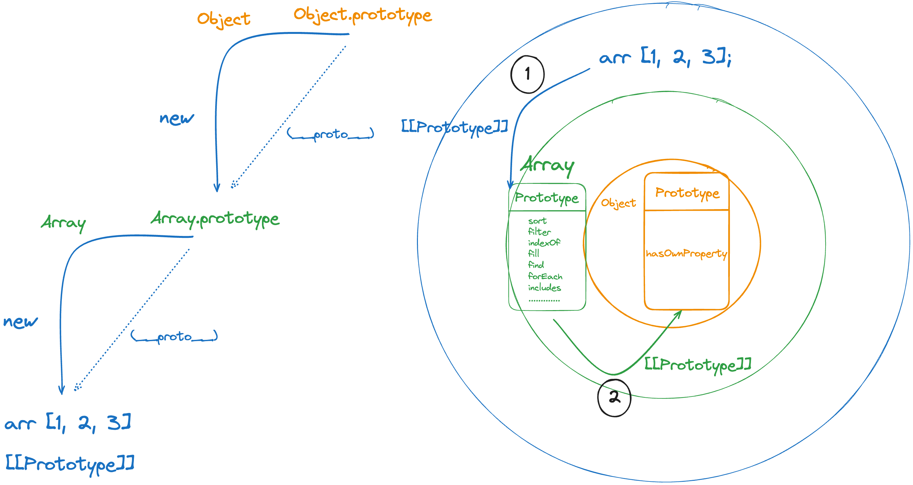

## 🖌️ 서론

자바스크립트는 명령형, 함수형, 프로토타입 기반 객체지향 프로그래밍을 지원하는 멀티 패러다임 프로그래밍 언어다.  
이번 글에서는 프로토타입에 초점을 맞추어 프로토타입이 무엇이고, 자바스크립트에서 프로토타입이 어떻게 이용되는지를 간단하게 알아보고자 한다.

```js
const arr = [1, 2, 3]

arr.sort((a, b) => a - b)
```

추가로 배열 리터럴로 생성한 arr 이 어떻게 sort 와 같은 메서드를 사용할 수 있는지도 프로토타입 관점에서 알아보고자 한다. 프로토타입에 대해서 이해하려면, 자바스크립트가 객체를 어떻게 바라보는지를 이해할 필요가 있다.  
**자바스크립트는 클래스 기반 객체지향 언어인 Java, C++ 과 객체를 바라보는 시선이 약간 다르다.**

## 💭 자바스크립트가 객체를 바라보는 시선

우선 클래스 기반 객체지향 언어인 Java, C++이 객체를 어떻게 바라보는지를 알아보자. 클래스 기반 객체지향 언어는 이름에서도 알 수 있듯이 분류(Classification)를 통해 객체를 구분한다. 속성이 동일한 개체들이 있는 경우, 해당 개체들을 같은 범주로 묶을 수 있다고 본다. 여기서 속성은 프로그래밍 관점에서 봤을 때, 클래스(클래스로 생성된 인스턴스)의 프로퍼티가 된다. 프로퍼티가 유사한 객체가 있다면, 일반화 과정을 통해서 클래스로 추상화된다.

이는 세상을 이분법적으로 나누어서 보았던, 서양철학과 연결된다. (영혼 / 육체, 추상 / 구체, 사물 / 본질)

> _눈 앞에 실제로 존재하는 사물이 있다면 반드시 그 사물의 본질이 존재한다. - 플라톤_

자전거를 예로 들자면 네발, 세발, 두발, 한발 자전거가 있을 것이며 이 때 반드시 본질적이고 추상적인 자전거가 존재한다고 본다.

```js
class Cycle {
...
}

Cycle harryCycle = new Cycle();
```

추상적으로 존재하는 자전거(Cycle)가 new 연산자를 사용해서 현실세계에 구체적으로 존재(harryCycle)하게 된다고 본다.  
하지만, [프로토타입 이론](https://ko.wikipedia.org/wiki/%ED%94%84%EB%A1%9C%ED%86%A0%ED%83%80%EC%9E%85_%EC%9D%B4%EB%A1%A0)에서는 객체는 정의를 통해서 분류(Classification)되는 것이 아니라 가장 좋은 보기로 부터 범주화 되는 것이라고 본다.


- 이미지 출처 : https://laurabecker.gitlab.io/classes/as/08-semantics.pdf

예를 들어, 인간이 새를 분류한다고 할 때 자연스럽게 가장 유사성이 높은 순새대로 등급을 매긴다고 본다.
이렇게 분류했을 때, 가장 높은 등급이 나오는 새를 새의 원형(Prototype)으로 보는게 프로토타입 이론이다.

즉, ‘가장 새 다운 것, 새스러운 것’을 새의 원형(Prototype) 이라고 본다. 위 예시에서는 참새가 새의 범주를 대표할만한 전형적인 새로 본다. 프로토타입 이론에는 객체를 유사성을 기준으로 바라보는 것 이외에 또 한 가지 중요한 것이 있다. 바로 같은 단어라고 할지라도 누가 어떤 상황(context)에서 사용했냐, 접했냐에 따라서 의미가 달라진다고 보는 것이다.

예를 들어, 나(해리)가 생각했을 때는 새의 범주에 ‘오리’가 속할 수 있지만 지니가 생각했을 때는 새의 범주에 ‘오리’가 속하지 않을 수도 있다. 같은 단어(새)라도 어떤 상황(나 or 지니)에서 접했느냐에 따라서 범주(의미)가 크게 달라진다고 본다.

이는 단어의 진정한 본래의 의미(전통적인 서양철학에서의 본질)은 존재하지 않고 단어의 의미는 사용하는 상황과 맥락에 의해 결정된다고 본 [비트켄슈타인의 의미 사용 이론](https://ko.wikipedia.org/wiki/%EC%96%B8%EC%96%B4%EB%86%80%EC%9D%B4)을 기반으로 한다.

> _세계에 미리 내재되어서 대상과 언어를 완전히 규정하는 어떤 언어란 존재하지 않는다. — 비트겐슈타인_

정리하자면 프로토타입 이론에서는

- 가장 좋은 본보기를 원형으로 선택한다.
- 특정 상황(문맥, 컨텍스트)에 따라서 특정 단어의 범주(의미)가 달라진다.

고 본다.

따라서, 프토토타입 기반 언어인 자바스크립트에서 객체에는 원형이 있다고 봤고, 새로운 객체를 만들 때 그 원형을 복제(참조)해서 만드는 방법을 사용했다.

선언되는 위치(환경)에 따라 스코프(실행 컨텍스트 내 환경 레코드)가 결정되고, 사용되는 상황(문맥)에 따라서 this가 결정되는 자바스크립트의 특징이 떠오르지 않는가? 😊

## 💭 자바스크립트에서 프로토타입

위 내용에서 프로토타입은 어떤 범주에서 가장 좋은 보기, 원형이라고 했었다.  
그렇다면, 자바스크립트에서 프로토타입은 어떻게 사용될까?  
자바스크립트에서는 원시 타입의 값(String, Number, Boolean…)을 제외한 나머지 값(Array, Function,,,)들은 모두 객체이다. 객체는 다른 객체들과 메시지를 주고 받거나 데이터를 처리할 수도 있고, 다른 객체의 상태 데이터나 동작을 상속받아서 사용할 수도 있다. 이 때, 프로토타입이 상속을 위해서 사용된다.  
자바스크립트에서는 어떤 객체를 원형(Prototype)으로 삼고 이를 복제함으로써 상속과 비슷한 효과를 내도록 한다.

### prototype 객체

프로토타입 객체는 상위 객체의 역할을 하는 객체로써, 다른 객체에 공유 프로퍼티를 제공할 수 있다. 프로토타입을 상속받은 하위 객체는 상위 객체의 프로퍼티를 자신의 프로퍼티처럼 자유롭게 사용할 수 있다.

모든 객체는 [[Prototype]] 이라는 내부 슬롯을 가지며, 이 내부 슬롯의 값은 프로토타입(원형)에 대한 참조이다. 즉 [[Prototype]] 내부 슬롯은 해당 객체의 원형을 가르킨다(참조한다). [[Prototype]]이 참조하는 프로토타입 객체(상위 객체, 원형)는 객체 생성 방식에 따라서 결정된다.

모든 객체는 하나의 프로토타입을 가지며 즉, 원형을 가지며 모든 프토토타입은 해당 객체를 생성한 생성자 함수와 연결되어 있다. 쉽게 말하자면, 생성자 함수의 프로퍼티에 프로토타입 객체가 있다.

```js
const arr = [1, 2, 3]

arr.sort((a, b) => a - b)
```

배열 리터럴로 배열을 생성한 후, sort 메서드를 사용했던 위 예시를 다시 한번 살펴보자. 배열 리터럴로 생성된 배열도, Array 생성자 함수를 통해서 생성된 배열 객체로 볼 수 있으며 생성된 배열 객체 arr 의 [[Prototype]] 내부 슬롯은 Array 생성자 함수의 프로토타입 객체를 가르킨다.


위 이미지에서도 확인할 수 있듯이, 배열 리터럴 방식으로 생성된 배열 객체의 [[Prototype]]은 Array 생성자 함수의 프로토타입 객체를 가르킨다.

정리하자면, Array 생성자 함수를 통해 생성된 배열 객체는 생성자 함수의 프로토타입(원형)을 복제함으로써 생성되고 프로토타입 객체를 상속 받아서 자유롭게 사용할 수 있다.

이로 인해서 extends 키워드를 사용하는 것과 같은 명시적인 상속 없이, 상위 객체의 메서드들을 사용할 수 있게 되는 것이다. 한가지 짚고 넘어가야할 점은, Array 생성자 함수의 프로토타입 내부에 있지 않은 from, of, isArray는 생성된 배열 객체에서 사용할 수 없다는 것이다. 오직 생성자 함수의 프로토타입 내부에 있는 프로퍼티나 메서드들을 상속 받아서 사용할 수 있다.  
from, of, isArray와 같은 메서드들은 생성자 함수에서 직접 접근해야 실행이 가능하다. 이 메서드들을 스태틱 또는 정적 메서드라고 한다.

```js
const arr = [1, 2, 3]

console.log(Array.isArray(arr)) // true

console.log(arr.isArray(arr)) // TypeError : arr.isArray is not a function
```

생성된 배열 객체에서 `isArray` 메서드를 호출하려고 하면 TypeError가 발생한다.

### `__proto__` 프로퍼티

모든 객체는 `__proto__` 접근자 프로퍼티를 가지며, 해당 프로퍼티를 통해서 자신의 프로토타입(원형) 즉, [[Prototype]] 내부 슬롯에 간접적으로 접근할 수 있다.

자바스크립트는 원칙적으로 [[Prototype]]과 같은 내부 슬롯에 직접 접근하는 방법을 제공하지 않기 때문에, 간접적으로 프로토타입 객체를 참조할 수 있는 방법인 `__proto__` 접근자 프로퍼터를 제공한다. 자바스크립트 엔진은 객체의 프로퍼티에 접근하려고 할 때, 해당 객체에 접근하려는 프로퍼티가 없다면 `__proto__` 접근자 프로퍼티가 가리키는 참조를 따라서 자신의 부모 역할을 하는 프로토타입의 프로퍼티를 순차적으로 검색한다.

위 배열 예시에서도, 생성된 배열 객체(arr)에는 sort 메서드가 존재하지 않기 때문에 `__proto__` 접근자 프로퍼티를 사용해서 배열 객체의 프로토타입인 Array 생성자 함수의 프로토타입에서 sort 메서드를 검색한 후 사용한 것이다.


```js
const arr = [1, 2, 3]

console.log(arr.__proto__ === Array.prototype) // true

console.log(arr.hasOwnProperty("__proto__")) // false

console.log(Object.prototype.hasOwnProperty("__proto__")) // true
```

한가지 짚고 넘어가야할 점은, 위 이미지처럼 `__proto__` 접근자 프로퍼티는 생성된 객체가 직접 소유하는 숨겨진 프로퍼티가 아니라 자바스크립트의 최상위 객체인 `Object.prototype`의 프로퍼티이다.

모든 객체는 Object.prototype의 상속을 통해서 `Object.prototype.__proto__` 를 사용할 수 있다.

### 🤔 복제한다는 것의 의미

프로토타입에 대해서 학습하면서,

> _어떤 객체를 원형(Prototype)으로 삼고 이를 복제함으로써 상속과 비슷한 효과를 내도록 한다._

이 문장이 개인적으로 잘 와닿지 않았었다. 특히 “복제”한다는 것이 제일 와닿지 않았는데 간단한 예시를 통해서 어느 정도 이해할 수 있었다.

```js
const arr = [1, 2, 3]
const brr = [4, 5, 6]
console.log(arr.__proto__ === brr.__proto__)
```

`console.log(arr.sort === brr.sort);`
위 코드에서 각각 콘솔에는 무엇이 출력될까?  
모두 true 가 출력된다.


위 이미지에서 확인할 수 있듯, 생성된 배열 객체의 프로토타입은 모두 Array 생성자 함수의 프로토타입을 가르키고 있다.  
Array 생성자 함수의 프로토타입을 원형으로 삼고, 이를 복제하여 배열 객체를 생성한 것이며 생성된 배열 객체들이 **proto** 프로퍼티를 통해서 참조하게되는 프로토타입은 모두 같은 프로토타입이다.  
`프로토타입(원형)을 복제한다 === 생성된 배열 객체들이 모두 같은 프로토타입을 참조한다` 로 해석할 수 있다.

## 💭 프로토타입 체인

자바스크립트는 객체의 프로퍼티에 접근하려고 할 때, 해당 객체에 접근하려는 프로퍼티가 없다면 `__proto__` 접근자 프로퍼티를 통해서 부모 역할을 하는 프로토타입의 프로퍼티를 순차적으로 검색한다고 했었다.

이를 프로토타입 체인이라고 하며, 프로토타입 체인은 상속과 프로퍼티 검색을 위한 매커니즘이라고 할 수 있다.

```js
const arr = [1, 2, 3]

arr.name = "harry"

console.log(arr.hasOwnProperty("name")) // true
```

배열 객체에 특정 프로퍼티를 추가하는 경우는 흔하지 않지만, 프로토타입 체인 과정을 이해해보기 위해서 위 코드와 같은 배열 객체가 있다고 가정해보자.



`hasOwnProperty` 메서드를 호출하면, 다음과 같은 과정을 거쳐서 메서드를 검색한다.

1. Array.prototype

우선, 해당 메서드를 호출한 arr 배열 객체에서 `hasOwnProperty`를 검색한다.

메서드가 존재하지 않으므로 프로토타입 체인을 따라서 즉, [[Prototype]] 내부 슬롯에 바인딩되어 있는 프토로타입(원형)으로 이동하여 hasOwnProperty를 검색한다.

2. Object.prototype

Array.prototype에도 hasOwnProperty가 존재하지 않는다.

따라서, 다시 프로토타입 체인을 따라서 즉, Array.prototype 객체의 [[Prototype]] 내부 슬롯에 바인딩되어 있는 프토토타입(원형)인 Object.prototype으로 이동하여 hasOwnProperty를 검색한다.  
(자바스크립트에서 프로토타입의 프로토타입은 언제나 최상위 객체인 Object.prototype이다.)

프로토타입 체인의 최상위에 위치하는 객체는 언제나 Object.prototype이다. 따라서 모든 객체는 Object.prototype을 상속받는다.  
즉, 자바스크립트에서는 가장 객체 다운 것, 객체스러운 것을 Object.prototype(원형)으로 봤으며 이 원형을 복제해서 새로운 객체를 만들도록 했다.

반면, 객체의 프로퍼티가 아닌 식별자는 스코프 체인에서 검색한다. 자바스크립트 엔진은 함수들의 중첩 관계로 이루어진 스코프의 계층적 구조에서 식별자를 검색 식별자를 검색한다.
따라서, 스코프 체인은 식별자 검색을 위한 매커니즘이라고 할 수 있다.

## 📚 정리

- 프로토타입은 어떤 범주에서 가장 좋은 보기, 원형이다.
- 자바스크립트에서 어떤 객체를 원형(Prototype)으로 삼고 이를 복제함으로써 상속과 비슷한 효과를 낸다.
- 자바스크립트에서 모든 객체는 하나의 프로토타입을 가지며 즉, 원형을 가지며 모든 프토토타입은 해당 객체를 생성한 생성자 함수와 연결되어 있다.
- 프로토타입 체인은 상속과 프로퍼티 검색을 위한 매커니즘이다.

## 🔗 참고

- https://medium.com/@limsungmook/%EC%9E%90%EB%B0%94%EC%8A%A4%ED%81%AC%EB%A6%BD%ED%8A%B8%EB%8A%94-%EC%99%9C-%ED%94%84%EB%A1%9C%ED%86%A0%ED%83%80%EC%9E%85%EC%9D%84-%EC%84%A0%ED%83%9D%ED%96%88%EC%9D%84%EA%B9%8C-997f985adb42
