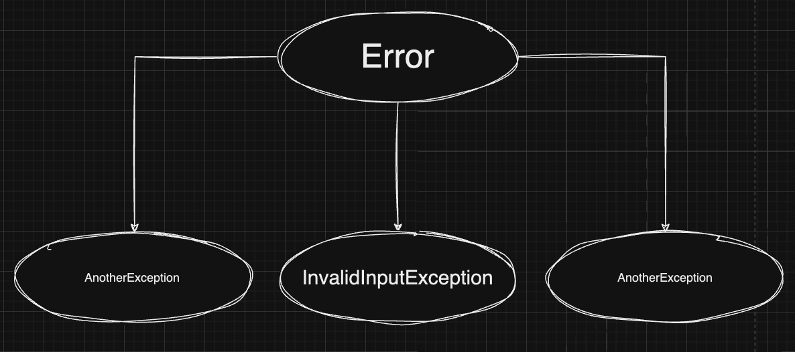

## 서론

우테코 레벨1 콘솔 기반 로또 애플리케이션을 진행하면서, 로또와 당첨 로또의 유효성 검증 로직이 중복되는 부분이 많아 재사용하기 위해서 이미 구현된 로또 도메인에서 재사용하는 로직을 재사용해보기 위해서 상속이나 조합을 사용해볼 수 있었다.

> "상속이나 조합을 사용해서 중복을 줄일 수 있다...? 그렇다면..."

- 두 방식은 어떠한 차이점이 있을까?
- 왜 LMS에서는 조합을 권장하는 것일까?

의 두 가지 의문점이 생겼다. 이 글에서 의문점을 나름대로 해결하고 차이를 이해해 본 내용을 기록해본다. 😊

## 상속

로또 도메인에서 진행하는 유효성 검증은 다음과 같다.

- 로또 번호는 1 ~ 45 사이의 숫자여야 한다.
- 로또 번호는 6개의 숫자로 이루어진다.
- 로또 번호는 중복이 있을 수 없다.

이를 아래와 같이 코드로 표현해볼 수 있다.

```js
class Lotto {
  #numbers

  constructor(numbers) {
    Lotto.#validate(numbers)
    this.#numbers = numbers
  }

  static #validate(numbers) {
    Lotto.#validateNumbersType(numbers)
    Lotto.#validateLength(numbers)
    Lotto.#validateUniqueness(numbers)
  }

  static #validateNumbersType(numbers) {
    // 로또 번호가 1 ~ 45 사이의 숫자들인지 판단한다.
  }

  static #validateLength(numbers) {
    // 로또 번호가 6개의 숫자로 이루어져 있는지 판단한다.
  }

  static #validateUniqueness(numbers) {
    // 로또 번호에 중복이 있는지 판단한다.
  }
  //...
}
```

생성자 함수에서 멤버 변수에 외부에서 주입한 값을 할당해주기 전에 유효성 검증을 진행한다. 당첨 로또를 만들 때 진행하는 유효성 검증은 다음과 같다

- 로또 번호는 1 ~ 45 사이의 숫자여야 한다.
- 로또 번호는 6개의 숫자로 이루어진다.
- 로또 번호는 중복이 있을 수 없다.
- 보너스 번호는 로또 번호와 중복될 수 없다.

4번 째 검증을 제외하면 로또 번호가 진행하는 유효성 검증과 중복된다. 상속을 통해서 중복을 줄여보자

```js
class WinningLotto extends Lotto {
  constructor(numbers, bonusNumber) {
    super(numbers)
    //...보너스 번호 유효성 검증
  }
}
```

구현된 로또 클래스를 상속 받은 당첨 로또는 인스턴스가 생성될 때, 외부에서 주입 받은 numbers에 대한 유효성 검증을 부모 클래스인 로또에서 진행하기 때문에 당첨 로또 클래스는 보너스 번호와의 중복을 확인하는 유효성 검증을 제외하면 중복을 줄일 수 있게 되었다. 중복을 줄였으니 이제 상속을 통해서 애플리케이션을 계속 만들어가면 되는 것일까? 잠시 멈추고 상속의 단점에 대해서도 한 번 생각해 보자.

### 1. 부모 클래스와 너무 강한 결합도

상속은 부모 클래스와 자식 클래스 사이의 너무 강한 결합도로 인해서 변경에 취약해진다는 단점이 있다. 예시를 들어보자,

만약 리뷰어가

> _꼭 배열로 외부에서 주입해줘야 하나요? Set을 사용해서 외부에서 주입하면 uniqueness에 대한 유효성 검증은 생략할 수 있을 것 같은데 한번 해보실래요~?_

와 같은 내용의 리뷰를 해줬다고 가정해보자. 이제 피드백을 반영하기 위해서 코드를 수정해본다.

```js
class Lotto {
  #numbers;

  constructor(numbers) {
    Lotto.#validate(numbers);
    this.#numbers = numbers;
  }

  static #validate(numbers) {
    Lotto.#validateNumbersType(numbers);
    Lotto.#validateLength(numbers);
  }

  static #validateNumbersType(numbers) {
		// 로또 번호가 1 ~ 45 사이의 숫자들인지 판단한다.
  }

  static #validateLength(numbers) {
		// 로또 번호가 6개의 숫자로 이루어져 있는지 판단한다.
  }

  static #validateUniqueness(numbers) {
		// 로또 번호에 중복이 있는지 판단한다.
  }

  //...
}

const lotto = new Lotto(new Set([1,2,3,4,5,6)]
```

피드백 수용 과정에서 어떤 문제가 있었을까? 자식 클래스는 부모 클래스에 강하게 의존하고 있기 때문에 부모 클래스에 변경 사항이 있으면 자식 클래스도 그 변경을 반영하기 위한 변경이 불가피하다는 것이다.  
지금은 생성자 함수에 변경 사항이 생긴 간단한 예시를 들었지만, 부모 클래스의 변경이 매우 많다면, 이에 비례해서 자식 클래스도 변경해야 한다는 문제점을 생각해볼 수 있다. 즉, **자식 클래스가 부모 클래스의 변경을 항상 바라보고 있기 때문에** 생긴 문제이다.

### 2. 불필요한 메서드도 상속

```js
class Vector {
  add() {}
}

class Stack extends Vector {
  pop() {}

  push() {}
}

const stack = new Stack()

stack.pop()
stack.push()
stack.add()
```

스택 클래스는 벡터 클래스를 상속받아 스택과 관련된 기능을 구현하고 있다. 이를 사용해서 생성된 인스턴스는 위의 코드와 같이 pop, push, add 메서드에 모두 접근이 가능하다.

- 스택 클래스는 add 메서드가 필요한 것일까?
- 구현에 있어서 필요하지 않은 메서드까지 같이 상속 받아버린것은 아닐까?
- 해당 메서드를 잘못 호출해서 애플리케이션이 예상치 못한 동작을 할 수도 있지 않을까?

구현에 필요하지 않은 메서드는 들고오지 않는다면, 위와 같은 문제들이 발생하지 않을 것 같은데 어떻게 해결해 볼 수 있을까?

## 조합

조합은

- 전체를 표현하는 클래스에서 부분을 표현하는 객체를 포함해서 부분 객체의 동작을 재사용하는 것을 말한다.
- 기존 클래스가 새로운 클래스의 부모가 되는 것이 아니라 새로운 클래스의 구성요소가 된다.
- 새로운 클래스는 기존 클래스를 호출해서 생성된 인스턴스를 멤버변수로 가진다.

위와 같은 특징을 가진다. 또, 기존 클래스에서 구현된 동작을 상속받는 것이 아닌 호출해서 사용하기 때문에(조합은 기존 클래스의 퍼블릭 메서드에 의존하기 때문에) 새로운 클래스를 통해서 생성될 인스턴스에 모든 동작(메서드)을 드러내지 않아 캡슐화를 깨뜨리지 않는다는 장점이 있다.
기존 클래스의 동작 방식이 변경 되어도 영향을 덜 받는다. 즉, 상속에 비해서 변화에 민감하게 반응할 필요가 없다.
조합을 사용해서 상속을 사용했을 때 확인할 수 있었던 문제들을 해결해보자.

### 1. 부모 클래스와의 결합도 낮추기

```js
class Lotto {
  #numbers

  constructor(numbers) {
    Lotto.#validate(numbers)
    this.#numbers = numbers
  }

  static #validate(numbers) {
    Lotto.#validateNumbersType(numbers)
    Lotto.#validateLength(numbers)
  }

  static #validateNumbersType(numbers) {
    //...
  }

  static #validateLength(numbers) {
    //...
  }

  has(number) {
    return this.#numbers.includes(number)
  }
}
```

```js
class WinningLotto{
  constructor(winningLotto, bonusNumber) {
	if(winningLotto.has(bonusNumber){
		throw new Error("보너스 번호는 당첨 번호와 중복될 수 없습니다.");
	}
	//...보너스 번호 유효성 검증
  }
}
```

당첨 로또 클래스는 이미 구현된 로또 클래스를 통해서 생성된 인스턴스를 멤버변수로 가지며 로또 클래스의 메서드를 사용해서 유효성 검증을 진행하고 있다. 조합을 사용하는 경우에 리뷰어의 피드백을 반영하기 위해서 배열을 집합으로 바꾸는 상황을 생각해보자. 과연 당첨 로또 클래스 내부에서 변화가 있을까? 없다.

당첨 로또 클래스는 로또 클래스를 호출해서 생성된 인스턴스를 **생성자 함수를 통해서 주입받기 때문에, 배열을 통해서 생성되든 집합을 통해서 생성되든 신경쓸 필요가 없다.** 따라서, 로또 클래스의 생성자 함수에 변경이 발생해도 당첨 로또 클래스는 변경할 필요가 없어진다. 이로써 부모, 자식 클래스가 너무 강하게 묶여있어 변화에 유연하게 대응하지 못하는 문제를 조합을 통해서 어느정도 해결할 수 있게 되었다.

### 2. 불필요한 메서드 드러내지 않기

```js
class Stack {
  #vector

  constructor() {
    this.#vector = new Vector()
  }

  pop() {}

  push() {}
}

const stack = new Stack()

stack.pop()
stack.push()
stack.add() // error
```

스택 클래스는 벡터 클래스를 통해 생성된 인스턴스를 멤버 변수로 가지고 있다. 벡터 클래스의 모든 메서드를 드러내지 않아도 되기 때문에, 스택 클래스를 통해서 생성될 인스턴스에 add 동작이 필요하지 않다면 외부에 노출하지 않을 수 있다. 이로써, 인스턴스에서 필요로 하지 않는 동작까지 외부로 드러냈던 문제를 해결할 수 있게 되었다. (이미 구현된 동작에서 필요한 것만 뽑아 쓰자!)

## 상속 쓰면 안되나요?

지금까지 상속이 가진 문제를 조합이 어떻게 해결해볼 수 있는지에 대해 살펴봤다. 상속의 단점만 부각시킨 것 같은데, 그렇다면 상속은 아예 사용하지 말라는 것일까?

상속은 의미상 관계가 있고 상하 관계가 분명한 객체를 나타내고 연결하기 위해서 고려해볼 수 있다. 또, 객체의 동작을 사용하는 입장에서 동일한 행동을 할 것임을 기대할 수 있을 때 고려해볼 수 있다.

나 역시 프리코스와 이번 미션에서 모두 상속을 사용했었다.

```js
class InvalidInputException extends Error {
  constructor(error) {
    super(`${ERROR_MESSAGES.prefix} ${error}`)
  }
}
```

콘솔에서 받는 입력이 유효하지 않다면 예외를 발생 시켜야 했는데, 그냥 Error 객체를 던지기 보다 어떤 상황에서 발생한 예외인지를 더 잘 표현하기 위해서 Error 클래스를 상속 받아서 InvalidInputException을 구현했다. 이는 둘 다 예외를 던진다는 의미상의 관계가 있으며 상하 관계도 분명하다고 볼 수 있다. 그리고, Error와 InvalidInputException 모두 예외를 던진다는 동일한 행동을 할 것임을 기대할 수 있다.



또 다른 예시로, `IS-A` 관계일 경우에도 상속을 고려해볼 수 있다. IS-A 관계는 한마디로 **“자식클래스는 부모클래스이다”라고 말해도 이상하지 않은 관계**이다.

```js
class Person {
  talk() {
    console.log("말하기")
  }

  run() {
    console.log("달리기")
  }
}

class Student extends Person {}

const student = new Student()

student.talk()
student.run()
```

위 예시에서 Student 클래스는 Person 클래스를 상속받고 있다. “학생은 사람이다”라는 문장은 어색하지 않기에 상속을 고려해볼 수 있다.(상하 관계가 분명하다)

## 결론

상속과 조합의 차이에 대해서 알아보면서 LMS에서 왜 조합을 권장하는지에 대해 나름대로 정리해볼 수 있었다.(아, 이래서 조합을…!)

상속을 사용하는 목적이 단순히 코드의 재사용이라면 다시 생각해봐야할 듯 하다.

## 🔗 참고 링크

- https://mangkyu.tistory.com/199
- https://www.youtube.com/watch?v=U4OSS4jJ9ns&t=189s
- https://tecoble.techcourse.co.kr/post/2020-05-18-inheritance-vs-composition/
