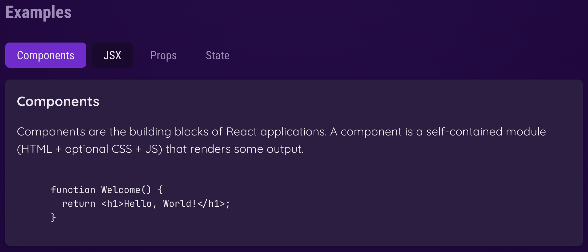

## 서론



위 이미지처럼 탭 버튼이 있고 탭에 해당되는 내용을 보여주는 기능을 구현하려고 할 때, Tabs 컴포넌트를 만들 수 있을 것이다. 만약, 만들고 있는 프로덕션의 규모가 커 여러 페이지에서 탭이 필요한 경우 Tabs 컴포넌트를 재사용하기 위해서

```tsx
interface TabsProps {
  children: React.ReactNode
  buttons: JSX.Element
}

const Tabs = ({ children, buttons }: TabsProps) => {
  return (
    <>
      <div>{buttons}</div>
      {children}
    </>
  )
}
```

- buttons : 탭 버튼들
- children : 클릭한 탭 버튼에 따라서 보여져야하는 내용들

이 2가지를 props로 넘겨줄 수 있을 것이다.
buttons의 타입은 JSX.Element이기 때문에 Tabs 컴포넌트를 호출할 때마다 여러 페이지에서 스타일이 다른 버튼들을 props로 넘겨줄 수 있을 것이다. 각 버튼들의 스타일은 유연하게 정할 수 있지만 버튼들을 감싸는 부모 태그는 현재 div로 고정되어 있기 때문에 스타일을 유연하게 정할 수 없다. 예를 들어,

- a 페이지 : 버튼들의 방향flex-direction : row
- b 페이지 : 버튼들의 방향flex-direction : column

일 경우 Tabs 컴포넌트를 재사용하기 힘들 것이다. 이를 해결하기 위해서 버튼들을 감싸는 부모도 함께 props로 넘겨줄 수 있다. 버튼들을 감싸는 부모는 JSX가 되거나 children props를 받는 리액트 컴포넌트가 된다. JSX인 경우

```tsx
React.createElement('div',,,)
```

이런 식으로 변환되기 때문에

```tsx
interface TabsProps {
  children: React.ReactNode
  buttons: JSX.Element
  ButtonContainer: string | React.FunctionComponent
}

const Tabs = ({ children, buttons, ButtonContainer }: TabsProps) => {
  return (
    <>
      <ButtonContainer>{buttons}</ButtonContainer>
      {children}
    </>
  )
}
```

`ButtonContainer`의 타입을string으로 지정했다 하지만,

```text
Type '{ children: Element; }' has no properties in common with type 'IntrinsicAttributes'.
```

위 에러를 확인할 수 있었는데, 현재 사용하려고 하는 컴포넌트에는 컴포넌트를 호출할 때 전달해야 하는 기본 속성인 IntrinsicAttribute가 존재하지 않기 때문이다. 리액트 컴포넌트에는 기본적인 내장 속성 IntrinsicAttribute가 존재하는데 이 속성에 컴포넌트를 호출할 때 기본적으로 전달해야하는 속성(onClick, onChange, style,,,)들이 정의되어 있다. 하지만 현재 사용하려고 하는 컴포넌트에는 이러한 기본 속성이 없다는 것을 의미하며, string으로 JSX의 타입을 지정하려고 했기 때문에 생긴 문제임을 파악할 수 있었다.

## JSX.intrinsicElement

타입스크립트 공식문서에서는 JSX.intrinsicElement 다음과 같이 설명하고 있다.

> _Intrinsic elements are looked up on the special interface JSX.IntrinsicElements. By default, if this interface is not specified, then anything goes and intrinsic elements will not be type checked. However, if this interface is present, then the name of the intrinsic element is looked up as a property on the JSX.IntrinsicElements interface._

즉, 타입스크립트에서 유효한 JSX인지 타입 체크를 하기 위해서 사용하는 타입이며

```ts
interface IntrinsicElements {
  //HTML
	a: React.DetailedHTMLProps<React.AnchorHTMLAttributes<HTMLAnchorElement>, HTMLAnchorElement>;
	abbr: React.DetailedHTMLProps<React.HTMLAttributes<HTMLElement>, HTMLElement>;
  //...
```

유효한 html 태그인지 확인하기 위한 타입이다. 유요한 intrinsicElement만 기본 내장 속성인 intrinsicAttribute을 가질 수 있다.

```ts
declare namespace JSX {
  interface IntrinsicElements {
    foo: any
  }
}
;<foo /> // ok
;<bar /> // error
```

## JSX.IntrinsicElement vs React.FunctionComponent

JSX 요소와 리액트 함수형 컴포넌트는 다음과 같은 차이가 있다.

### React.createElement 호출

```tsx
React.createElement("div",,,)
React.createElement(Component)
```

JSX를 전달하는 경우에는 유요한 html 태그 문자열을 전달하며, 함수형 컴포넌트를 전달하는 경우 참조할 수 있는 값으로 전달된다.

### attribute vs props

JSX 요소는 기본 내장 속성 intrinsicAttribute를 전달받으며, 함수형 컴포넌트는 props를 전달받는다.

```tsx
;<div onClick={doSomething} />

interface ComponentProps {
  onClick: () => void
}

const Component = ({ onClick }) => {
  return <div onClick={onClick} />
}

;<Component onClick={doSomething} />
```

만약 한 컴포넌트가 받는 props가 많은 경우, 해당 props가 컴포넌트가 반환하는 JSX 더미 중 어디에서 사용되는지를 수동으로 설정해줘야 한다.

## 해결

```tsx
interface TabsProps {
  children: React.ReactNode
  buttons: JSX.Element
  ButtonContainer: keyof JSX.IntrinsicElements | React.FunctionComponent
}

const Tabs = ({ children, buttons, ButtonContainer }: TabsProps) => {
  return (
    <>
      <ButtonContainer>{buttons}</ButtonContainer>
      {children}
    </>
  )
}
```

`keyof` 연산자를 사용해서 유효한 JSX.intrinsicElement 중 하나임을 설정했다. 컴포넌트를 호출할 때,

```tsx
<Tabs
  ButtonContainer="abc"
  //...
/>
```

위 처럼 유효하지 않은 JSX를 전달하려고 하면,

```text
Type '"abc"' is not assignable to type 'keyof IntrinsicElements | FunctionComponent<{}>'.
```

위 에러가 발생한다.
