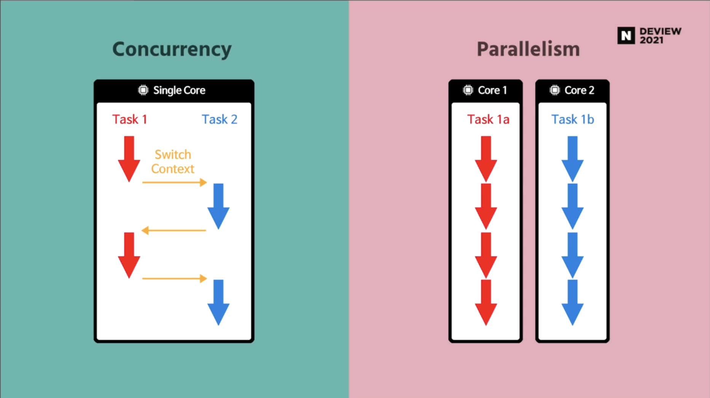
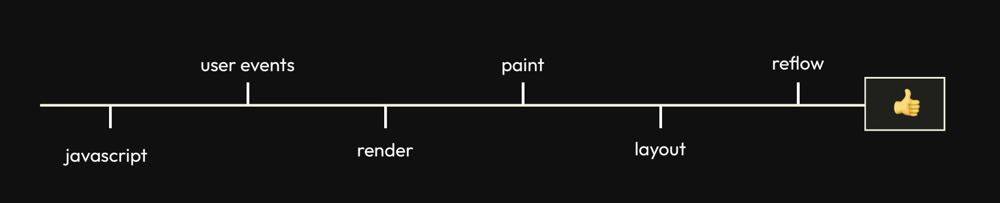
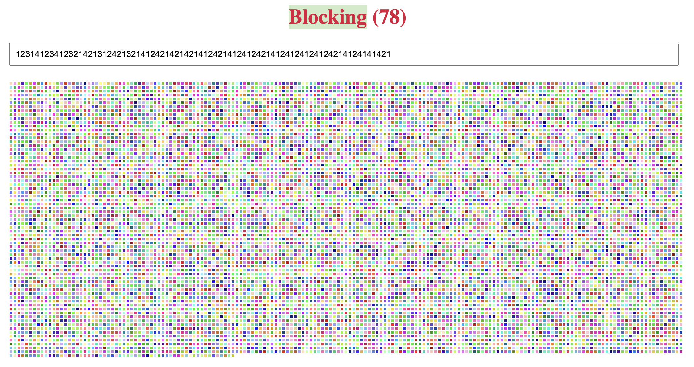
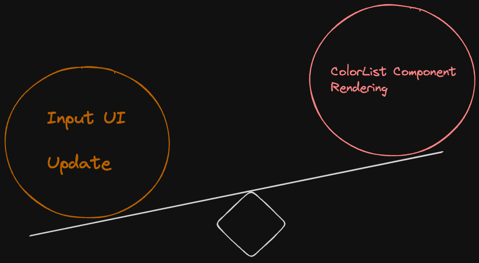
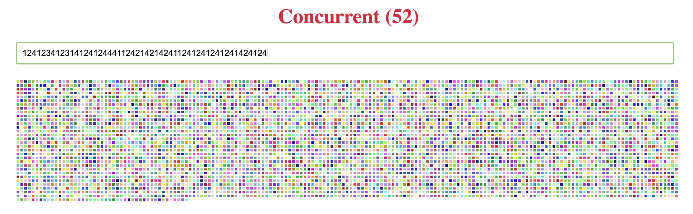

## 🪄 동시성 렌더링?

리액트 18 버젼이 등장하면서, 동시성 기능을 지원하는 여러 훅들이 나왔다.

리액트 공식문서에서는 다음과 같이 말한다.

> _React 18 adds the long-awaited concurrent renderer and updates to Suspense without any major breaking changes. Apps can upgrade to React 18 and begin gradually adopting concurrent features with the amount of effort on par with any other major release._
>
> _This means there is no concurrent mode, only concurrent features._
>
> _React 18은 오랫동안 기다려온 동시 renderer를 추가하고 Suspense를 큰 변경 없이 업데이트했다. 앱을 React 18로 업그레이드하여 다른 주요 출시와 동등한 수준의 노력으로 동시 기능을 점진적으로 도입할 수 있게 되었다. 이는 동시 모드가 없고 동시 기능만 있음을 의미한다._

앱의 전체를 동시성 모드로 결정하고 개발을 해가는 것이 아닌 리액트가 제공해주는 동시성 기능을 가지는 API들 즉, `useTransition`, `useDeferredValue` 훅을 사용해서 앱에 부분적으로 동시성 기능을 사용할 수 있게 되었다는 것을 의미한다.

```tsx
const root = ReactDOM.createRoot(document.getElementById("root") as HTMLElement)
```

조금 만 더 자세하게 들어가 보자면, 리액트 18 버젼부터 `createRoot` 함수를 통해서 전체 컴포넌트 트리를 만들게 되면 **내부적으로 concurrent mode 가 실행된다.** 하지만 concurrent mode 가 실행된다고 해서, 무조건 모든 렌더링에 동시성이 적용되는 것이 아니라 **concurrent features 를 사용하는 경우에만** 부분적으로 동시성 렌더링이 적용된다는 것이다.

(concurrent features 는 `useTransition`, `useDeferredValue` 훅이나 `Suspense`, `streaming SSR` 등을 말한다.)

리액트가 말하는 동시성에 대해서 알아보기 전, 컴퓨터 과학에서 말하는 동시성을 병렬성과 비교해 보면서 알아보자.

## concurrency(동시성)

컴퓨터 과학에서 동시성이란, 독립적으로 실행되는 프로세스들의 조합을 말한다.  
반면, 동시성과 헷갈리기 쉬운 개념인 병렬성은 연관된 복수의 연산들을 동시에 실행하는 것이다.
동시성은 여러 일을 한꺼번에 다루는 문제에 관한 것이고, 병렬성은 여러 일을 한꺼번에 실행하는 방법에 관한 것이다.

도서관 사서 예시를 통해서 동시성과 병렬성을 좀 더 이해해보자. 😊

1. 동시성

동시성은, 도서관 사서가 책을 정리하고 있었는데 꼬마 아이가 어떤 책의 위치를 질문하는 상황을 떠올려보면 조금 더 쉽게 이해할 수 있다.


사서는 책을 정리하고 있다가(`task 1`), 꼬마 아이의 질문에 답을 해줘야 한다. (`task 2`)

즉, 도서관 사서는 책을 정리하는 논리적 흐름과 질문에 답을 해주는 논리적 흐름을 둘 다 가지게 되며 **사서 한 명이 두 가지 논리적 흐름을 동시에 실행하는 것 처럼 보인다.**

2. 병렬성


반면, 병렬성은 도서관 사서가 두 명인 경우를 떠올려보면 쉽게 이해할 수 있다. 한 명은 책을 정리하며(`task 1`), 다른 한 명이 꼬마 아이의 질문에 답을 해준다. (`task 2`)  
각 사서들은 하나의 논리적 흐름을 가지며, **한 명씩 스스로가 수행해야 하는 논리적 흐름을 독립적으로 수행한다.**

다음 이미지를 통해서 한 번 더 정리해 보자.



- 이미지 출처 : https://tv.naver.com/v/23652451

위 그림에서도 확인할 수 있는 동시성과 병렬성의 차이는 다음과 같다.  
동시성은 최소 두개의 논리적 흐름(task)가 존재한다. 동시성은 싱글 코어(단일 CPU) 에서도 동작하며, 병렬성은 멀티 코어(다중 CPU) 에서 동작한다.

정리해 보자면, 동시성이란 두 개 이상의 작업을 잘게 나누고 우선순위에 따라서 작업 전환을 빠르게 함으로서 여러개의 작업들이 마치 동시에 실행되는 것 처럼 보이게 프로그램을 구조화 하는 방법이다.

## 리액트에서 동시성(concurrency)

리액트 공식문서에서는 동시성에 대해서 다음과 같이 설명한다.

> _Concurrency is not a feature, per se. It’s a new behind-the-scenes mechanism that enables React to prepare multiple versions of your UI at the same time._
>
> _Concurrency 자체는 기능이 아니다. React가 동시에 여러 버전의 UI를 준비할 수 있게 해주는 새로운 비하인드 메커니즘이다._

> _A key property of Concurrent React is that rendering is interruptible. When you first upgrade to React 18, before adding any concurrent features, updates are rendered the same as in previous versions of React — in a single, uninterrupted, synchronous transaction. With synchronous rendering, once an update starts rendering, nothing can interrupt it until the user can see the result on screen._
>
> _Concurrent React의 핵심은 렌더링 작업이 중단 가능하다는 것이다. React 18로 처음 업그레이드할 때 concurrent 기능을 추가하기 전 업데이트는 이전 버전의 React와 동일하게 중단되지 않는 단일 동기식 트랜잭션으로 렌더링 되었다. 동기식 렌더링의 경우 한 번 렌더링이 시작되면, 사용자가 화면에서 결과를 볼 수 있을 때까지 그 어떤 것도 렌더링을 방해할 수 없었다._

> _In a concurrent render, this is not always the case. React may start rendering an update, pause in the middle, then continue later. It may even abandon an in-progress render altogether. React guarantees that the UI will appear consistent even if a render is interrupted._
> …  
> _With this capability, React can prepare new screens in the background without blocking the main thread. This means the UI can respond immediately to user input even if it’s in the middle of a large rendering task, creating a fluid user experience._

> _Concurrent 렌더링에서는 항상 그렇지는 않다. React는 업데이트된 렌더링을 시작하고 중간에 일시 중지했다가 나중에 계속할 수 있다. 심지어 진행 중인 렌더링을 완전히 중단할 수도 있다. React는 렌더링이 중단되더라도 UI가 일관되게 표시되도록 보장한다._
>
> _이 기능을 통해 React는 메인 스레드를 차단하지 않고 백그라운드에서 새 화면을 준비할 수 있다. 즉, UI가 대규모 렌더링 작업 중에도 사용자 입력에 즉시 반응하여 유동적인 사용자 경험을 제공할 수 있다._

공식문서의 내용을 정리해 보자면, 리액트가 말하는 동시성 렌더링이란,

- 동시성 개념을 활용해서 한 번 시작하면 멈출 수 없었던 렌더링 작업을 멈추거나,
- 우선순위를 정해서 더 우선순위가 높은 렌더링 작업을 수행해 여러 버젼의 UI를 만들고,
- 그 중 사용자 입력과 같은 인터렉션에 **가장 빠르게 반응할 수 있는 UI를 선택**하는 것을 말한다.

동시성 렌더링의 핵심은 여러 작업을 동시에 실행하는 것 처럼 보이게 해서 **사용자 경험을 향상시키는 것이다.**(핵심은 사용자 경험!)

그렇다면, 어떤 상황에서 동시성 개념이 필요하게 될까? 🤔

## 💭 Blocking Rendering

브라우저의 메인 스레드는 **싱글 스레드라서 한 번에 하나의 작업만 처리**할 수 있다.



즉 HTML을 파싱, Javascript 파일을 다운로드 하고 실행, 사용자의 행동으로 발생하는 이벤트를 처리, 리페인트, 리플로우 등을 모두 단일 메인 스레드에서 처리한다.그리고, 메인 스레드에서 어떤 작업이 실행되면 그 작업이 끝날 때까지 멈출 수 없었다.

이를 **Blocking Rendering** 이라고 한다.

리액트에서의 렌더링 즉, 화면을 그리는 작업, 재귀적으로 컴포넌트를 렌더링해서 이전 렌더링과 비교해 다르게 보여야 하는 UI를 파악하고(render phase) 그 결과를 브라우저에 커밋해(commit phase) 실제 사용자의 눈에 보이는 작업이 한 번 시작되면 멈출 수 없는 작업이었다.

보통의 상황에서는 한 번 시작되면 멈출 수 없는 리액트의 렌더링 작업이 사용자 경험에 큰 영향을 주지 않는다. 리액트의 변경 비교 알고리즘이 매우 빠르기 때문이다.

하지만, 다음과 같은 특수한 상황을 생각해보자.

```tsx
import React, { useState } from "react"

function App() {
  const [text, setText] = useState("")

  return (
    <div className="container">
      <h1>Blocking ({text.length})</h1>
      <input
        type="text"
        value={text}
        maxLength={100}
        onChange={({ target }) => {
          setText(target.value)
        }}
      />
      <ColorList length={text.length} />
    </div>
  )
}
```



- 출처 : https://ajaxlab.github.io/deview2021/blocking/

input 에 입력을 할 때마다, App 컴포넌트가 렌더링 되며 ColorList 또한 렌더링 된다. 여기서, **ColorList는 무거운 연산을 수행**하고 있기 때문에 사용자가 입력한 텍스트가 UI에 바로 반영되지 않아 좋지 못한 사용자 경험을 제공할 수 있다.

`concurrent features`을 사용하지 않는 리액트에서 렌더링은 한 번 시작하면 멈출 수 없는 작업이여서, 사용자가 입력한 텍스트를 UI에 반영해줘야 하는 사용자 경험 기준 높은 우선순위 작업이 ColorList 컴포넌트 렌더링에 의해 밀리게 된다.

이 문제를 리액트 18 버젼부터 사용할 수 있는 concurrent features 를 사용해서 해결할 수 있다.

사용자가 발생시키는 특정 이벤트에 더 빠르게 반응할 수 있는 UI를 우선시하고, 현재 렌더링 작업을 일시적으로 중단할 수 있도록 할 수 있다.

즉, 더 빠르게 반응해야 하는 작업(input UI 표시)이 실행되면, 현재 렌더링(ColorList 렌더링)을 일시 중단하고 우선 작업을 먼저 처리한다.

이제 어떤 concurrent features가 있는지 알아보자.

## ✨ useTransition

공식문서에서 useTransition 훅을 다음과 같이 설명한다.

> _useTransition is a React Hook that lets you update the state without blocking the UI._
>
> _useTransition은 UI를 차단하지 않고 상태를 업데이트할 수 있는 리액트 훅이다._

여기서 UI를 차단하지 않는다는 것은, 사용자의 인터렉션을 즉각적으로 UI에 반영해야 할 때 이전 하고 있던 무거운 렌더링 작업이 다음 UI 렌더링을 차단하지 않아야 한다는 뜻이다. 렌더링 작업이 언제 수행되고 있든, 더 급한 상태 업데이트로 인해서 중단될 수 있음을 의미한다.

```tsx
const [isPending, startTransition] = useTransition()
```

`useTransition` 훅에서 제공하는 `startTransition` 함수를 사용하여 상태 업데이트가 긴급하지 않다는 것을 표시할 수 있다. 빠른 UI 업데이트, 반응을 방해할 수 있는 상태 업데이트가 긴급하지 않다는 것을 상태 업데이트를 “트랜지션”으로 표시해서 리액트에게 알려 의도적으로 우선순위를 조정할 수 있다.

(a 상태 업데이트? 급하지 않습니다! 해당 상태 업데이트보다 더 중요한 작업이 있다면 그것부터 해주세요~ 와 같은 요청)

즉, 상태 업데이트가 동시성 기능을 사용하지 않고 동기적으로 렌더링 될 경우 잠재적으로 사용자의 경험에 나쁜 영향을 미칠 수 있다고 리액트에게 알리는 것이다.



위 `Input` , `ColorList` 컴포넌트 예시를 다시 생각해보면 사용자가 현재 어떤 값을 입력해 줬는지를 UI에 표시해주는 작업이 더 우선순위가 높은 작업이라고 할 수 있다.
`startTransition API`를 사용해서 상태 업데이트를 긴급하지 않은 것으로 간주해서 무거운 렌더링 작업인 **ColorList 컴포넌트 렌더링 작업을 뒤로 미뤄보자.**

```tsx
import React, { useState, useTransition } from "react"

function TextInput({ onChange }) {
  const [text, setText] = useState("")
  return (
    <input
      type="text"
      value={text}
      onChange={({ target }) => {
        setText(target.value)
        onChange(target.value)
      }}
    />
  )
}

function App() {
  const [size, setSize] = useState(0)
  const [isPending, startTransition] = useTransition()

  function handleChange(text) {
    startTransition(() => {
      setSize(text.length)
    })
  }

  return (
    <div className="container">
      <h1>Concurrent ({size})</h1>
      <TextInput onChange={handleChange} />
      <div className={isPending ? "pending" : ""}>
        <ColorList length={size} />
      </div>
    </div>
  )
}

export default App
```



`ColorList` 컴포넌트가 props로 받는 size 상태를 따로 분리하고 해당 상태 업데이트가 우선순위가 낮은 상태 업데이트라는 것을 리액트에게 알린다.

> _React can prepare new screens in the background without blocking the main thread._
>
> _React는 메인 스레드를 차단하지 않고 백그라운드에서 새 화면을 준비할 수 있다._
>
> 출처 : 리액트 공식문서

리액트는 이제 `size` 상태 업데이트가 무거운 렌더링을 유발하는 것임을 알기 때문에, 업데이트를 즉시 반영하는 대신 백그라운드에서 새로운 상태를 준비하면서 현재의 UI를 인터랙티브하게 유지한다.

`useTransition` 훅이 제공하는 isPending 불리언 값을 사용해서 긴급하지 않은 상태 업데이트의 진행 상태를 알 수 있고, 이를 사용해 사용자에게 loading feedback 또한 제공할 수 있게 된다.

```jsx
<div className={isPending ? "pending" : ""}>
  {isPending && <h1>loading...</h1>}
  <ColorList length={size} />
</div>
```

## ✨ useDeferredValue

공식문서에서 `useDeferredValue` 훅을 다음과 같이 설명한다.

> _useDeferredValue is a React Hook that lets you defer updating a part of the UI._
>
> _useDeferredValue는 UI 일부 업데이트를 지연시킬 수 있는 React Hook이다._

`useTransition` 훅이 제공하는 `startTransition` 은 상태를 업데이트하는 함수를 래핑해서 해당 작업의 우선순위가 낮다는 것을 리액트에게 알리지만, `useDeferredValue` 훅은 인자로 들어오는 값 업데이트의 우선순위가 낮다는 것을 알린다.

```tsx
const deferredValue = useDeferredValue(value)
```

만약 값의 변경으로 인해서 무거운 렌더링 작업이 수행된다면, 해당 훅으로 감싼 후 무거운 렌더링을 지연시킬 수 있게 된다.

이번에는 위 예시를 useDeferredValue 훅을 사용해서 개선해보자.

```tsx
import React, { useState, useDeferredValue } from "react"

function TextInput({ onChange }) {
  const [text, setText] = useState("")
  return (
    <input
      type="text"
      value={text}
      onChange={({ target }) => {
        setText(target.value)
        onChange(target.value)
      }}
    />
  )
}

function App() {
  const [size, setSize] = useState(0)
  const deferredSize = useDeferredValue(size)

  function handleChange(text) {
    setSize(text.length)
  }

  return (
    <div className="container">
      <h1>Concurrent ({size})</h1>
      <TextInput onChange={handleChange} />
      <div className={deferredSize !== size ? "pending" : ""}>
        <ColorList length={deferredSize} />
      </div>
    </div>
  )
}

export default App
```

무거운 렌더링을 유발하는 값인 `size` 업데이트의 우선순위를 낮춰서 UI를 인터랙티브하게 유지될 수 있게 한다.

(결과는 useTransition과 같다.)

useDeferredValue 훅은 지연해야 하는 값 업데이트 직접 제어할 수 없고, props로 전달받을 때 유용하게 사용할 수 있다.

```tsx
function SomeComponent({ value }) {
  const deferredValue = useDeferredValue(size)

  // heavy work using deferredValue

  return <JSX />
}
```

## 🧚 정리

- 리액트는 동시성 기능을 도입해서, 시작하면 멈출 수 없었던 렌더링 과정을 일시 중지했다가 나중에 다시 시작하거나 중단할 수 있게 되었다. 이는 무거운 렌더링 작업이 진행되고 있더라도 사용자 입력과 같은 더 빠른 반응을 해야 하는 상황에 대해 UI가 즉각적으로 반응해 사용자 경험을 향상시킬 수 있게 되었다는 것을 의미한다.

- 리액트는 앱 전체 동시성 모드는 존재하지 않고, concurrent features 를 통해 부분적으로 동시성 기능을 활용할 수 있으며, 어떤 상황에 어디에 적용할지는 개발자인 우리가 결정해야 한다.

- 상태를 업데이트 하는 작업(size 상태 업데이트), 렌더링 작업(<ColorList /> 컴포넌트 렌더링)을 잘게 나누고 우선순위를 정한 후 빠른 Context Switching을 통해서 마치 두 작업이 동시에 실행되는 것 처럼 보이게 한다.

- useTransition 훅은 ‘특정 상태 업데이트’를 지연시켜서 무거운 렌더링 작업을 뒤로 미룰 수 있도록 한다.

- useDeferredValue 훅은 ‘값’ 업데이트를 지연시켜서 무거운 렌더링 작업을 뒤로 미룰 수 있도록 한다.

- ✨ 리액트 동시성 렌더링의 핵심은 사용자 경험 향상이다!

## 🔗 Ref

- https://velog.io/@jay/Concurrent-React

- https://velog.io/@sehyunny/how-react-18-improves-app-perf

- https://tecoble.techcourse.co.kr/post/2023-07-09-concurrent_rendering/

- https://tv.naver.com/v/23652451

- https://ko.react.dev/blog/2022/03/29/react-v18#what-is-concurrent-react
