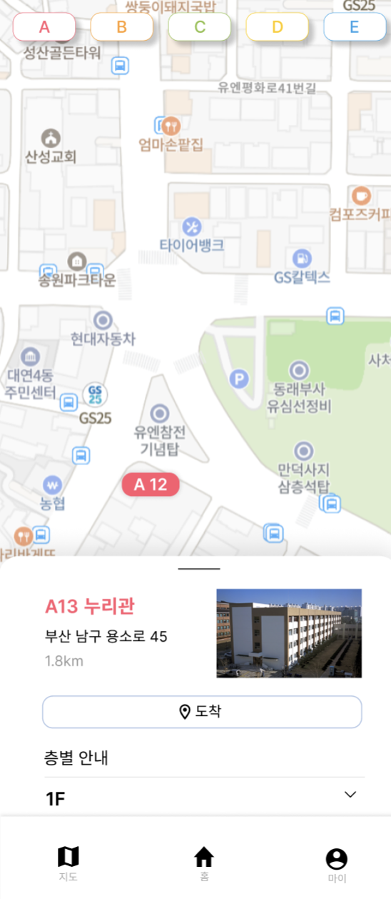

## 서론



현재 프로젝트에서 카카오 지도 API를 활용해서 학교 지도 페이지를 구현 하고 있고, 지도 위 건물 번호(카카오 지도가 제공하는 커스텀 오버레이)를 클릭하면 해당 건물에 대한 정보를 보여주는 컴포넌트를 추가로 구현 중에 있었다. 커스텀 오버레이에 `onClick` 이벤트 프로퍼티를 추가해줘도 되지만,

```tsx
interface ICustomOverlay {
  handleOverlays(buildingTypes: Record<BuildingType, boolean>, map: any): void;
  addOverlay(
    buildingType: BuildingType,
    building: PKNUBuilding,
    map: any,
  ): void;
}

class CustomOverlay implements ICustomOverlay {
  private overlays: Record<BuildingType, any[]>;

  constructor() {
    this.overlays = {
      A: [],
      B: [],
      C: [],
      D: [],
      E: [],
    };
  }

  private createOverlayContent(
    activeColor: CSSProperties['color'],
    building: PKNUBuilding,
  ) {
    const content = document.createElement('span') as HTMLSpanElement;

    //...add style

    const buildingNumberText = document.createTextNode(building.buildingNumber);
    content.appendChild(buildingNumberText);
    content.onclick = () => //... mount building info component

    return content;
  }

  //...
```

지도 위 건물 번호의 렌더링 로직을 클래스로 구현 했고, 해당 클래스에 리액트 상태 훅인 `useState` 훅을 주입해서 구현하는 것 보다 document에 클릭 이벤트를 추가해서 어떤 건물 번호를 클릭했는지 알아내는 것이 더 낫다고 생각해 해당 방법으로 구현하기로 했다.

## 문제

```tsx
const BuildingInfoToggle = () => {
  const [buildingNumber, setBuildingNumber] = useState<string>("")

  const unmountInfo = () => setBuildingNumber("")
  const isInfoMounted = buildingNumber !== ""

  useEffect(() => {
    const getNumber = (e: MouseEvent | TouchEvent) => {
      console.log("building number : ", buildingNumber) // always empty string
      if (!(e.target instanceof HTMLSpanElement) || isInfoMounted) return

      setBuildingNumber(e.target.innerText)
    }

    document.addEventListener(eventType, getNumber)
    // eventType : 'touchstart' or 'click'

    return () => {
      document.removeEventListener(eventType, getNumber)
    }
  }, [])

  return isInfoMounted ? (
    <BuildingInfo buildingNumber={buildingNumber} unmountInfo={unmountInfo} />
  ) : null
}
```

위 로직은, document에 클릭 이벤트가 발생할 때마다 지도 위 건물 번호를 클릭한 것인지 확인하고 만약 그렇다면 `setBuildingNumber`를 호출해서 상태를 변경한다. 그리고 건물 정보 컴포넌트가 렌더링 될 때 해당 컴포넌트에서 span을 사용하는 JSX가 있는 경우 `buildingNumber`의 상태가 변경되면 안되므로 `isInfoMounted` 불리언 변수를 사용해 이미 건물 정보 컴포넌트가 렌더링 된 상태라면 `setBuildingNumber`를 호출하지 않도록 early return 패턴을 적용했다.

하지만, 건물 정보 컴포넌트 위의 **span을 클릭할 때 buildingNumber의 상태가 계속해서 변경되는 문제가 발생했다.** 즉, 적용하려고 했던 early return 패턴이 적용되지 않은 것이다.

## 원인 파악

리액트의 useEffect 훅은 의존성 배열이 비어있다면 해당 컴포넌트가 렌더링 될 때 한번만 실행되며 상태 변화로 인해 컴포넌트가 재호출 되어 리렌더링 되더라도 다시 실행되지 않는다. 만약, 의존성 배열에 어떠한 요소가 있다면 해당 요소가 변할 때마다 useEffect 훅의 첫 번째 인자인 콜백 함수가 실행되며 해당 콜백 함수가 실행되기 전

```js
return () => {}
```

해당 함수가 실행된다.

이 내용에 대해서 알고 있었지만, 막상 개발을 진행 할 때는 의존성 배열이 비어 있어도 `buildingNumber`의 상태가 변하면 `getNumber` 함수 내부에서 변경된 상태를 참조할 수 있을 것이라고 생각했다.

자바스크립트에서 함수가 선언될 때, 주위의 환경을 기억한다. 실행되기 전 평가될 때의 렉시컬 환경을 기억한다.

```tsx
const BuildingInfoToggle = () => {
  const [buildingNumber, setBuildingNumber] = useState<string>("")

  useEffect(() => {
    const getNumber = (e: MouseEvent | TouchEvent) => {
      console.log("building number : ", buildingNumber) // always empty string
      if (!(e.target instanceof HTMLSpanElement) || isInfoMounted) return

      setBuildingNumber(e.target.innerText)
    }

    //...
  }, [])

  //...
}
```

`BuildingInfoToggle` 컴포넌트가 제일 처음 렌더링 될 때, `buildingNumber`의 메모리 주소가 만약 100이라면 `getNumber` 함수 내부에서 참조하고 있는 `buildingNumber`의 메모리 주소도 100이 된다. 지도 위 건물 번호를 클릭해 상태가 변경되면 불변성을 유지하기 위해 메모리 주소도 변경 된다.

하지만, useEffect의 첫 번째 콜백 함수는 의존성 배열이 비어있어 다시 실행되지 않고 따라서 getNumber 함수도 다시 선언되지 않아 메모리 주소가 100인 즉, 빈 문자열인 buildingNumber을 계속해서 참조하게 된다. **따라서 isInfoMounted는 항상 false가 되어 early return 패턴이 적용되지 않았던 것이다.**

그렇다면 useEffect 훅 밖에 getNumber 함수를 선언하면 상태가 변할 때마다 함수를 다시 선언하니 변경된 메모리 주소를 참조해서 문제를 해결할 수 있지 않을까? 라는 생각을 했었다.
즉,

```tsx
const BuildingInfoToggle = () => {
  const [buildingNumber, setBuildingNumber] = useState<string>("")

  const getNumber = (e: MouseEvent | TouchEvent) => {
    if (!(e.target instanceof HTMLSpanElement) || isInfoMounted) return

    setBuildingNumber(e.target.innerText)
  }

  useEffect(() => {
    document.addEventListener(eventType, getNumber)

    return () => {
      document.removeEventListener(eventType, getNumber)
    }
  }, [buildingNumber])

  //...
}
```

위와 같이 밖에 선언하면 변경된 상태를 참조할 수 있을 것이라 생각 했지만, useEffect훅의 첫 번째 콜백 함수 자체가 다시 실행되지 않기 때문에 컴포넌트가 제일 처음 렌더링 됐을 때의 getNumber 함수를 호출하고 해당 함수 내부에서는 buildingNumber 의 상태가 항상 빈 문자열이기 때문에 문제를 해결할 수 없었다.

## 해결

이 문제를 해결하기 위해서 **의존성 배열에 buildingNumber 를 추가**해줘야 했다.

```tsx
const BuildingInfoToggle = () => {
  const [buildingNumber, setBuildingNumber] = useState<string>("")

  useEffect(() => {
    const getNumber = (e: MouseEvent | TouchEvent) => {
      if (!(e.target instanceof HTMLSpanElement) || isInfoMounted) return

      setBuildingNumber(e.target.innerText)
    }

    document.addEventListener(eventType, getNumber)

    return () => {
      document.removeEventListener(eventType, getNumber)
    }
  }, [buildingNumber])

  //...
}
```

이제 **buildingNumber가 변경될 때마다 useEffect의 콜백 함수가 다시 실행되어 변경된 메모리 주소를 제대로 참조**할 수 있게 되었고 따라서, early return 패턴도 잘 적용되어 건물 정보 컴포넌트가 렌더링 될 때 예상치 못하게 상태가 변경되는 문제를 해결할 수 있게 되었다. 😊
