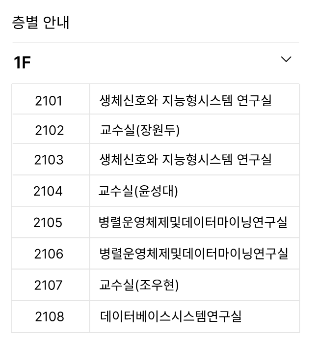

## 서론

현재 진행중인 프로젝트에서 정보를 보여줄 때, 토글 기능을 사용해서 보여주는 경우가 2가지가 있었다.

- 지도 페이지에서 건물 정보를 보여주는 경우
- FAQ 페이지에서 질문에 대한 응답을 보여주는 경우




이 2가지 경우에 대해서 각각 독립된 다른 컴포넌트를 만들기 보다 **재활용 할 수 있는 컴포넌트를 만들 수 있는 방법에 대해서 고민**하다 `render-props` 패턴을 적용해 보기로 했다. 리액트의 특별한 props인 `children` props를 사용해도 되지만, 다양한 패턴들을 경험해 보고자 적용해 보기로 했다!

## render-props?

render-props는 리액트에서 사용되는 패턴 중 하나로, 부모 컴포넌트에서 자식 컴포넌트로 props를 넘겨 줄 때 JSX를 반환하는 함수를 props로 넘겨주는 패턴을 말한다. props를 받는 컴포넌트에서는 호출함으로써 렌더링한다. 패턴의 이름이 render-props일 뿐이지 props의 이름이 꼭 render여야 할 필요는 없다.

```jsx
;<Title render={() => <h1>I am a render prop!</h1>} />

const Title = props => props.render()
```

render-props는 props를 받는 컴포넌트를 재사용하기 좋다는 장점을 가진다. 위의 Title 컴포넌트는 단순히 전달 받은 함수를 호출함으로써 렌더링 하지만, Title 컴포넌트 내부에서 가진 상태 또는 데이터를 인자로 전달하는 것도 가능하다.

```tsx
function Title(props) {
  const someData = { ... }

  return props.render(someData)
}
```

## 활용하기

위 서론에서, 토글 기능을 통해서 정보를 보여주는 재사용할 수 있는 컴포넌트를 만들고자 했다. 이미지에서도 확인할 수 있듯이 두 UI는 모두 다르다. 이 때, render-props를 활용해서 스타일이 정해진 JSX를 반환하는 함수를 주입하고 컴포넌트를 유연하게 재사용해볼 수 있다.

### ToggleInfo

```tsx
interface ToggleInfoProps {
  infoTitle: () => JSX.Element
  infoDesc: () => JSX.Element
}

const ToggleInfo = ({ infoTitle, infoDesc }: ToggleInfoProps) => {
  const [showInfo, setShowInfo] = useState<boolean>(false)
  const toggleInfo = () => setShowInfo(prevState => !prevState)

  return (
    <>
      <ToggleContainer showInfo={showInfo} onClick={toggleInfo}>
        {infoTitle()}
        <IconContainer>
          <Icon kind="arrowDown" size="24" />
        </IconContainer>
      </ToggleContainer>
      {showInfo && infoDesc()}
    </>
  )
}
```

ToggleInfo 컴포넌트는 JSX를 반환하는 2개의 함수를 props로 받아서 showInfo 상태일 때만 infoDesc 함수를 호출한다. infoDesc 함수를 호출할지 말지에 대한 여부는 ToggleInfo 컴포넌트의 내부 상태인 showInfo에 의해서 결정된다. Title 컴포넌트 예시에서 컴포넌트 내부의 상태나 데이터를 전달해서 호출하는 것도 가능하다고 했었는데 ToggleInfo의 경우 showInfo 상태를 통해서 조건부 렌더링에 활용하고 있다.

### 지도 페이지에 사용하기

```tsx
<ToggleInfo
  infoTitle={() => (
    <FloorText>
      {formatFloorTitle(floorType as Floor, floor)}
    </FloorText>
  )}
  infoDesc={() => (
    <RoomInfoContainer key={index}>
      {(infoContent[floor] as Room[]).map(
        ({ roomNumber, roomName }, dataIndex) => (
          <RoomInfo key={dataIndex}>
            <RoomNumber>{roomNumber}</RoomNumber>
            <Seperator />
            <RoomName>{roomName}</RoomName>
          </RoomInfo>
        ),
      )}
    </RoomInfoContainer>
)}
```

지도 페이지에서는 건물의 층을 클릭하면 각 층에 있는 강의실 정보를 보여준다. 이 때, 스타일이 결정 된 JSX를 반환하는 함수를 컴포넌트를 호출부에서 주입한다.

### FAQ 페이지에 사용하기

```tsx
<ToggleInfo
  infoTitle={() => (
    <>
      <span
        css={css`
          font-weight: bold;
        `}
      >
        {FAQ_CONSTANTS.QUESTION_MARK}
      </span>
      <QuestionText>{question}</QuestionText>
    </>
  )}
  infoDesc={() => (
    <AnswerContainer>
      {answer.text}
      {hasLink && (
        <StyledLink onClick={moveToLink}>{FAQ_CONSTANTS.LINK}</StyledLink>
      )}
    </AnswerContainer>
  )}
/>
```

FAQ 페이지에서는 사용자들이 자주 할법한 질문을 클릭하면 해당 질문에 대한 답을 보여준다.

## 사용 후기

### 1. 관심사의 분리

ToggleInfo 컴포넌트 내부에서는 showInfo의 상태만 관리하고 상태에 따라서 조건부 렌더링에 대한 책임만 가진다. 반면, 호출부에서는 ToggleInfo 내부에서 어떤 상태가 있고 해당 상태를 어떻게 관리하는지에 대해서 알 필요 없이 UI 2개만 넘겨주면 된다.

### 2. 유연한 스타일 적용

지도 페이지, FAQ 페이지에서 사용하는 UI가 달랐다.

```tsx
const InfoInMap = ({ infoTitle, infoDesc }: ToggleInfoProps) => {
  const [showInfo, setShowInfo] = useState<boolean>(false);
  const toggleInfo = () => setShowInfo((prevState) => !prevState);

  return (
    <>
      <ToggleContainer showInfo={showInfo} onClick={toggleInfo}>
        // styled title UI in map
        <IconContainer>
          <Icon kind="arrowDown" size="24" />
        </IconContainer>
      </ToggleContainer>
      {showInfo && // styled desc UI in map}
    </>
  );
};
```

```tsx
const InfoInFAQ = ({ infoTitle, infoDesc }: ToggleInfoProps) => {
  const [showInfo, setShowInfo] = useState<boolean>(false);
  const toggleInfo = () => setShowInfo((prevState) => !prevState);

  return (
    <>
      <ToggleContainer showInfo={showInfo} onClick={toggleInfo}>
        // styled title UI in FAQ
        <IconContainer>
          <Icon kind="arrowDown" size="24" />
        </IconContainer>
      </ToggleContainer>
      {showInfo && // styled desc UI in FAQ}
    </>
  );
};

```

위와 같이 2개의 컴포넌트를 만들고 각 페이지에서 해당 컴포넌트를 호출해서 사용할 수 있겠지만, 두 컴포넌트 모두

- 정보를 보여줄지 말지 결정하는 상태(showInfo)
- 정보를 보여주는 상태일 때 화살표 애니메이션

이 두 부분이 동일하기 때문에 충분히 재사용할 수 있게 만들어볼 수 있었고 render-props를 활용해서 유연하게 스타일을 적용해볼 수 있었다.

### 깊어지는 depth

```tsx
<ToggleInfo
  infoTitle={() => (
    <FloorText>
      {formatFloorTitle(floorType as Floor, floor)}
    </FloorText>
  )}
  infoDesc={() => (
    <RoomInfoContainer key={index}>
      {(infoContent[floor] as Room[]).map(
        ({ roomNumber, roomName }, dataIndex) => (
          <RoomInfo key={dataIndex}>
            <RoomNumber>{roomNumber}</RoomNumber>
            <Seperator />
            <RoomName>{roomName}</RoomName>
          </RoomInfo>
        ),
      )}
    </RoomInfoContainer>
)};
```

지도 페이지에서 사용한 부분에서 느낄 수 있겠지만, JSX를 반환하는 함수를 props로 전달할 때 해당 JSX가 복잡한 UI를 다루고 있다면 위 처럼 코드의 depth가 굉장히 깊어져 가독성이 떨어진다는 느낌도 받았다.
