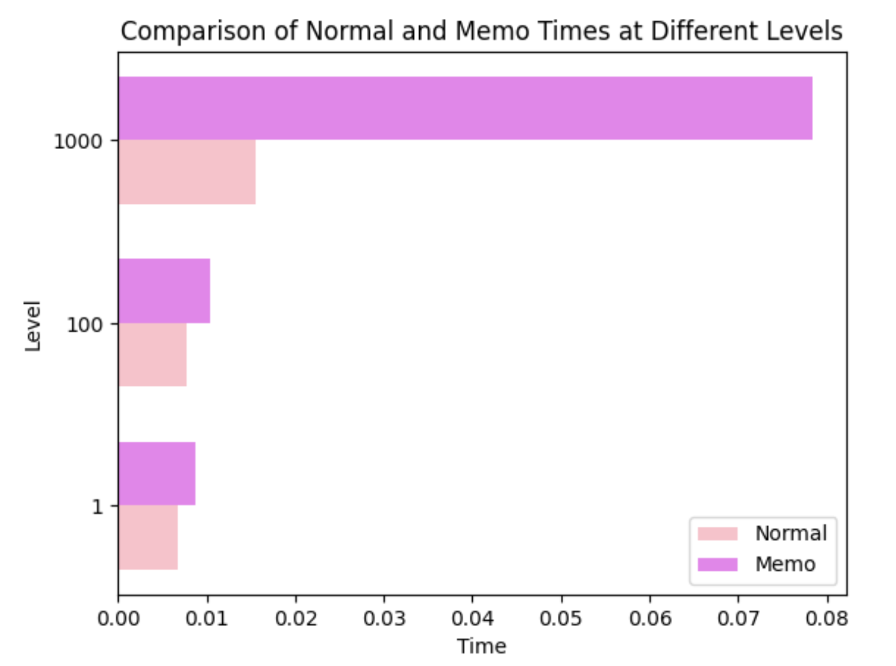
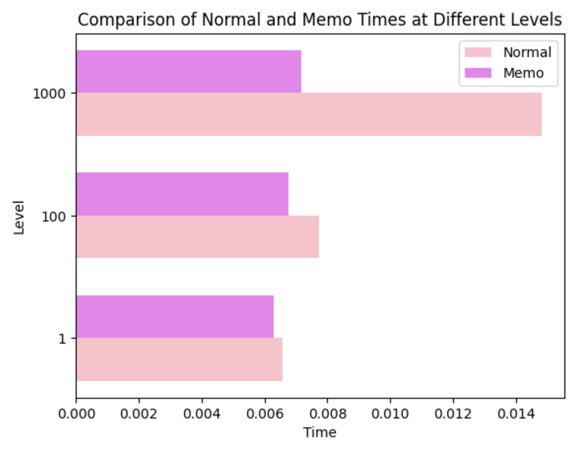

## 서론

```tsx
const AnnounceContainer = ({
title,
category,
endPoint,
}: AnnounceContainerProps) => {
  const { type } = useParams();
  if (!type) return <></>;

  const { routerTo } = useRouter();

  const showNormalAnnouncement = () => routerTo(PATH.NORMAL_ANNOUNCEMENT(category));
  const showPinnedAnnouncement = () => routerTo(PATH.PINNED_ANNOUNCEMENT(category));

  const resource = fetchAnnounceList<AnnounceItemList>(endPoint)

  return (
  //...
  <Suspense fallback={<AnnounceCardSkeleton length={30} />}>
    <AnnounceList resource={resource} type={type as AnnouncementType} />
  </Suspense>
  //...
)
```

프로젝트를 진행 하면서 공지사항을 보여주는 컴포넌트를 구현하는 작업을 맡았다. 공지사항은 다시 일반, 고정 공지사항으로 나눠서 보여줘야 해서 url을 통해서 보여 줄 공지사항을 구분하기로 했다.

- 일반 : `announcement/school/normal`
- 고정 : `announcement/school/pinned`

그리고 리액트의 Suspense를 활용해서 공지사항을 가져올 때 까지 Skeleton을 보여주는 방식으로 구현했다. 여기서, normal, pinned가 변경될 때마다 AnnounceContainer 컴포넌트가 리렌더링 되었으며 따라서 공지사항 데이터를 가져오기 위한 api 호출도 매번 발생했다. (`React-Query` 라이브러리를 활용하지 않기에 별도의 캐싱 기능을 활용할 수 없는 상황이었다.)  
공지사항 페이지를 처음 방문할 때 데이터를 한번만 가져오면 되는데 url이 변경될 때마다 똑같은 데이터를 가져오기 위해서 불필요한 api 호출을 할 필요는 없다고 생각했다.  
useEffect, useState 훅을 사용해서 해결할 수 있지만 이 방법은 제일 처음 공지사항 페이지를 방문할 때 컴포넌트가 두 번 렌더링 되며, 클라이언트와 서버의 상태를 분리하기 위해서 Suspense를 사용한 것이므로 useState를 사용하면 Suspense를 사용한 의미가 없어진다고 판단했다.  
따라서, 이번에는 의존성 배열의 원소가 변경되지 않는 한 함수의 계산 결과를 캐싱하는 useMemo 훅을 사용해서 api 호출 결과를 캐싱해보기로 했다.

```tsx
const resource = useMemo(
  () => fetchAnnounceList<AnnounceItemList>(endPoint),
  []
)
```

이제 일반, 공지사항으로 url이 변경될 때마다 불필요한 api 호출이 발생하지 않았다.
useMemo훅은 성능 최적화를 위해서 주로 사용된다고 하는데, 과연 정말 최적화에 도움이 되는 훅인지에 대해서 궁금해졌다. 지금까지 프로젝트를 진행하면서 useMemo를 처음 써봤는데, 써본김에 궁금증을 해결해보기로 했다.

## 리액트가 제공하는 훅 : useMemo

```tsx
const cachedValue = useMemo(calculateValue, dependencies)
```

컴포넌트가 리렌더링 될 때, dependencies의 값이 변하지 않으면 이전 계산 결과 calculateValue를 재사용할 수 있는 리액트 훅이다.

### useMemo 훅이 유용한 경우

1. useMemo의 계산이 눈에띄게 느리면서 의존성 배열이 거의 변하지 않아 캐싱의 장점이 최대한 드러나는 경우

내가 useMemo훅을 적용한 이유이다.
서버에서 데이터를 가져오는 것이기 때문에 서버의 상태와 사용자 네트워크 환경 상태에 따라서 계산이 느려질 가능성이 충분히 있고, 공지사항 페이지에 처음 방문했을 때 데이터를 가져오면 되기 때문에 캐싱의 장점을 최대한 살릴 수 있을 것이라 판단했다.

2. React.memo로 감싼 컴포넌트에 prop으로 전달하는 경우.

```tsx
const ParentComponent = () => {
  const [count, setCount] = useState<number>(0)
  const addCount = () => setCount(prevCount => prevCount + 1)

  const objExample = {
    name: "woong",
    age: 25,
  }

  return (
    <>
      <ChildComponent name={objExample.name} age={objExample.age} />
      <button onClick={addCount}>ParentComponent Rerender</button>
    </>
  )
}
```

```tsx
const ChildComponent = ({ name, age }: Props) => {
  console.log("ChildComponent rerendered")
  return (
    <div>
      <h1>{name}</h1>
      <h1>{age}</h1>
    </div>
  )
}

export default React.memo(ChildComponent)
```

리액트는 기본적으로 컴포넌트가 리렌더링 되면 해당 컴포넌트의 모든 자식 컴포넌트들을 재귀적으로 리렌더링 한다. 하지만, 자식 컴포넌트의 리렌더링 비용이 큰 경우에 React.memo를 활용해서 이전 렌더링의 props와 비교해 변경되지 않는다면 리렌더링을 건너뛸 수 있다.  
React.memo는 이전 렌더링의 props와 비교할 때 얕은 비교로 비교한다.

```js
const oldProps = {
  a: "1",
  b: "2",
}

const newProps = {
  a: "1",
  b: "2",
}

Object.keys(oldProps).forEach(key => {
  console.log(Object.is(oldProps[key], newProps[key])) // all true
})
```

자바스크립트에서 객체를 비교할 때는 메모리 참조값을 통해서 비교하므로 oldProps, newProps는 다른 객체이다. 이 방법으로 비교하면 React.memo를 활용해도 항상 자식 컴포넌트는 리렌더링 되기 때문에 최적화가 전혀 되지 않는다. 따라서, 얕은 비교를 통해 객체 키의 값(원시 값)들이 같은지 비교한다.

3. 자식 컴포넌트에서 props를 useEffect와 같은 훅의 의존성 배열에 활용하는 경우

useEffect는 의존성 배열의 한 원소라도 변경되면 첫 번째 인자인 콜백 함수를 다시 실행한다. 만약 콜백 함수의 실행이 불필요한 과정이라면 부모 컴포넌트에서 useMemo를 사용해서 props를 전달할 수 있다.

## 정말 최적화에 도움이 되는가?

궁금증을 해결하기 위해서 useMemo를 사용하는 컴포넌트와 그렇지 않은 컴포넌트를 비교해보기로 했다. 비교는

- 제일 첫 번째 렌더링이 얼마나 걸리는가?
- 리렌더링 얼마나 걸리는가?

이 2가지를 통해서 진행 했다.

### Normal

```tsx
const Normal = ({ level, count }: Props) => {
  const obj = {
    values: [] as Record<string, string>[],
  }

  for (let i = 0; i <= level; i++) {
    obj.values.push({ test: "test" })
  }

  return <div>Benchmark level: {level}</div>
}
```

props로 전달되는 level만큼 for문을 돈 후, JSX를 리턴한다.

### Memo

```tsx
const Memo = ({ level, count }: Props) => {
  const obj = useMemo(() => {
    const result = {
      values: [] as Record<string, string>[],
    }

    for (let i = 0; i <= level; i++) {
      result.values.push({ test: "mytest" })
    }
    return result
  }, [level])

  return <div>Benchmark with memo level: {level}</div>
}
```

1. props로 전달되는 level만큼 for문을 돈 후, JSX를 리턴한다.
2. useMemo를 사용해서 for문의 결과를 캐싱한다.

### Test

```tsx
const Test = () => {
  const [count, setCount] = useState<number>(0)

  const timesToRender = 10000
  const renderTimes: number[] = []

  const calculateAvgTime = () => {
    const totalTime = renderTimes.reduce((acc, cur) => acc + cur, 0)
    return totalTime / timesToRender
  }
  const logAvgTime = () => {
    const totalTime = calculateAvgTime()
    console.log(totalTime)
  }

  const renderProfiler: ProfilerOnRenderCallback = (
    id: string,
    phase: "mount" | "update",
    actualDuration: number
  ) => {
    const renderTime = actualDuration
    renderTimes.push(renderTime)
  }

  return (
    <p>
      <button onClick={logAvgTime}>show avg Time</button>
      <button onClick={() => setCount(count => count + 1)}>rerender</button>
      {[...Array(timesToRender)].map((_, index) => {
        return (
          <Profiler
            id={`normal-${index}`}
            key={`normal-${index}`}
            onRender={renderProfiler}
          >
            <Normal level={1000} count={count} />
            <Memo level={1000} count={count} />
          </Profiler>
        )
      })}
    </p>
  )
}
```

1. 리액트 컴포넌트 성능을 측정할 수 있는 Profiler 컴포넌트를 사용한다.
2. 각 테스트케이스에서 Normal, Memo를 각각 10_000번 씩 렌더링하며 렌더링 될때마다 renderTimes배열에 렌더링 시간을 저장한다.
3. 그 후, 각 컴포넌트가 모두 렌더링 될 때 까지의 평균 시간을 계산한다.

## 결과

1. 제일 첫 번째 렌더링



2. 리렌더링



첫 번째 렌더링은 useMemo를 적용하지 않은 Normal컴포넌트의 렌더링 속도가 더 빨랐다. 리렌더링은 level이 커질수록 useMemo를 적용한 Memo 컴포넌트의 렌더링 속도가 더 빨랐다.ㅠ

## 결론

- 데이터를 계산하는데 드는 비용이 소프트웨어 성능에 영향을 줄 정도로 크지 않다면 useMemo를 사용하는 것이 오히려 오버헤드일 수 있다.
- useMemo는 함수의 연산량이 많거나, 다루는 데이터가 클 경우 활용을 고려해볼 수 있다.
- `console.time`, `console.timeEnd`를 사용해 함수의 실행시간을 측정하고 1ms 정도 되는 경우 useMemo사용을 고려해볼 수 있다.(공식문서에서 이 내용을 확인할 수 있다)

## 참고자료

- https://medium.com/swlh/should-you-use-usememo-in-react-a-benchmarked-analysis-159faf6609b7
- https://ko.react.dev/reference/react/useMemo
