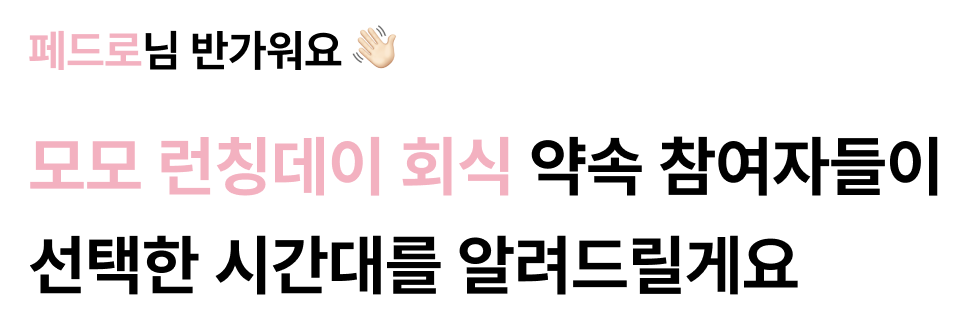
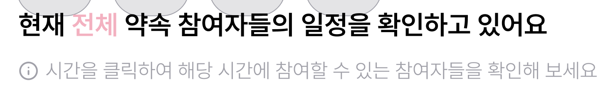
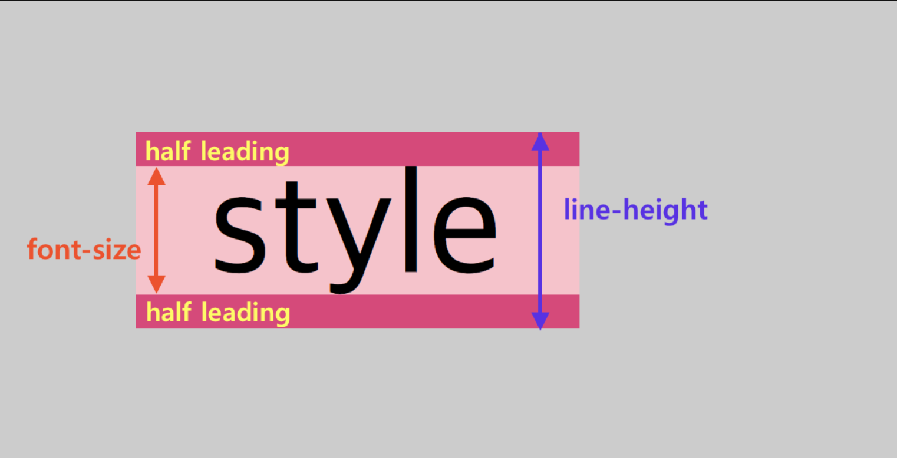
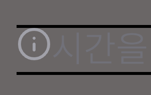
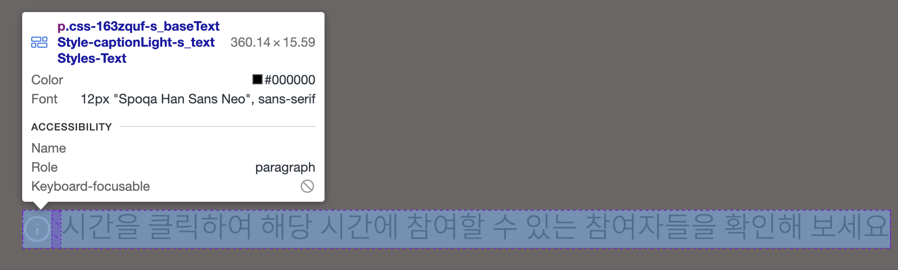
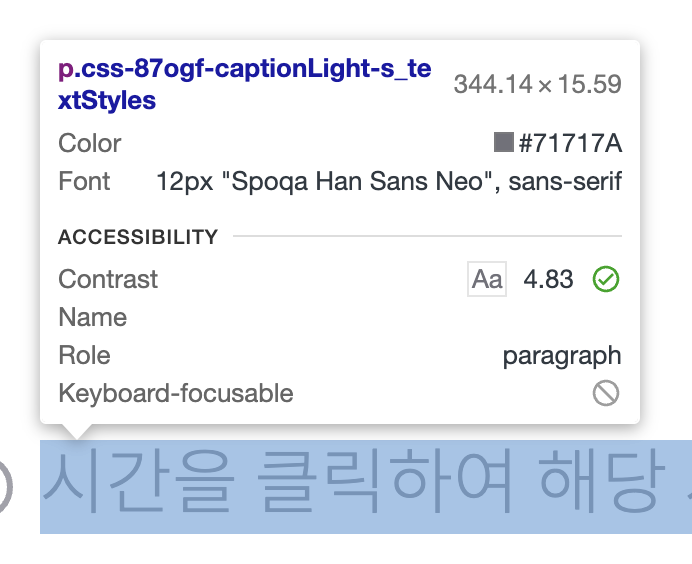
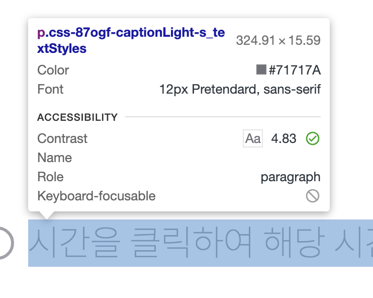
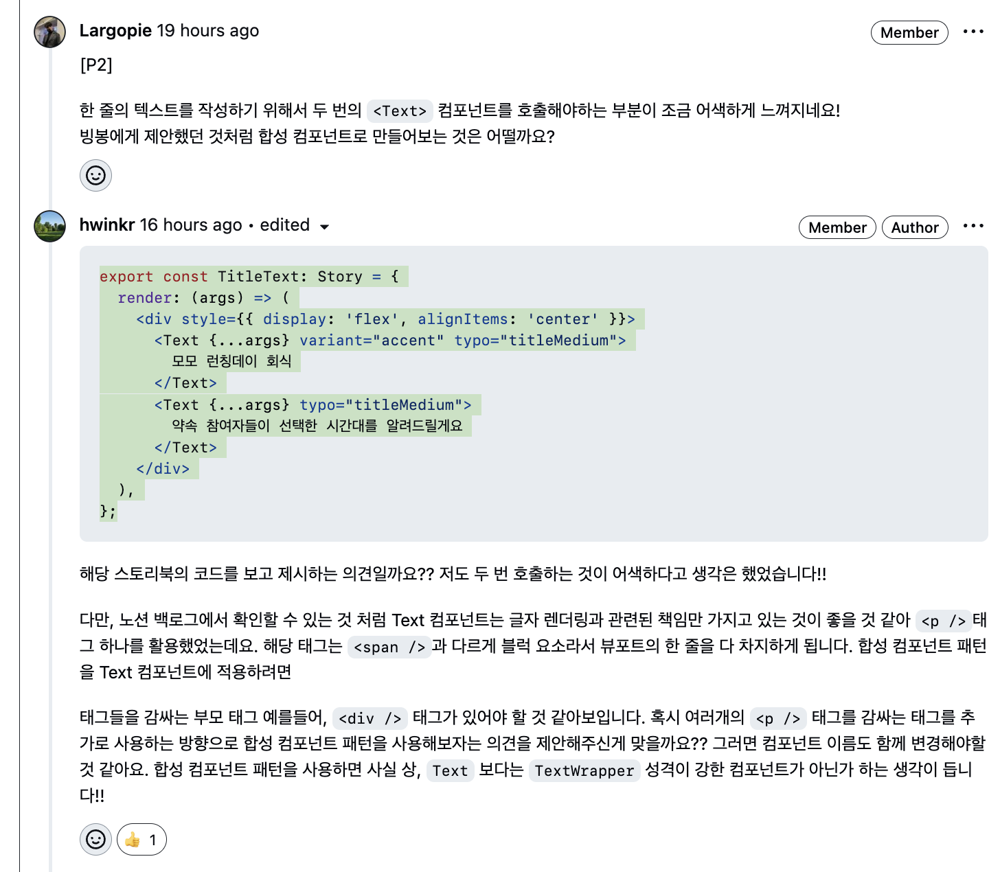
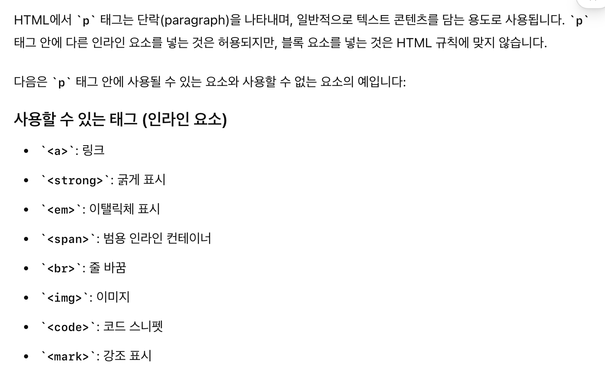

## 재사용할 수 있는 Text 컴포넌트를 만드는 여정




UT와 주변 크루들의 디자인 피드백을 받고나서 피그마 디자인 개선 작업을 진행했다. 개선하면서 사용자들에게 정보를 알려주는 텍스트들이 많아졌고 하나의 Text 컴포넌트를 잘 만들면 여러 상황에서 유연하게 재사용할 수 있을 것 같았다. 재사용할 수 있는 유연한 Text 컴포넌트를 만들기 위해서 인터페이스를 설계하고 합성 컴포넌트 패턴까지 도입하게 된 흐름을 소개한다.

모모 서비스에서는 약속과 관련된 정보를 알려주기 위한 텍스트가 많다. 여러 컴포넌트에서 공통적으로 쓰일 수 있는 Text 컴포넌트를 만들어두면, 재사용하기 좋고 따라서 작업 속도가 빨라지는 장점이 있을 것 같았다.

Text 컴포넌트를 구현하기 전, **UI 인터페이스부터 정의**했다

## UI 인터페이스 설계

### 1) Input

- variant
  - default : 가장 기본이 되는 텍스트이며, 검은색을 사용한다.
  - caption : 사용자에게 추가적인 정보를 알려주기 위해 사용되는 텍스트이며, 회색을 사용한다. 약속을 생성하기 위해 정보를 입력할 때, 추가 정보를 주기 위해서 사용하거나 / 조회 페이지에서 추가 정보를 주기 위해서 사용할 수 있다.
  - warning : 사용자에게 예외 피드백, 경고를 주기 위해서 사용되는 텍스트이며, 빨간색을 사용한다. 약속을 생성하기 위해 정보를 입력할 때, 잘못된 입력을 할 경우 예외 피드백을 주기 위해서 사용할 수 있다.
  - accent : ‘**페드로**님 반가워요' 에서 ‘페드로’라는 단어를 강조할 때 사용되는 텍스트이며, 모모 서비스의 주 색상인 핑크색을 사용한다.
- typo
  - 디자인 토큰을 생성할 때, 만들었던 `TYPOGRAPHY`를 사용하며 titleBold, titileMedium,,,등 다양한 typo의 텍스트를 만들 수 있다.
- chidren(React.ReactNode)

  - 텍스트 컴포넌트를 사용해서, 사용자에게 전달할 메시지

### 2) output

Text 컴포넌트 인터페이스의 output은 여러 상황에서 유연하게 그려지는 텍스트 UI라고 할 수 있다!

## Text 컴포넌트에서 아이콘을 그려주는 책임을 줄지 말지에 대한 고민

### 줄까?


`시간을 클릭하여 해당 시간에 참여할 수 있는 참여자들을 확인해 보세요` 메시지를 보여줄 때, `i` 아이콘을 함께 그려주고 있다. 우선 텍스트 컴포넌트에서 아이콘을 그려주는 책임도 함께 가지고 있으면 사용하기 편리할 것 같아서 인터페이스의 input(props)에 `leftContent` 를 추가했고, 타입은 `JSX.Element` 로 정의했다.

```tsx
interface TextProps extends PropsWithChildren {
  variant?: TextVariant
  typo?: TextTypo
  leftContent?: JSX.Element
}

export default function Text({
  variant = "default",
  typo = "bodyMedium",
  leftContent,
  children,
}: TextProps) {
  return (
    <span css={[s_baseTextStyle, s_textStyles({ variant, typo })]}>
      {leftContent && leftContent}
      {children}
    </span>
  )
}
```

```tsx
export const CaptionWithIcon: Story = {
  args: {
    variant: "caption",
    typo: "captionLight",
    children:
      "시간을 클릭하여 해당 시간에 참여할 수 있는 참여자들을 확인해 보세요",
    leftContent: <InformationIcon />,
  },
}
```

`leftContent`가 있는 경우에 `props`로 넘겨주고 유연하게 **Text 컴포넌트를 재사용할 수 있도록 했다.**

### `<span />` vs `<p />`

아이콘이 있는 경우의 스토리인 `CaptionWithIcon` 을 스토리북에서 띄워보니 아이콘과 텍스트의 수직 정렬이 맞지 않는 문제가 생겼다. `CaptionWithIcon` 의 typo인 captionLight의 스타일은

```js
const TYPOGRAPHY = {
	//...
  captionLight: {
    fontSize: '1.2rem',
    fontWeight: FontWeight['light'],
    lineHeight: '1.3',
  },
} as const;
```

위와 같다. font-size와 line-height의 관계는



이미지 처럼 자연스럽게 수직 정렬된다.



하지만 **아이콘의 경우 수직 정렬이 가운데로 되지 않았다.** 이 문제를 해결하기 위해, 기본 텍스트 스타일에 `display : flex`와 `align-items : center` 스타일을 추가해줬다.

```js
export const s_baseTextStyle = css`
  display: flex;
  gap: 0.4rem;
  align-items: center;
`
```



하지만 이렇게 하니, 폰트가 `line-height` 기준 가운데에 있지 않고 약간 위쪽으로 밀려나는 문제가 있어 아이콘과 텍스트의 수직 정렬이 여전히 맞지 않았다. 인라인 요소인 `<span />` 태그를 사용하는 것이 문제일까 싶어, 텍스트를 표현하는데 사용되는 블럭 요소인 `<p />` 태그를 사용해봐도 문제는 해결되지 않았다. 아이콘, 텍스트 모두 수직 정렬이 되지 않는 문제를 해결하기 위해서 정말 많은 삽질을 했지만 원인은 정말 허무하게도 폰트 문제였다.




기존에 모모 서비스에서 사용하고 있던, `Spoqa Han Sans Neo` 폰트는 특정 `line-height`에서 텍스트가 가운데에 오지 않는 문제가 있지만, 혹시나 하고 어떤 폰트를 결정할지 고민할 때 2순위 폰트였던 `Pretendard` 폰트를 사용해보니 모든 `line-height`에 대해서 텍스트가 가운데에 잘 배치됐다. 폰트를 변경하는 것으로 아이콘, 텍스트가 수직 정렬이 되지 않는 문제가 허무하게 해결되었다.

하지만, 이번 삽질을 통해서, `<span />`태그와 `<p />`태그를 비교하는 학습을 해볼 수 있었고 텍스트 컴포넌트를 만드는 만큼 `<p />` 태그를 사용하는 것으로 결정을 변경했다.

```tsx
export default function Text({
  variant = 'default',
  typo = 'bodyMedium',
  leftContent,
  children,
}: TextProps) {
  return (
    <p css={[s_baseTextStyle, s_textStyles({ variant, typo })]}>
      {leftContent && leftContent}
      {children}
    </p>
  );
```

### 말까?

아이콘을 함께 보여주는 경우에도, Text 컴포넌트의 재사용할 수 있도록 하기 위해서 위해서 `leftContent` props를 추가했었다. 하지만 Text 컴포넌트는 말 그대로 **텍스트(글자)를 그려주기 위한 컴포넌트**라서 svg와 같은 asset들을 **Text 컴포넌트에서 함께 그려주는 것이 과연 옳은가에 대한 고민**을 하게 되었다. 아이콘과 텍스트를 함께 그릴 때, 수직 정렬이 맞지 않는 문제가 발생한 것도 폰트 문제이긴 했지만, 사실 묶을 필요가 없는 요소들을 억지로 한 컴포넌트에서 묶으려고 했기 때문에 생긴 문제가 아닐까하는 생각도 들었다. `<p />` 태그를 사용하는 만큼 Text 컴포넌트는 **글자만 유연하게 그릴 수 있도록 하는 책임을 가지도록 책임을 덜어주는 것으로 결정**했다.

그리고, 기존에 아이콘과 텍스트를 함께 보여주기 위해서 작성했던 스타일 코드

```js
export const s_baseTextStyle = css`
  display: flex;
  gap: 0.4rem;
  align-items: center;
`
```

에서 확인할 수 있듯, leftContnet와 텍스트 사이에 약간의 거리를 두기 위해서 `gap` 속성을 사용했다. 0.4rem으로 고정되어 있기 때문에 더 좁거나 넓은 거리가 필요한 경우에는 유연하게 재사용하지 못한다는 단점도 추가로 있었다. gap 또한 props로 받아서 처리할 수 있지만, 글자만 유연하게 그려주는 책임만 가지도록 결정을 변경한 것에 따라 gap 속성을 제거하기로 했다.

```tsx
interface TextProps extends PropsWithChildren {
  variant?: TextVariant
  typo?: TextTypo
}

export default function Text({
  variant = "default",
  typo = "bodyMedium",
  children,
}: TextProps) {
  return <p css={s_textStyles({ variant, typo })}>{children}</p>
}
```

아이콘 안녕~

## Text 컴포넌트에 합성 컴포넌트 패턴 적용해 보기



```tsx
export const TitleText: Story = {
  render: (args) => (
    <div style={{ display: 'flex', alignItems: 'center' }}>
      <Text {...args} variant="accent" typo="titleMedium">
        모모 런칭데이 회식
      </Text>
      <Text {...args} typo="titleMedium">
        약속 참여자들이 선택한 시간대를 알려드릴게요
      </Text>
    </div>
};
```

Text 컴포넌트를 사용할 때, 강조해야하는 부분이 있으면 위 코드와 같이 Text 컴포넌트를 두 번 호출해야했다. 낙타가 합성 컴포넌트 패턴을 활용해서 한 번만 호출하는 방향으로 개선해보는 것을 제안했다.

처음에는 위 스토리북 코드 처럼, 여러개의 `<p />`태그를 감싸는 상위 `<div />`태그가 있어야 한다고 생각했다. `<p />` 태그 내부에는 텍스트만 있어야 하며, 다른 태그가 있는 것은 안티 패턴이라고 생각했기에, 여러개의 `<p />`태그를 감싸는 `<div />`태그가 있어야 하지 않을까 생각했다. 그래서 합성 컴포넌트 패턴을 사용하는 것으로 개선하면, 사실 상 Text 컴포넌트가 아니라 TextWrapper 컴포넌트가 아닌가…하는 생각에 낙타의 제안을 받아들이지 않으려고 했었다.



<p /> 태그에 대해서 더 알아보니 단락(paragraph)를 나타낼 때 사용되는 태그이며 블록 레벨 요소이기 때문에 p 태그 안에 다른 인라인 요소를 넣는 것은 허용된다는 것을 알게되었다. 그래서 특정 텍스트를 강조할 때 사용되는 <strong /> 태그를 활용하여 기존 Text 컴포넌트의 구조를 합성 컴포넌트 구조로 변경하기로 했다.

### 특정 글자의 색을 강조하는 Accent 컴포넌트

```tsx
import type { PropsWithChildren } from "react"

import { s_accentTextStyle } from "./Accent.styles"

interface AccentProps extends PropsWithChildren {}

export default function Accent({ children }: AccentProps) {
  return <strong css={s_accentTextStyle}>{children}</strong>
}
```

처음, Text 컴포넌트를 구현할 때 설계했던 인터페이스의 `variants`에서 `accent`를 제거하고 특정 글자의 색을 모모 서비스의 색으로 강조해서 보여주는 책임을 가지는 Accent 컴포넌트를 추가로 구현했다.

### 변경된 Text 컴포넌트 구조

```tsx
import type { PropsWithChildren } from "react"

import Accent from "./Accent"
import { s_textStyles } from "./Text.styles"
import type { TextTypo, TextVariant } from "./Text.types"

interface TextProps extends PropsWithChildren {
  variant?: TextVariant
  typo?: TextTypo
}

export default function Text({
  variant = "default",
  typo = "bodyMedium",
  children,
}: TextProps) {
  return <p css={s_textStyles({ variant, typo })}>{children}</p>
}

Text.Accent = Accent
```

### 변경된 Text 컴포넌트 사용 방법

```tsx
export const TitleText: Story = {
  render: (args) => (
    <Text>
      <Text.Accent>모모 런칭데이 회식</Text.Accent>약속 참여자들이 선택한 시간대를 알려드릴게요
    </Text>
};
```

훨씬 깔끔해진 것을 확인할 수 있다.

## 느낀점

정말 간단한 Text 컴포넌트를 만든 과정이지만

> 직접 디자인을 하고 -> 디자인에서 공통적으로 묶을 수 있는 컴포넌트를 뽑고 -> 재사용성에 대해서 고민하고 -> `<span />`, `<p />` 태그 중 어느 것을 쓰는게 옳은지 고민 후 판단하고 -> 낙타 & 빙봉과 의견을 주고 받기

이 순서대로 만들어가니 개인적인 학습, 팀 단위의 학습을 모두 챙길 수 있어서 좋았다. 특히 그냥 하기 보다는 필요에 의해서 고민하고 비교해 보니 더 뜻깊은 경험이 되었다.

- [[FE] 재사용할 수 있는 탭 컴포넌트 구현](https://github.com/woowacourse-teams/2024-momo/pull/291)
