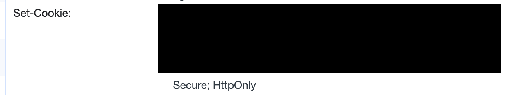
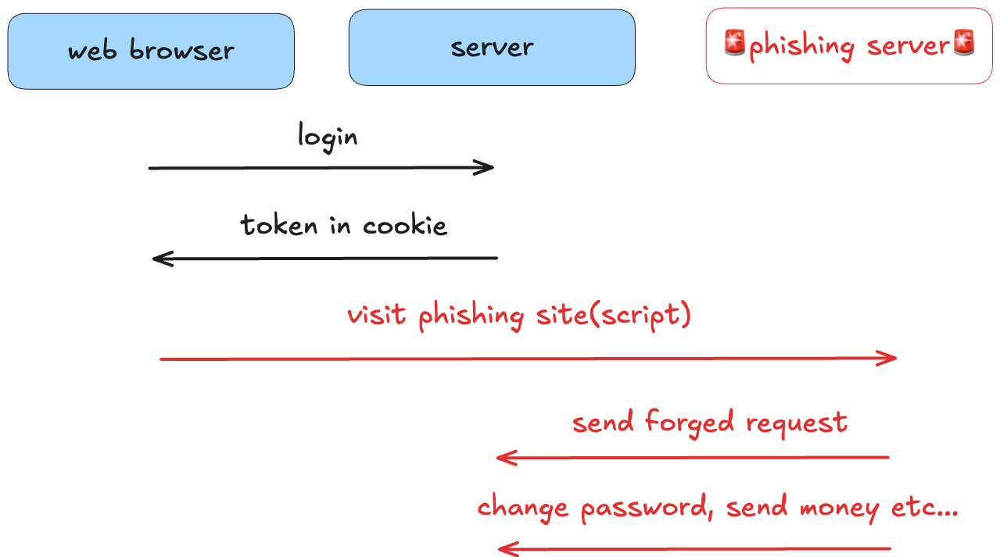
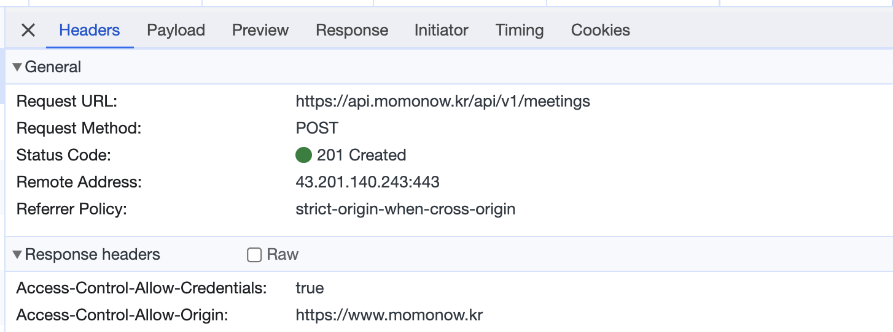

## 학습 배경

모모 서비스 로그인 방식이 변경되면서 CORS에 대해서 이해해야 할 필요성이 생겼다.
기존 로그인 방식은 다음과 같았다.

1. 약속에 참여하고자 하는 사용자가 처음 로그인을 하면 응답 바디에 토큰을 넣어서 전달
2. 토큰을 쿠키에 저장
3. `react-cookie` 라이브러리를 활용해서 쿠키에 저장된 토큰을 사용

```jsx
export default function getHeaders(): HeadersInit {
  const headers = { "Content-type": "application/json" }
  const token = getCookie(COOKIE_KEYS.token)

  if (token) {
    return { ...headers, Authorization: `Bearer ${token}` }
  }

  return headers
}
```

위 코드에서도 확인할 수 있듯, **쿠키에 저장된 사용자의 토큰을 자바스크립트로 접근해서 요청 헤더에 담아서 보냈었다.** 하지만, 해당 로그인 방식을 사용하다가 로그인과 관련된 보안을 강화하게 되면서 로그인 방식도 자연스럽게 변경되었다. 아래는 강화된 보안 내용을 간단하게 정리한 것이다.

## HttpOnly

httpOnly는 이름에서 확인할 수 있듯 **쿠키를 오직 http 프로토콜을 사용한 통신에서만 접근할 수 있도록 하는 설정**이며, 쿠키 자체에 설정한다. httpOnly를 설정하지 않으면 `react-cookie`나 `document.cookie`등 자바스크립트로 쿠키에 접근을 할 수 있기에 xss 공격에 취약해진다는 단점이 있다.



그래서 서버측에서 응답 헤더에 HttpOnly 설정을 하고 자바스크립트로는 쿠키에 접근할 수 없도록 했다.

## sameSite

이제, 자바스크립트로는 쿠키에 접근할 수 없기 때문에 서버에 인증/인가가 필요한 요청을 할 때 브라우저의 쿠키를 직접 서버에 전달해주는 것으로 변경되었다.

```tsx
const createFetchClient = (baseUrl: string) => {
  return async <T>({ path, method, body, isAuthRequire }: FetchOption): Promise<T> => {
		//...
    const response = await fetch(url, {
      method,
      headers: {
        'Content-Type': 'application/json',
      },
      body: body ? JSON.stringify(body) : null,
      credentials: isAuthRequire ? 'include' : 'omit',
    });
	  //...
};
```

fetch 함수를 호출할 때, `credentials : ‘include’` 설정을 해주면 요청 시 브라우저의 쿠키를 함께 전달해줄 수 있다. 하지만, 클라이언트와 서버가 쿠키를 주고 받음으로써 통신할 때 CSRF 공격을 받을 수 있는 문제가 있다고 한다.

[ProtSwagger](https://portswigger.net/web-security/csrf)에서는 CSRF에 대해서 다음과 같이 설명한다.

> _Cross-site request forgery (also known as CSRF) is a web security vulnerability that allows an attacker to induce users to perform actions that they do not intend to perform. It allows an attacker to partly circumvent the same origin policy, which is designed to prevent different websites from interfering with each other._
>
> _크로스 사이트 요청 위조(CSRF라고도 함)는 공격자가 사용자가 의도하지 않은 작업을 수행하도록 유도할 수 있는 웹 보안 취약점입니다. 이를 통해 공격자는 서로 다른 웹사이트가 서로 간섭하지 못하도록 설계된 동일한 출처 정책을 부분적으로 우회할 수 있습니다._

정리하자면, 웹 사이트 사용자 자신의 의지와는 무관한 행동을 하도록 유도하는 공격을 말한다.



해커가 스크립트가 심어진 페이지를 사용자에게 방문하도록 유도한 후, 방문하면 비밀번호 변경이나 송금을 요청한다. 이 때, 사용자 브라우저의 쿠키에는 로그인을 한 후 받은 토큰이 저장되어 있기 때문에 서버는 사용자의 요청이라고 간주하고 해당 요청을 실행한다. **이로써 해커가 의도한 행동을 마치 사용자가 한 것 처럼 꾸미는 공격이 가능**해진다.

해당 공격이 가능한 이유는 도메인이 다른 클라이언트라도 서버에 특정 요청을 할 때, 쿠키를 보내는 것이 가능하기 때문이다.

```html
<form action="https://www.example.com/change-password" method="POST">
  <input type="hidden" name="new-password" value="newpassword123" />
</form>
<script>
  document.forms[0].submit()
</script>
```

위 악성 코드가 심어진 공격자의 도메인에 방문한 사용자는 쿠키와 함께 서버에 요청을 보내게 되어 비밀번호가 공격자의 의도대로 변경된다.

이 문제를 해결하기 위해서 same-site 설정이 등장했고, 모모도 적용해 보기로 했다. 서버에서 설정할 수 있는 same-site 옵션은 다음과 같다.

1. **None**: 브라우저가 **모든 출처**에 쿠키를 전송할 수 있도록 허용. 이 설정은 `SameSite` 속성이 없는 것과 같습다. 단, `None`을 사용할 때는 쿠키에 `Secure` 속성을 반드시 포함해야 하며, 그렇지 않으면 대부분의 브라우저에서 쿠키가 차단된다.
2. **Lax**: 일부 안전한 요청(GET, HEAD 등)에 대해서만 쿠키를 보낸다. 즉, **안전한 요청**에서 쿠키가 전송되며, 사용자 상호작용이 발생한 링크 클릭 또는 폼 제출과 같은 경우에만 `SameSite`가 적용된다. 단, `POST` 요청 등 **안전하지 않은** 메서드에서는 쿠키가 전송되지 않는다.
3. **Strict**: **동일한 사이트 내에서 발생하는 요청**에 대해서만 쿠키를 전송하도록 한다. **Cross-site** 요청에는 쿠키를 전송하지 않는다. Cross-site의 정의는 기본 도메인(eTLD+1) 비교에 기반한다.

](./assets/etld.png)

- TLD : 최상위 도메인(top-level-domain), 해당 이미지에서 uk
- eTLD : 유효 최상위 도메인(effective-top-level-domain), 해당 이미지에서 co.uk
- eTLD + 1 : **eTLD+1**은 eTLD와 도메인 이름의 다음 부분을 의미. google.co.uk

eTLD + 1에 기반한 클라이언트 요청 origin, 응답 origin 비교를 통해서 같을 경우에만 쿠키를 보내도록 한다.

모모 서비스를 예시로 들자면 다음과 같다.

- `https://www.naver.com`

- `https://momonow.kr`, `https://api.momonow.kr`은 둘 다 eTLD + 1이 momonow.kr 이므로 same-site라고 판단되어 요청에 쿠키를 함께 전달한다.
- 반면 `http://뭐시기저시기.kr`, `https://api.momonow.kr`은 eTLD + 1 비교에 의해서 cross-site라고 판단되어 요청에 쿠키를 함께 전달하지 않는다.

여기까지 정리하면서 추가적인 궁금증이 생겼다.

🤔 도메인이 다르다는 것이 어떤 의미인지?  
🤔 쿠키를 주고 받으면서 요청/응답을 할 때, 클라이언트 영역이 더 알면 좋은 지식이 있는지?

해당 궁금증들을 해결하기 위해서 CORS 개념에 대해서 간단하게 학습해 보는 시간을 가졌다.

## 브라우저는 기본적으로 SOP

브라우저는 기본적으로 SOP 정책을 사용한다고 한다. MDN에서는 SOP에 대해서 다음과 같이 설명한다.

> _The same-origin policy is a critical security mechanism that restricts how a document or script loaded by one origin can interact with a resource from another origin._
>
> _It helps isolate potentially malicious documents, reducing possible attack vectors. For example, it prevents a malicious website on the Internet from running JS in a browser to read data from a third-party webmail service (which the user is signed into) or a company intranet (which is protected from direct access by the attacker by not having a public IP address) and relaying that data to the attacker._
>
> _동일 출처 정책은 한 출처에서 로드된 문서 또는 스크립트가 **다른 출처의 리소스**와 상호 작용하는 방식을 제한하는 중요한 보안 메커니즘입니다._
>
> _잠재적으로 악의적인 문서를 격리하여 가능한 공격 경로를 줄이는 데 도움이 됩니다. 예를 들어, 인터넷의 악성 웹사이트가 브라우저에서 JS를 실행하여 사용자가 로그인한 타사 웹메일 서비스 또는 회사 인트라넷(공용 IP 주소가 없어 공격자가 직접 액세스할 수 없도록 보호됨)에서 데이터를 읽고 해당 데이터를 공격자에게 전달하는 것을 방지할 수 있습니다._

해당 내용을 정리해 보자면, 보안상의 이유로 브라우저가 사용하는 정책인 SOP는 출처가 다른 요청을 제한한다 즉, 출처가 다른 요청은 잘못된 요청이라고 판단하고 요청을 허가하지 않는 정책이라고 할 수 있다.

그렇다면, 어떤 경우에 출처가 다르다고 판단하는 것일까?

## 출처(origin) 비교하기

출처(origin)이 무엇인지 알아보기 위해서 아래 URL이 있다고 가정해 보고, 해당 URL을 분석해 보자.

```text
https://momonow.kr:8080/meeting/schedules?attendeeName='해리'
```

- scheme(protocol) : http 또는 https
- host : hostname과 port를 합친 것을 말한다.
  - hostname : momonow.kr
  - port : 8080
- pathname : /meeting/schedules
- search : attendeeName=’해리’

여기서 출처(origin)는 scheme와 host(hostname + port)를 합친 것을 말하며, **구성 중 하나라도 다르면 cross-origin이라고 판단한다.**

만약 현재 사용자의 웹 사이트 방문 URL 다음과 같다고 가정해 보자.

```text
https://momonow.kr
```

그렇다면, 다음과 같은 경우에 cross-origin이라고 할 수 있다.

1. http로 요청을 보내는 경우
2. `http://something.momonow.kr`로 요청을 보내는 경우

→ 해당 요청은 서브 도메인으로 요청을 보내지만 서브 도메인이 다른 경우에도 다른 호스트라고 판단하기 때문에 cross-origin이라고 판단한다.

3. 포트번호 80으로 요청을 보내는 경우 (https 기본 포트 번호는 443)

브라우저는 위 3가지 요청에 대해서 **모두 출처가 다른 요청이라고 판단**하기 때문에 요청을 허가하지 않는다.

## CORS



현재 모모 서비스는 `https://momonow.kr` → `https://api.momonow.kr/api/v1/meetings`로 보내는 요청인 corss-origin 요청인 경우에도 클라이언트 & 서버가 응답/요청을 주고 받을 수 있다. 그 이유는 서버 측에서 `Access-Control-Allow-Origin` 설정에 `https://momonow.kr`을 추가해줬기 때문이다. 해당 설정은 브라우저에게 해당 origin에서 오는 요청은 유효한 요청이라는 것을 알려주기 위한 설정이다. 브라우저는 기본적으로 특정 사이트에 요청을 보내도 되는지 확인할 방법이 없기 때문에 요청을 받아서 처리하는 서버 측에서 직접 정책에 따른 설정을 해줘야 한다. 해당 설정이 CORS 개념을 이용한 것이다.

MDN에서는 CORS에 대해 다음과 같이 설명한다.

> _**Cross-Origin Resource Sharing** ([CORS](https://developer.mozilla.org/en-US/docs/Glossary/CORS)) is an [HTTP](https://developer.mozilla.org/en-US/docs/Glossary/HTTP)-header based mechanism that allows a server to indicate any [origins](https://developer.mozilla.org/en-US/docs/Glossary/Origin) (domain, scheme, or port) other than its own from which a browser should permit loading resources. CORS also relies on a mechanism by which browsers make a "preflight" request to the server hosting the cross-origin resource, in order to check that the server will permit the actual request. In that preflight, the browser sends headers that indicate the HTTP method and headers that will be used in the actual request._
>
> _**교차 출처 리소스 공유**(Cross-Origin Resource Sharing, [CORS](https://developer.mozilla.org/ko/docs/Glossary/CORS))는 브라우저가 자신의 출처가 아닌 다른 어떤 [출처](https://developer.mozilla.org/ko/docs/Glossary/Origin)(도메인, 스킴 혹은 포트)로부터 자원을 로딩하는 것을 허용하도록 서버가 허가 해주는 [HTTP](https://developer.mozilla.org/ko/docs/Glossary/HTTP) 헤더 기반 메커니즘입니다. 또한 CORS 는 교차 출처 리소스를 호스팅하는 서버가 실제 요청을 허가할 것인지 확인하기 위해 브라우저가 보내는 "사전 요청(프리플라이트, Preflight)" 메커니즘에 의존합니다. 이 사전 요청에서 브라우저는 실제 요청에서 사용할 HTTP 메서드와 헤더들에 대한 정보가 표시된 헤더에 담아 보냅니다._

정리하자면, CORS는 서버가 자원 공유를 **부분적으로 허용할 출처를 결정하는 정책 및 설정이다.**

CORS를 사용하기 위해서는 서버 측에서 아래 두 설정을 해줘야 한다.

1. ACAO - access control allow origin
2. ACOM - access control allow method

```java
registry.addMapping("/api/**")
        .allowedOriginPatterns(corsProperties.getAllowOrigins())
        .allowedMethods("GET", "POST", "HEAD", "PATCH", "PUT", "DELETE")
        .allowCredentials(true);
```

코드로 나타내면 다음과 같고, 클라이언트 측과 쿠키를 주고 받기위해 `allowCredentials` 설정까지 해줬다.

## 느낀 점

글 제목은 간단하게 알아보기였지만, 글을 다 작성하니 전혀 간단하지 않은 것 같다…ㅎ

브라우저는 보안을 위해서 기본적으로 SOP 정책을 사용하지만 동일 서비스에서 클라이언트 & 서버의 도메인이 다를 경우 서버의 자원을 부분적으로 허용하기 위해서 CORS를 사용할 수 있다는 것을 배웠다. 브라우저는 특정 경로에 요청을 보내도 되는 것인지 판단할 수 없기 때문에 CORS 설정으로 알려줘야한다고 정리하니 이해가 정말 잘 됐다.

그리고, xss, CSRF 공격이 실제로 발생한 것을 눈으로 확인해 보지는 않았지만 해당 공격이 발생할 경우 어떻게 대처할 수 있을지를 깊게는 아니지만 어느 정도 배울 수 있었다.

“쿠키를 직접 주고 받는 방식으로 로그인 방법 변경” 이 한 문장을 완성하기 위해서 정말 많은 개념이 필요했다. 위에서 정리한 내용 정도면 프론트엔드 영역을 개발하는 사람으로서 쿠키 기반 로그인에 대해 충분히 이해했다고 볼 수 있을 것 같다(~~아니면 뭐…더 공부해야겠지만~~)
