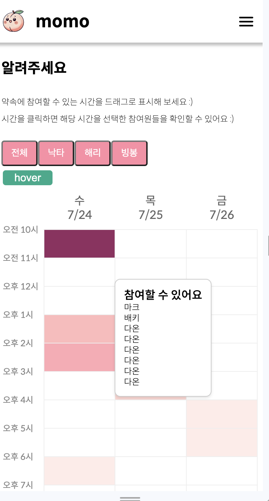
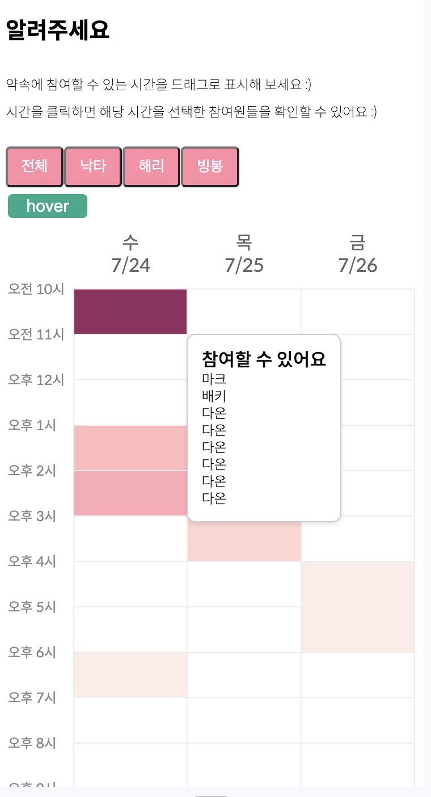
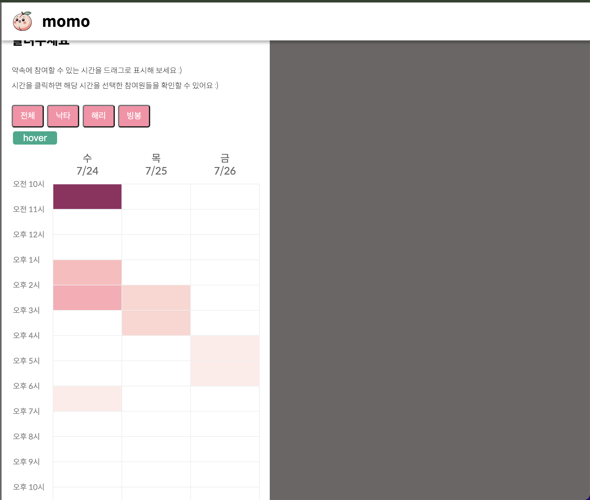
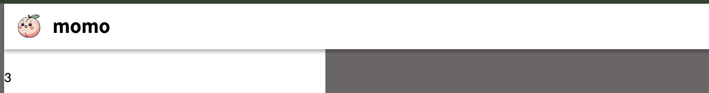
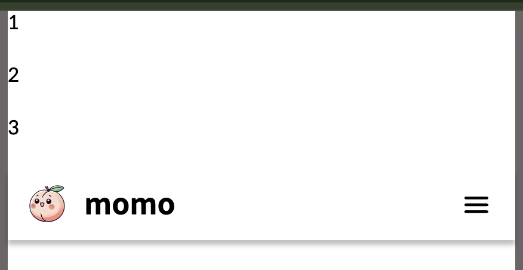

## 배경

모모에서 사용하는 헤더 컴포넌트의 `position` 속성을 `fixed`로 변경했다가 예상치 못한 UI 관련 문제를 겪고, 이를 해결하는 과정에서 fixed, sticky의 차이를 학습하게 되었다. 어떤 차이가 있는지 학습한 내용을 기록해 본다 :)

현재 모모 앱의 글로벌 레이아웃 컴포넌트는 다음과 같다.

```tsx
export default function GlobalLayout() {
  return (
    <div css={s_globalContainer}>
      <Header />
      <div css={s_content}>
        <Outlet />
      </div>
    </div>
  )
}
```

```tsx
export const s_content = css`
  overflow-y: scroll;
  height: calc(100vh - 8.4rem); // 8.4rem : 헤더의 높이
  padding: 0 1.6rem;
`
```

헤더 아래에 있는 요소들의 공통 레이아웃 스타일을 정의하는 s_content 스타일은 위와 같이 정이되어 있다. 높이가 고정되어 있고, overflow-y : scroll이 되어있기 때문에 모바일 환경에서 툴팁을 보게되면 스크롤과 관련해서 사용자 경험에 좋지 못한 문제가 생겼다.



가장 짙은 색의 셀을 클릭하면 툴팁이 나오게 되고, 이 상태에서 스크롤을 하게 되면 셀과 툴팁이 떨어져버리는 문제가 발생했다. 높이가 고정되어 있고 `overflow-y : scroll` 속성에 의해서 스크롤이 되는 것이기 때문에 툴팁은 처음 렌더링 된 위치에 가만히 있고 툴팁 뒤의 셀만 움직이기 때문에 발생한 현상이었다.

이 문제를 해결하기 위해서 높이를 고정하지 않고, `overflow-y : scroll` 속성을 삭제했다.

```tsx
export const s_content = css`
  padding: 0 1.6rem;
`
```



이제 스크롤을 해도 셀과 툴팁은 떨어지지 않게 되었다. 하지만, 이미지에서 확인할 수 있는 것 처럼, 헤더에 position 속성이 없기 때문에 스크롤을 하면 헤더도 함께 올라가서 눈에 보이지 않는 문제가 발생했다. 스크롤을 하다가 중간에 메뉴 바를 클릭하거나 홈으로 이동하고 싶은 사용자들을 위해서 헤더는 고정되었으면 좋겠다 생각해서. `position : fixed` 속성을 추가했다. 그러나…



`fixed` 속성은 부모의 css 속성을 무시하고, 뷰포트 기준으로 크기, 위치를 결정하기 때문에 글로벌 레이아웃 스타일을 무시하는 문제가 생겼다. `sticky` 속성 사용으로 해결했지만, 두 속성에 어떤 차이가 있는지 궁금했다.

## 1) fixed

MDN에서는 fixed 속성에 대해서 다음과 같이 설명한다.

> _The element is removed from the normal document flow, and no space is created for the element in the page layout. The element is positioned relative to its initial [containing block](https://developer.mozilla.org/en-US/docs/Web/CSS/Containing_block#identifying_the_containing_block), which is the viewport in the case of visual media. Its final position is determined by the values of `top`, `right`, `bottom`, and `left`.
> This value always creates a new [stacking context](https://developer.mozilla.org/en-US/docs/Web/CSS/CSS_positioned_layout/Understanding_z-index/Stacking_context). In printed documents, the element is placed in the same position on every page._
>
> _요소는 일반 문서 흐름에서 제거되며 페이지 레이아웃에서 요소에 대한 공간이 생성되지 않습니다. 요소는 초기 포함 블록(시각적 미디어의 경우 뷰포트)을 기준으로 배치됩니다. 최종 위치는 위쪽, 오른쪽, 아래쪽, 왼쪽 값에 의해 결정됩니다._
>
> _이 값은 항상 새로운 스태킹 컨텍스트를 생성합니다. 인쇄된 문서에서 요소는 모든 페이지에서 동일한 위치에 배치됩니다_

여기서 일반 문서 흐름이란 html로 마크업을 할 때, 위에서부터 아래로 내려오는 순서를 말한다.

```tsx
<div>1</div>
<div>2</div>
<div>3</div>
```

해당 마크업 구조에서 1, 2, 3이 위에서부터 아래로 순서대로 나타날 것임을 예상할 수 있다. 이는, html 태그들의 position 속성이 기본적으로 `static` 이기 때문이다. MDN에서는 staitc을 다음과 같이 설명한다.

> \*The element is positioned according to the Normal Flow of the document. The top, right, bottom, left, and z-index properties have no effect. This is the default value.

요소는 문서의 일반 흐름에 따라 배치됩니다. 위쪽, 오른쪽, 아래쪽, 왼쪽 및 z-인덱스 속성은 영향을 미치지 않습니다. 이것이 기본값입니다.\*

>

```tsx
<div>1</div>
<div>1</div>
<div>1</div>
<FixedHeader />
```

만약 position 속성이 fixed인 FixedHeader를 위와 같은 구조로 마크업을 하면,



위와 같이 문서 일반 흐름을 무시해서 배치된다.

일반 문서 흐름에서 벗어나기 때문에, `GlobalLayout` 컴포넌트에서 `width`, `max-width`를 설정해도 부모-자식 관계가 형성되지 않아 속성을 무시하게 되는 것이었다.

## 2) sticky

MDN에서는 sticky 속성에 대해서 다음과 같이 설명한다.

> \*The element is positioned according to the normal flow of the document, and then offset relative to its nearest scrolling ancestor and containing block (nearest block-level ancestor), including table-related elements, based on the values of top, right, bottom, and left. The offset does not affect the position of any other elements.

요소는 문서의 일반적인 흐름에 따라 배치된 다음 위, 오른쪽, 아래, 왼쪽 값을 기준으로 테이블 관련 요소를 포함하여 가장 가까운 스크롤 조상 및 포함 블록(가장 가까운 블록 수준 조상)을 기준으로 오프셋됩니다. 오프셋은 다른 요소의 위치에는 영향을 주지 않습니다.\*

> _이 값은 항상 새로운 스태킹 컨텍스트를 생성합니다. 고정 요소는 '스크롤 메커니즘'(오버플로, 스크롤, 자동 또는 오버레이가 숨겨진 경우 생성됨)이 있는 가장 가까운 조상이 실제로 가장 가까운 스크롤 조상이 아니더라도 그 조상에 "고정"됩니다._

sticky 속성을 가지면 기본적으로 일반 문서 흐름에 따라 배치되지만, `top` `right` `bottom` `left` 속성에 할당한 값만큼 해당 요소에 닿으면 그 후 fixed 처럼 동작하게 된다. 글로만 설명하니 이해하기 어려운 것 같다. 예시를 보자.

```tsx
<div>1</div>
<div>2</div>
<div>3</div>
<StickyHeader />
```

마크업 구조가 다음과 같이 되어있고, StickyHeader의 스타일이

```tsx
position: sticky
top: 0
```

위와 같다면 우선 기본적으로 일반 문서 흐름에 따라 1, 2, 3 아래에 StickyHeader가 위치한다.



스크롤을 통해서 `top : 0` 에 즉, 헤더의 가장 윗 부분에 스크롤이 닿는다면 그 후 fixed처럼 동작하게 된다. 기본적으로 일반 문서 흐름에 맞게 배치되기 때문에 부모 - 자시 관계도 형성할 수 있어, `GlobalLayout` 컴포넌트에서 설정한 width 설정을 사용할 수 있게 되었다!
