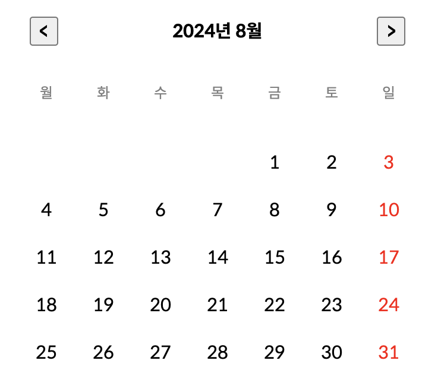
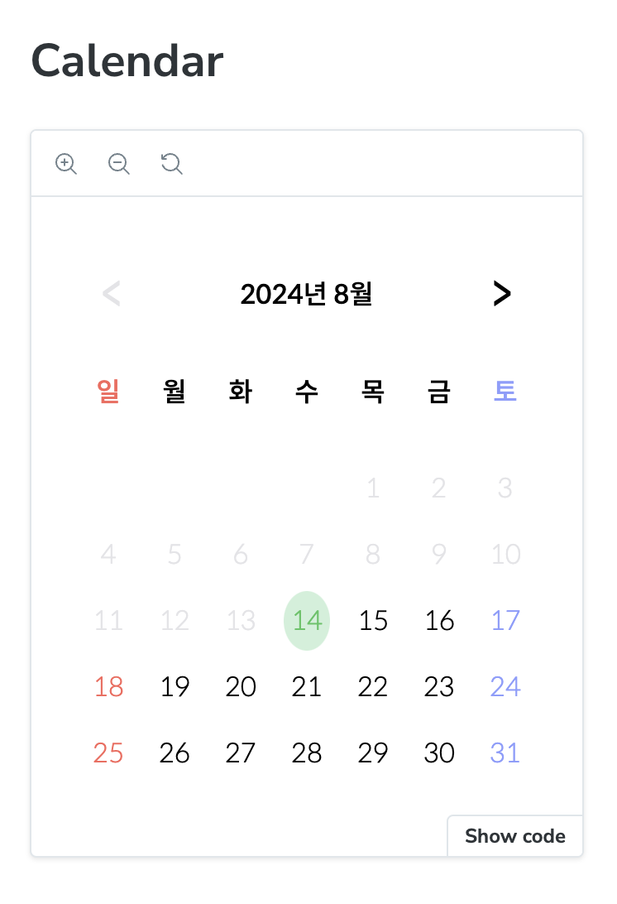
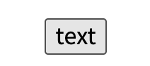
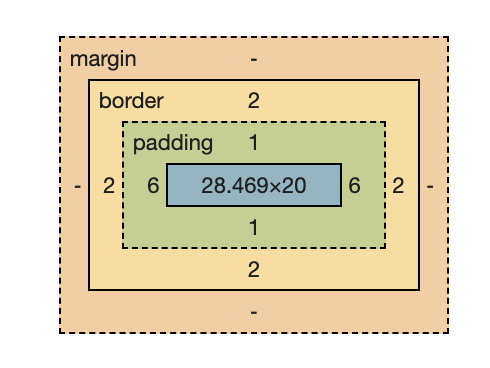
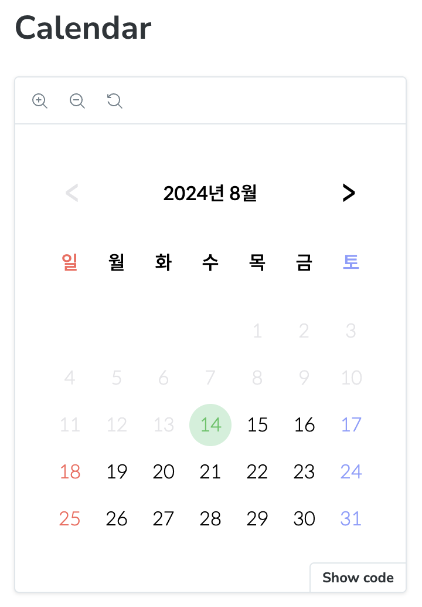
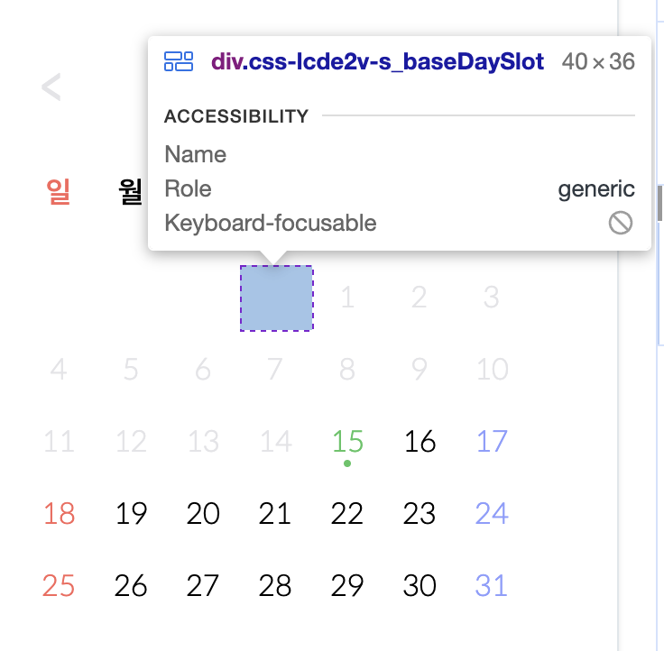
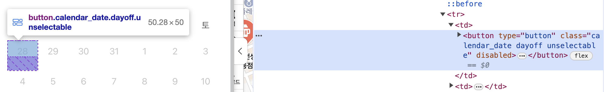
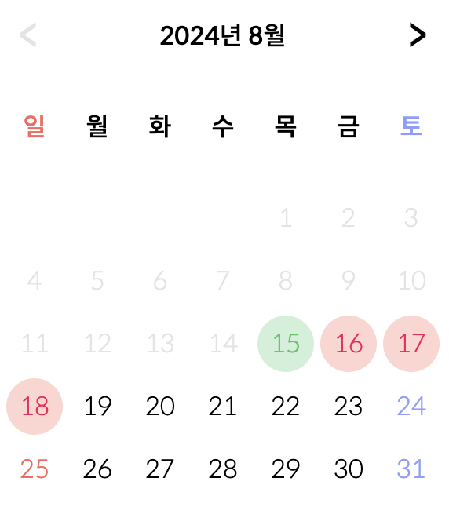
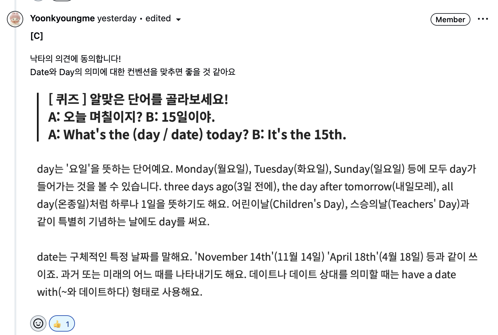
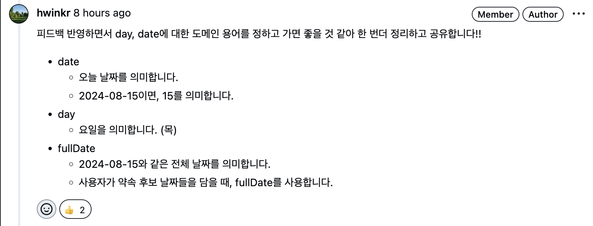

## 배경

모모 서비스를 만들면서 구현하고 사용중이었던 캘린더 UI를 UT(Usability Test)가 끝난 후, 같이 학습을 하는 크루들에게 피드백을 받은 후 개선하면서 했던 고민들과 해결 과정들을 기록한다...!

## 기존 캘린더 UI



## 기존 캘린더 UI에서 개선했으면 하는 사항들

- 모바일에서 선택된 날짜가 계란처럼 보이는 문제 해결



모모 서비스에서 약속을 만드는데 사용되는 캘린더 컴포넌트를 모바일에서 사용할 때 약간의 문제가 생겼다. 모바일 환경에서 특정 날짜를 강조하는 UI가 계란 형태로 보여지는 문제였다. 개발자 도구의 Element 탭에서 이유를 분석해보니, 스타일 속성에 기본적으로 padding이 6으로 설정되어 있는 것을 확인할 수 있었다. <button /> 태그는 기본적으로 padding : 6 스타일 속성을 가지는 것인지, 아니면 내가 인지하지 못하는 곳에서 스타일 속성을 설정한 것인지 궁금해서, 완전 기본 <button /> 태그를 만들어봤다.





아무런 스타일을 설정하지 않아도 기본적으로 padding : 6 스타일이 적용된 것을 확인할 수 있었다. 이제 이 스타일 속성을 제거하자 :)



개발자라면, 브라우저의 개발자 도구를 활용해서 문제를 빠르게 해결하자! 때로는 AI에게 물어보는 것 보다 개발자 도구를 열어서 빠르게 확인하는 것이 좋은 것 같다고 느꼈다.

- 가장 왼쪽에 일요일이 오도록 변경 + 일요일 색 수정

새벽 4시까지 디자인을 했었던 날에 이유는 확실하게 기억이 나지는 않지만, 월요일이 가장 왼쪽에 오도록 달력 디자인이 설계됐었다. 이 후 다른 크루들에게 피드백을 몇 번 받았었는데 다른 서비스의 달력은 모두 일요일이 가장 왼쪽에 있으니, 모모 달력도 이에 맞춰 변경했으면 좋겠다는 피드백들을 받았다. 월요일이 가장 왼쪽에 있어야 하는 확실한 이유도 없었기에, 수용할 만한 피드백이라고 생각해서 개선하기로 했다!

```tsx
export function getYearMonthInfo(year: number, month: number) {
  const startDate = new Date(year, month - 1, 1)

  /* 
   로직 설명(@hwinkr)
   - 월요일을 index 0으로 변경하기 위해서 나머지 연산자를 활용한다.
   - 자바스크립트 Date 객체는 기본적으로 일요일이 인덱스가 0인데, 모모 달력은 월요일을 인덱스를 0으로 만들어줘야 한다.
   - 따라서, 특정 달의 시작 날짜에 대한 인덱스에 6을 더해주고 7로 나눈 나머지를 사용하는 것으로 구현했다.
  */
  const firstDayIndex = (startDate.getDay() + 6) % 7

  const lastDayOfMonthDate = new Date(year, month, 0)
  const lastDayNumber = lastDayOfMonthDate.getDate()

  const daySlotCount = firstDayIndex + lastDayNumber

  return { year, month, firstDayIndex, daySlotCount } as const
}
```

일요일이 가장 첫 번째 요일 즉, 인덱스가 0이기 때문에 월요일을 가장 왼쪽에 배치하기 위해서는 월요일의 인덱스를 0으로 만들어줘야 했다. 이를 위해서 나머지 연산자를 사용했다.

```tsx
const firstDayIndex = (startDate.getDay() + 6) % 7
```

월요일은 인덱스가 1이기 때문에 `(1 + 6) % 7 = 0` 이 되고, 월요일 인덱스를 0으로 변경해줄 수 있었다.

하지만, 피드백을 반영하면서 다시 일요일 인덱스를 0으로 만들어줘야 했기에 해당 로직은 제거하게 되었다.

```tsx
export const generateMonthDaySlots = (year: number, month: number) => {
  const startDate = new Date(year, month - 1, 1)
  const firstDayIndex = startDate.getDay()

  const lastDateOfMonth = new Date(year, month, 0)
  const lastDayNumber = lastDateOfMonth.getDate()

  const daySlotCount = firstDayIndex + lastDayNumber

  return { firstDayIndex, daySlotCount } as const
}
```

- 토요일에 색 추가 +) 요일을 보여주는 텍스트 크기 변경

위 캘린더를 보여주니, 일요일에 빨간색을 표시해주는 것은 좋지만 토요일에도 파란색 표시가 있으면 사용자가 더 쉽게 달력 UI를 이용할 수 있을 것 같다는 피드백도 받았다. 이를 수용해서 알맞은 색을 찾았고, 달력에서 활용하기로 했다. `#8c9eff`


추가로, 요일을 보여주는 텍스트의 크기가 실제로 휴대폰에서 확인해보니 너무 작은 것 같아서 1.6rem(1.6px)로 변경했다.

- 일요일 색 변경

기능 구현에 집중하느라, 디자인에 신경 쓰지 못해서 일요일의 색을 `red` 로 했었다. 모모 서비스의 MVP가 완성되고 달력을 다시 보니 일요일의 색을 변경해야 할 필요성을 느꼈다. 그래서, col.or앱을 참고해서 모모의 분홍색에 그나마 어울리는 빨간색을 찾아서 변경했다. `#fa665b`

- 오늘 이전은 선택할 수 없도록 disabled 처리 +) 오늘 날짜에 색 추가

과거 날짜에 대한 약속은 잡지 않기 때문에, 사용자에게 과거 날짜는 선택할 수 없음을 UI로 표시해줘야 했다. 다른 캘린더 UI를 참고하면서 <button />이 disabled 상태일 때 보여주는 UI와 비슷하게 표시하면 사용자에게 지난 날짜는 선택할 수 없다는 것을 알려줄 수 있을 것 같았다.


확실히 사용자에게 선택할 수 없는 날짜임을 암묵적으로 알려줄 수 있을 것 같았다.

여기까지 작업을 하고, 한 가지 고민을 추가로 하게 되었다. 선택할 수 없는 요소 즉, clickable 하지 않은 요소인데 <button /> 태그를 사용하는 것이 맞는지에 대한 고민이었다.

```tsx
return isValidDate ? (
  <button
    key={fullDate}
    onClick={() => onDateClick(fullDate)}
    disabled={isPrevDate}
    css={[s_baseDaySlot, s_daySlotButton]}
  >
    <span
      css={[
        s_baseDaySlotText,
        s_daySlotText({
          isSelectedFullDate,
          isPrevDate,
          isHoliday,
          isSaturday,
          isToday,
        }),
      ]}
    >
      {date}
    </span>
  </button>
) : (
  <div key={fullDate} css={s_baseDaySlot}></div>
)
```

실제로 달력 UI를 구현하는 코드에서는 유효한 날짜가 아니면



즉, 날짜로 표시할 필요가 없고 빈칸으로 보여줘야할 경우에 <button />이 아닌 <div /> 태그를 사용해서 보여주기 때문에 이미 지난 날짜에 대해서도 <div />를 사용해서 보여줘야할지에 대한 고민이었다. 웹 접근성을 고려했을 때, 클릭할 수 있는 요소에 대해서만 <button /> 태그를 사용하는 것이 좋다는 것을 알고 있으므로 이미 지난 날짜는 선택할 수가 없는데(클릭할 수가 없는데) <button /> 태그를 사용해도 되는지에 대한 의문이 생겼다. 이에 대한 고민을 낙타에게 이야기를 했고, 과거에는 선택할 수 있는 날짜였지만 시간이 지나서 선택할 수 없게된 것 뿐이고, 사용자에게 표시를 해줘야 하는 유효한 날짜이기 때문에 <button /> 태그를 사용하는 것이 좋을 것 같고 추가로, disabled 처리를 하면 될 것 같다는 결론을 지었다. 다른 서비스는 어떻게 하고 있나 궁금해서 네이버를 방문해서 알아보았다.



네이버도 이미 지난 날짜에 대해서도 <button /> 태그를 사용하고 disabled를 활용하고 있는 것을 확인할 수 있었다.

오늘 날짜를 표시하는 경우에는 모모 서비스의 primary color인 분홍색의 보색인 녹색 계열의 색을 활용했다. 기존에는 선택된 날짜들의 스타일과 비슷하게 동그란 원을 추가로 그려줬다.


해당 디자인을 적용하고 나서, 오늘 날짜를 잘 강조한 것 같아서 괜찮다 싶었다. 하지만, 약속 후보 날짜들을 선택하고 나니 생각이 달라졌다.



동그란 원을 활용한다는 점이 비슷해서, 오늘 날짜와 선택된 날짜들을 강조하는 것이 헷갈릴 수 있겠다는 생각을 했다. 모모 팀원들과 다른 팀 사람들을 찾아가서 물어보니 나와 생각이 비슷했다. 이를 해결하기 위해서 다른 서비스들의 달력은 어떻게 오늘 날짜를 강조하고 있는지 찾아보았다. 그 중 동그란 원을 활용하지 않고 오늘 날짜 밑에 작은 점을 두는 UI를 찾게되었고, 이 UI를 활용하면 선택된 날짜들을 강조하는 스타일과 달라지니 헷갈릴 수 있는 문제를 해결할 수 있을 것이라 판단해 적용해보았다.


적용한 뒤, 다시 다른 팀원들을 찾아가서 물어보니 날짜 뒤, 동그란 원을 두는 것 보다 날짜 아래에 작은 점을 두는 것이 스타일이 구분되어 헷갈리지 않을 것이라는 피드백을 받게 되었다. :)

정말 작은 디자인 요소이지만, 헷갈림을 줄 수도 있을 것 같은 부분을 개선하는 과정을 통해서 사용자 친화적인 디자인을 하는 것이 얼마나 중요한 것인지를 한 번더 깨닫게 되었다!

## 기타 배운점들

1. 자바스크립트 객체를 활용해서 특정 달의 마지막 날짜를 구하기

```tsx
const lastDayOfMonth = new Date(2024, 8, 1)
```

자바스크립트에서 월은 인덱스가 0부터 시작하기 때문에, 위 처럼 코드를 입력하면 숫자 8은 실제로 9를 가르키게 된다.

```tsx
"9/1/2024, 12:00:00 AM"
```

자바스크립트 Date 객체에서 세 번째 인자는 특정 달의 n번째 날짜를 가르키게 되어 1로 호출하게 되면 9월 1일을 가르키게된다. 여기서 0으로 변경하면 9월 1일의 전 날인 8월 31일을 반환하게 된다. 그래서 특정 달의 마지막 날짜를 구하기 위해서는 세 번째 인자를 0으로 변경해서 호출하는 방법을 활용할 수 있다.

```tsx
const lastDayOfMonth = new Date(2024, 8, 0);

console.log(lastDayOfMonth.toLocaleString())

-> // '8/31/2024, 12:00:00 AM
```

1. Day, Date 컨벤션 맞추기



코드리뷰를 해주는 팀원이 day, date의 단어를 혼용해서 사용하고 있는 것 같다는 피드백을 줬다. day를 요일로써도 사용하고 있고, 날짜(숫자)로써도 사용하고 있는 것 같아 코드 리뷰를 하기 어렵다는 피드백이었다. day, date 도메인 용어에 대한 의미를 정하고 가면 좋을 것 같아서 정리를 한 후 팀원들에게 공유했다.



- date
  - 오늘 날짜를 의미합니다.
  - 2024-08-15이면, 15를 의미합니다.
- day
  - 요일을 의미합니다. (목)
- fullDate
  - 2024-08-15와 같은 전체 날짜를 의미합니다.
  - 사용자가 약속 후보 날짜들을 담을 때, fullDate를 사용합니다.

코드 리뷰를 할 때에도 모든 팀원이 도메인 용어에 대해 전제가 깔려있으면 리뷰를 하기 편하겠구나,,,하는 생각이 들었다. PR description을 더 상세하게, 잘 작성해야겠다고 느꼈다.

## 남은 개선 사항들

- [ ] 일요일 뿐만 아니라, 실제 공휴일도 표시하기
- [ ] 드래그로 날짜들을 선택할 수 있도록 하기


기간이 긴 약속을 잡아야할 때는, 날짜를 일일이 하나씩 누르기 힘드므로 드래그를 활용해서 날짜를 선택할 수 있으면 좋을 것 같다는 피드백을 받았다. 이 피드백 반영은 `to be continued…`로 남겨둔다
