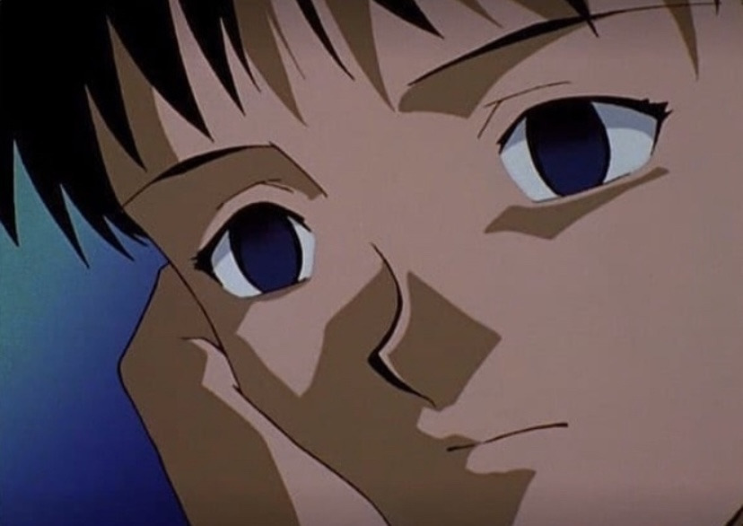
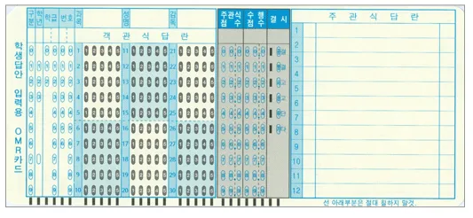
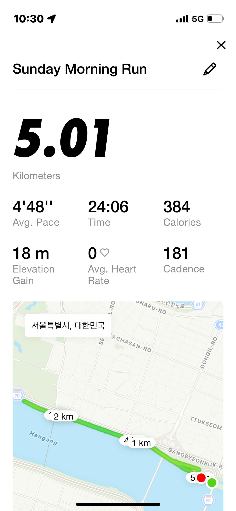

레벨 1을 마무리 하고, 방학을 시작한지 5일 정도가 되었다.
레벨 1에서 내가 주로 느꼈던 감정들과 생각들을 지금이라도 기록하고자 한다...!

## 남이 뭘 하든, 남이 뭐라하든 말든 마인드

항상 '그랬구나, 그럴 수도 있겠구나...' 마인드를 가지고 살아왔다.
친구들과 얘기를 나누는 와중에 생각이 다르면 '저 친구는 저렇게 생각하구나...'라며 넘겼고, 친구들이 들려주는 다른 친구들과의 에피소드들을 들어도 '아하...저런 일이 있었구나'라며 넘겼다.

공감을 잘 하지 않았고, 공감을 하려고 시도하지도 않았다. 억지로 해주는 공감은 안하느니 못하다고 생각했고, '알아서 잘 하겠지?'라는 생각과, '내가 조언이나 충고를 해준다고 해서 달라지는게 있을까?'라는 의심이 있었다. 그저 옆에서 들어주고 "응.. 응..? 응..!" 해주는게 다였다. 현실적으로 도움이 될만한 해결책을 몇가지 제시해주는 정도...? (~~어차피 우린 다르니까!~~)

이런 마인드를 가지고 살아가다 보니, 다른 사람들의 행동을 주의 깊게 관찰하거나, 다른 사람들의 생각에 대해서 깊게 고민해 본 경험이 거의 없었다. 그냥 다른 사람들의 행동과 생각들을 눈에 보이는 있는 그대로 받아들였고, 받아들이는 것 이상의 무언가를 해보려는 시도를 하지 않았다.

우테코를 시작한 지 얼마 지나지 않아 지금까지 가지고 있던 마인드를 고쳐야 한다는 필요성을 느꼈다. 피드백을 주고받는 상황이 생각보다 정말 많았기 때문이다.

페어 프로그래밍이 끝나자마자 각 미션의 페어는 서로를 피드백하고, 리뷰어들과도 서로를 피드백한다. 그리고 코치님들의 수업이 끝나자마자 피드백을 전달해 드려야 하며, 매주 진행하는 유연성 강화 스터디에서도 연극 조끼리 서로 피드백 해야 했다. 글쓰기 미션을 진행할 때도 같은 조 크루들의 글에 대해서도 피드백을 전달해 줘야 한다.

처음에는 정말 힘들었다. '이렇게까지 서로가 서로를 피드백 한다고?', '난 누구를 피드백 해본 적이 거의 없는걸... 도대체 피드백은 어떻게 하는 거야?'라는 생각이 나를 너무 힘들게 했다. 특히 지금까지 내가 살아오면서 가졌던 마인드 셋은 다른 사람들에게 피드백을 전달해 주기 너무 힘든 마인드 셋이었다.

## 조금 달라져볼까?

각 미션이 끝나면 페어가 해준 피드백과 리뷰어가 해준 피드백 내용을 확인할 수 있다. **피드백 내용을 읽으면서 내가 지금까지 몰랐던 나의 모습을 정말 많이 발견할 수 있었다.** 해당 내용이 설탕같이 달고 듣기 좋든, 채찍같이 조금 아프든 '다른 사람들 눈에는 내가 이렇게 보일 수도 있겠구나'를 많이 느꼈다. 그리고 해당 내용들을 통해 앞으로 우테코 생활을 어떻게 해갈지에 대한 방향도 잡을 수 있어서 나에게 정말 많은 도움이 되었다.

우테코에 오기 전 내 모습과 내 주변 상황들을 다시 떠올려보면, 난 다른 사람들의 행동과 생각에 대해 피드백을 해본 경험이 거의 없지만, 반대로 **내가 다른 사람들에게 내 행동과 생각에 대해 피드백을 받아본 경험도 거의 없었다.**

너무나도 새로운 환경이었다. 거의 매일매일 피드백 속에서 생활해야 한다니...
하지만, 크루들이나 리뷰어들이 나에게 해준 피드백들은 나에게 정말 많은 도움이 되었으며, 도움을 받은 만큼 나도 도움을 주고 싶었다. 그래서, 조금 달라져 보기로 했다. 지금부터라도 다른 사람들의 행동과 생각에 대해서 조금 깊게 대해보는 것으로.

나와 의견이 다른 사람이 있으면 그냥 저 사람은 저렇게 생각하구나가 아닌 '왜 다르지? 어떻게 다르지?'에 대한 궁금증을 가졌다. 리뷰어가 내 PR 메시지를 읽고, 내 코드를 보며 피드백을 해줄 때에도 나와 의견이 다르면

> '리뷰어는 왜 이렇게 고민해 보는 것을 권장하지?
>
> '이 코드에 대해서는 어떻게 생각할까?'

에 대한 궁금증을 가졌다.
매주 진행하는 유강스(유연성 강화 스터디)에도 연극 조원들이 목표를 잘 달성해나가고 있는지에 대해 집중해서 피드백을 전달해 주고 싶었고, 내 피드백이 조금이라도 도움이 되었으면 했다.

우테코 생활을 두 달 정도 하면서, 스스로도 지금까지 보지 못했던 모습을 발견할 수 있었다.
바로 생각보다 다른 사람의 이야기를 듣는 것을 좋아하며, 다른 사람들의 행동과 생각에 관심이 많다는 것이었다. 특히 나와 관심사가 비슷한다면. 나를 포함한 프론트엔드 크루들은 프론트엔드 공부(JS, TS, React 등등..)라는 공통된 관심사를 가지고 있을 것이다. 공통된 관심사를 가진 사람들이 모인 이 환경에서 주고받는 생각들과 이야기들은 정말 흥미로웠다.

노이즈 캔슬링 헤드셋을 끼고 미션을 하고 있다가도, JS에 대한 토론을 하고 있는 작은 소리가 들리면 노이즈 캔슬링 효과는 사라졌다. '어... 재밌겠다!'라는 생각으로 어느 순간부터 옆에 붙어서 같이 얘기를 하고 있었다. (~~더 비싸고 효과 좋은 노이즈 캔슬링 헤드셋이 필요할지도...~~)

레벨 1 때 스터디를 진행하지는 않았지만, 스터디를 진행 한 크루들은 어떻게 진행했는지에 대한 궁금증이 생겨서 찾아가서 인터뷰를 해보기도 했다. 남이 어떻게 생각하든 말든, 남이 나한테 뭐라 하든 말든 하나도 신경 쓰지 않던 내가 자발적으로 다른 사람들의 이야기를 들어보기 위해서 인터뷰를 하다니...많이 놀라웠다. (삐걱삐걱 인터뷰에 응해주었던 딩코 스터디 크루들과, 썬데이와 파슬리에게 감사드리며...🙇‍♂️) 우테코 생활을 시작하고, 나도 몰랐던 나의 모습을 발견할 수 있던 순간들은 정말 소중했다.

다른 사람들이 발견해 준 내 모습, 스스로 발견한 내 모습 모두 앞으로의 우테코 생활을 어떻게 해나갈지에 대한 방향성을 잡을 수 있는 귀중한 피드백들이었다. (피드백 해준 분들 모두 감사합니다 🍀)

## "정답은 없다"에 적응하기

우테코를 시작한 지 얼마 되지 않았을 때, 다른 사람들을 피드백 하는 것만큼 나를 정말 힘들게 했던 문장이 있었다.
바로 "정답은 없다"라는 문장이었다.

고등학생, 반수, 대학생 시절 모두 5지 선다형 문제 아니면 주관식에 정해진 정답을 골라야 하는 환경에서 공부를 해왔었고, 이 환경에 익숙해지다 보니 자연스럽게 좋은 코드와 좋은 소프트웨어 개발에도 정답이 있다고 생각했었다. 우테코에서 진행하는 미션과 몇몇 활동들 모두 그 정답을 찾아가는 과정이라고 여겼다.

하지만, 우테코에 와서 "정답은 없다"라는 말이 종종 들릴 때마다 '네...? 왜 없는건가요?'를 속으로 정말 많이 생각했다. (여긴 도대체 어디야...)

> ??? : 내 리뷰어는 `Object.freeze` 사용 왜 했냐던데?
>
> ??? : 엥, 내 리뷰어는 `Object.freeze` 사용 잘했다던데?

이런 대화가 들릴 때마다 너무나도 혼란스러웠다. (~~집에 가고 싶은걸...?~~) 동일한 코드에 대해서도 리뷰어들의 의견은 달랐고, 피드백도 천차만별이었다. 특정 메서드를 사용해야 하는 상황과 그렇지 않은 상황에 대한 정답이 있을 것이라 생각했는데... 그런 것은 없었다.

한 미션을 대하는 방법도 크루들마다 달랐고, 미션을 진행할 때 거쳤던 생각들도 달랐으며, 구현된 코드 또한 비슷한 크루들도 있었지만 대부분 달랐다. 그리고 그 어디에도 정답은 없었다.

하지만, 정답이 없는 것은 어쩌면 당연한 것일지도 모른다. **존재하지 않는 정답을 찾으려 하기보다는 다양한 의견들을 주고받으면서 자신만의 주관과 의견을 만들어가는 것이 더 중요한 것**이었다. 미션의 학습 목표를 달성하기 위해서 어떤 고민들을 거쳤는지 공유하고, 그 고민을 코드에 녹여낸 방법을 공유하고, 받은 피드백들을 공유하면서 **수많은 정보와 의견들 속에서 "내 의견"을 만들어 가는 과정이 더 중요한 것**이었다. 우테코에서의 학습은 정답을 찾기 위한 학습이 아니라, 프로그래밍이든 소프트 스킬이든 그 속에서 내 모습과 페이스를 찾아가는 학습이었다.

이걸 느낀 순간부터는 나도 '정답은 없다'라고 말하고 있다. 정답은 없고 각자의 의견만 있을 뿐...

## 유연함에 대하여

> 레벨 1 생활을 유연하게 했는가?

이 질문에 대해서는 생각보다 유연하게 잘 했다고 대답할 수 있다. 우테코 생활을 하면서 생각보다 할 일들이 많았다. 미션과 피드백 반영, 미션에서 놓친 부분들 학습, 글쓰기 미션, 메타인지 말하기 활동 준비, 유연성 강화 스터디 내용 준비 등등 생각했던 것보다 너무 많은 할 일들이 있었다. 모든 것을 잘 해내고 싶다는 욕심과 비례해서 할 일들이 점점 쌓여갔고, 그럴 때마다 '내가 이걸 다 해낼 수 있을까'에 대한 자기 의심도 많이 했다. 자연스럽게 선릉 캠퍼스 왔다 감 고정 멤버가 되었고, 주말에는 잠실 캠퍼스로 출근했다. 많은 일을 하는 만큼 많은 성장을 할 수 있다는 것은 좋았지만, 한편으로는 수능을 다시 준비했던 시절과 연구실을 다니던 시절처럼 또다시 번아웃이 찾아오지 않을까 하는 걱정도 많이 했다.

이 걱정은 매주 진행하는 유연성 강화 스터디를 통해 많이 해소되었다. 지친 것 같은 순간이 찾아올 때마다, 뇌가 멈춰버리고 아무 생각 없이 자리만 지키고 있었던 번아웃을 느낄 것 같은 순간이 찾아올 때마다 나의 레벨 1 유연성 강화 목표를 의식적으로 떠올렸다.

> '방금 정한 내 목표는 또 너무 크고 추상적이지 않나? 조금 작더라도 목표를 구체화해보는 게 어떨까?'
>
> '나 지금 지친 것 같은데, 이 내용은 나중에 무조건 공부하게 될 것이니 지금 체력을 깎아먹으면서까지 억지로 할 필요는 없지 않을까?'

위와 같은 생각을 계속 의식적으로 떠올리면서, 꾸준해야만 한다는 압박감 속에서 긴장을 하며 살아가던 내가 보다 유연하게 레벨 1 생활을 할 수 있었다. 유연성 강화 스터디를 하면서 스스로를 너무 혹사시키지 않고, 부드럽게 대했던 모습도 발견할 수 있었다. 단, 이 모든 것들은 혼자 했으면 절대 못했을 것이다. (나의 레벨 1 글쓰기 미션이 궁금하다면?)

매 주말마다 하는 한강 러닝도 내 유연성에 정말 많은 도움을 주었다. 우테코를 시작하기 전, 부산에서 생활했을 때는 달리기에는 전혀 관심이 없었다. 단지 달리기가 멘탈 강화에 정말 좋은 운동이라는 것만 알고 있는 정도였다. 스스로 멘탈이 약한 사람이라고 생각하며 살아왔고, 달리기가 내 약한 멘탈에 도움이 될지 궁금했다. 그리고, 서울에는 뛸 곳이 굉장히 많으니 이 환경을 이용해 보고자 했다.

달릴 때는 거의 아무런 생각을 하지 않는다. 계속해서 달리는 것에 집중해야 하기 때문에 다른 생각을 할 수 없다고 말하는 게 맞겠다. (진짜 힘들다...)

하지만, 억지로라도 아무런 생각을 하지 않도록 하는 시간이 나에겐 너무나도 필요한 시간들이었다. 미션을 진행하면서 해결하지 못한 부분을 계속해서 생각하거나, 더 잘 하고 완벽하게 하고 싶어서 고뇌하던 시간들에서 잠시라도 벗어났기 때문에 보다 유연한 생활을 할 수 있었다. 만약, 달리지 않았었더라면 맥북을 보고 있든 아니든, 옆에 누가 있든 말든 계속해서 내가 해결해야만 하는 문제들을 생각했을 것이며 지쳤을 것이고 번아웃으로 끌려갔을 것이다. 달리는 행위에만 집중해야 했던 순간들과, 오늘 뛰기로 설정한 거리를 모두 다 달렸을 때 느낄 수 있었던 상쾌함은 다음 주 우테코 생활을 더 유연하면서도 단단하게 할 수 있도록 도와주었다.

레벨 2에도 달리기는 필수야...!

## 불안해서가 아닌 재밌어서

지금까지 학습을 하지 않으면 안 될 것 같아서 했었다. 그리고 남들이 하니까 따라서 했었다. 특히 고등학생 때 했던 학습에서는 즐거움을 느낀 적이 거의 없었으며, '이걸 왜 하지?'라는 생각만 했다. 억지로 하고 싶지 않아서, 야간 자율학습도 많이 도망갔고 하는 척을 많이 했다. (이러니까 수능 두 번 치지...ㅋ)

이후 컴퓨터 공학을 전공으로 바꾸면서, 적성에 맞는다는 것을 느꼈고 자연스럽게 재미를 느꼈다. 누가 시키지 않았는데도, 자발적으로 학습을 한 것은 처음이 아니었을까 싶다. 중간중간 번아웃도 느꼈지만, 잠시 자책하는 시간(?)과 휴식을 가지면서 계속 학습했었고 우테코까지 오게 되었다. 우테코 생활을 시작한 지 얼마 되지 않았을 때는 지금까지 해왔던 학습 방식, 분위기와는 너무나도 달라서 적응하는 데 조금 걸렸지만, 하지 않으면 안 될 것 같아서라는 생각으로 억지로 학습했던 적은 없다. 내가 관심 있어 하는 분야를 다른 크루들도 관심 있어 하며, 크루들은 내 이야기를 잘 들어주고, 나 또한 크루들의 이야기를 듣는 것이 재밌다.

레벨 2에서도 자발적으로, 재밌게 학습하고 성장하고 싶다! 레벨 1 안녕 👋🏻🍀 (~~레벨 2는 조금만 더 뒤에 만나고 싶다...~~)
