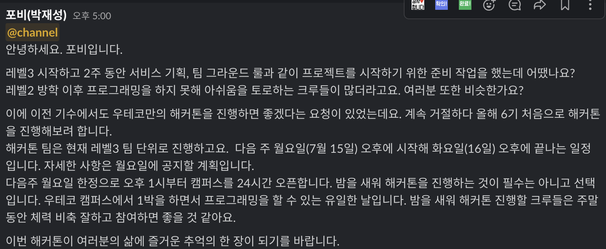
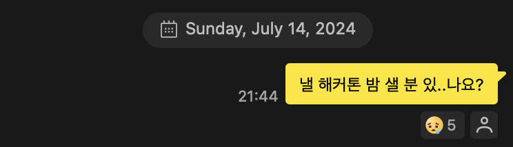
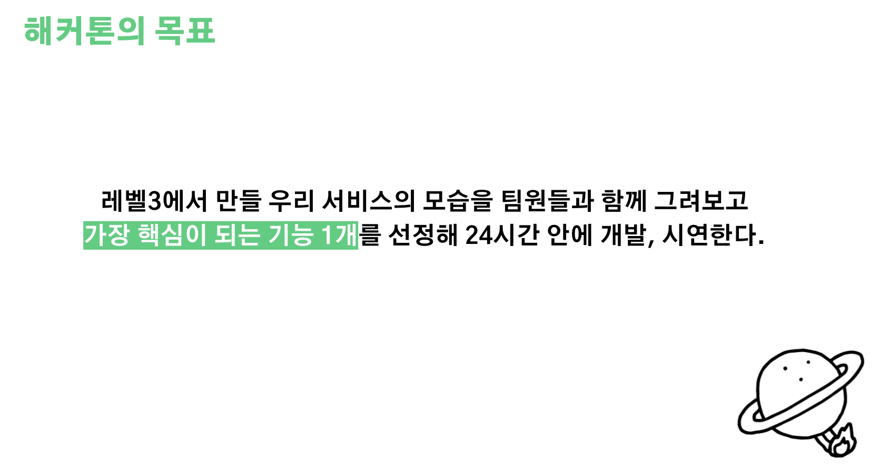
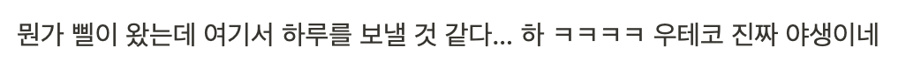
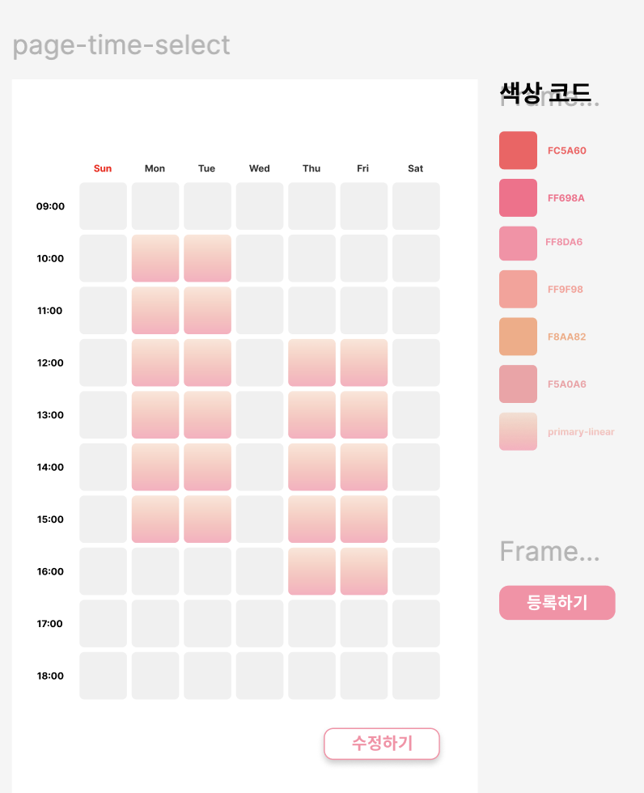
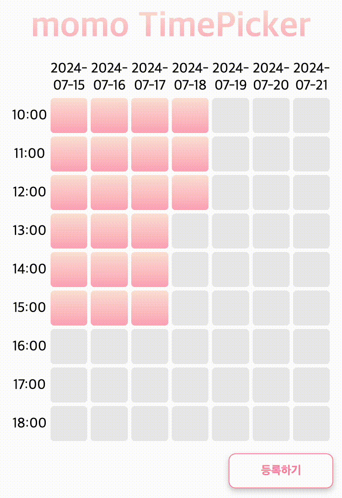
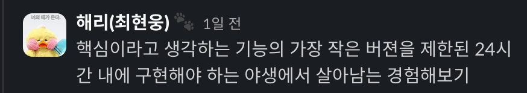
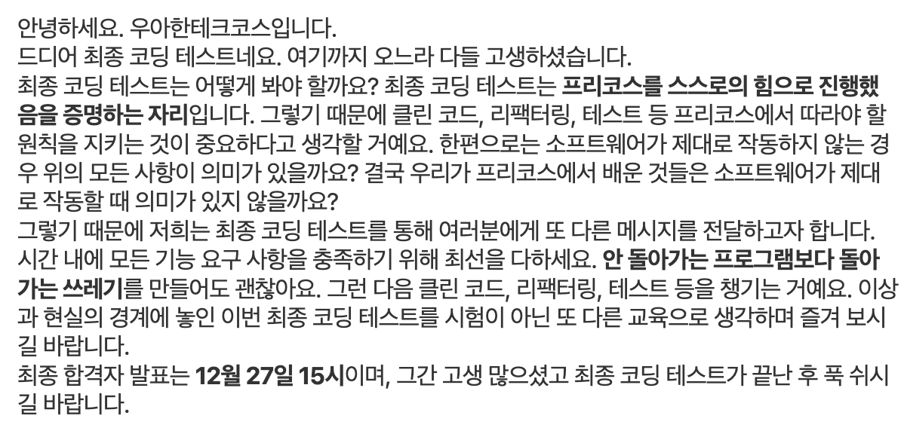

## 해커톤을 한다구요…?



레벨 3 프로젝트 1차 스프린트에 대한 데모데이가 종료되고, 팀원들과 1차 스프린트에 대한 회고를 하는 중 슬랙에 포비가 다음 주 월요일에 우테코만의 해커톤을 진행한다는 공지를 올리셨다.

‘엥…? 갑자기 해커톤? 띠용…’ 했지만 대수롭지 않게 생각하고 스프린트 회고를 진행했다. 우테코를 시작하기 전 GDSC 동아리에서 주최한 해커톤에 참여했을 때 밤을 새면서 코딩을 한 후 체력적으로 너무 지쳐서 앞으로 특별한 일이 없는 한 해커톤에 참여하지 않겠다고 다짐했었다. 그렇기에 월요일에 진행하는 해커톤에서도 밤은 절대로 새지 않을 것이라고 생각했고, 밤 새기 싫다고도 말했다.

??? : 해커톤 참여는 필수인데, 밤 새는건 필수 아니라는데? ‘에이…설마 또 밤 새겠어?’ 나 집 일찍가서 잘건데?

하지만 정말 큰 플래그를 세워버렸다. 다시는 밤을 새지 않겠다는 다짐과 선언들이 이번 해커톤에서 전혀 소용이 없었다.

지금 이 회고 글도 캠퍼스에서 2시간 잠시 눈을 붙인 것을 제외하고는 밤을 꼴딱 샌 직후 작성하고 있다…



혹시 몰라서 팀원들에게 밤을 샐 의향이 있는지 물었는데, 아무 말 없이 슬픈 이모지가 달렸다. 이것도 플래그 였을까? 우리 팀의 절반이 거의 해가 뜰 때까지 캠퍼스에 남아있었고, 먼저 집으로 귀가한 팀원들도 게더에서 열심히 새벽까지 해커톤에 참여했다.

(’앞으로 밤을 절대 새지 않을 것이다’와 같은 단언은 하지 말아야겠다.)

## 해커톤 OT : 요구사항 소개



해커톤 첫 날 오후 2시 해커톤의 목표와 함께 요구사항이 소개되었다.

> _레벨 3에서 만들 우리 서비스의 모습을 팀원들과 함께 그려보고 가장 핵심이 되는 기능 1개를 선정해 24시간 안에 개발, 시연한다._

요구사항을 보자마자 ‘또 우리를 극한의 야생으로 던지는구나…’라고 생각했고 가방을 싸고 그대로 다시 집으로 가고 싶었다. 밤을 새는 것은 필수가 아니라고 했지만, 뭔가 밤을 샐 것 같다는 느낌이 왔고 그 느낌은 정확이 들어맞았다.



1차 스프린트 데모데이에서 코치분들에게 소개한 우리 팀 프로젝트의 핵심 중의 핵심은 **약속에 참여하는 사람들이 자신의 시간을 공유하고 다른 사람들의 시간을 확인할 수 있도록 하는 것**이었다. 테이블 UI를 활용해서 시간을 드래그해서 표시할 수 있도록 하고, 시간 데이터를 포매팅해서 서버에 보낼 수 있도록 해야 했는데, 1차 스프린트에서 디자인 작업을 전혀 하지 않았어서 디자인과 드래그 기능을 24시간 안에 구현해야 했다. 심지어 드래그 기능은 이전에 한 번도 구현해 본 적이 없어 너무나도 막연했다. 이런 막연함이 자연스럽게 ‘아…나 밤 새겠다’라는 생각으로 이어졌다.

OT가 끝난 후, 어차피 밤을 샐 것 같으니 이 때부터 즐기자는 마인드로 해커톤에 임했다.

간식들도 많이 챙겨 주셨고, 이 날이 초복이라서 치킨과 피자도 시켜주신다고 하셨다! 맛있는거 먹으면서 즐겁게 해커톤 해보자~ 라고 생각했다.

## 핵심을 구현해 봅시다, 핵심!

우리 팀 프로젝트의 핵심 기능인 “**약속에 참여하는 사람들이 자신의 시간을 공유하고 다른 사람들의 시간을 확인할 수 있도록 하는 것”**을 24시간 안에 구현하기 위해서 제한 시간내에 구현할 수 있는 가장 작은 버전에 대해서 이야기를 나누었다.

팀원들과 이야기를 많이 나누면서 약속을 생성하는 것, 약속에 참여하는 사람들이 같은 페이지에서 시간을 표시하도록 하기 위해서 공유 링크를 생성하는 것, 가장 많은 인원이 만날 수 있는 약속 시간 추천 등과 같은 기능들은 있으면 좋은 기능이긴 하나 **진짜 핵심**은 아니라고 판단했다. 진짜 핵심은 시간 표시, 수정, 공유라고 생각했기에

- 홈페이지가 약속에 참여할 수 있는 시간을 표시하고 수정할 수 있는 페이지라고 가정한다.
- 약속에 참여하는 참여자는 `momo` 1명이라고 가정한다.
- 시간을 확인해야 하는 날짜의 범위는 일주일이라고 가정한다.

위와 같은 가정들을 세우고 핵심을 포함하는 가장 작은 버젼을 이번 해커톤에서 구현하기로 결정했다.

레벨 2에서 가장 많이 강조됐던 사고 방식인 ‘결국 우리가 무엇을 하려고 하는 것인가?, 내가 제공해주려고 하는 가치가 핵심을 포함한다고 가정했을 때 동작이 가능한 가장 작은 버젼은 뭐지?’가 이번 해커톤에서 핵심을 포함하는 기능을 뽑아내는데 많은 도움이 되었다.

([해커톤을 위한 이슈](https://github.com/woowacourse-teams/2024-momo/issues/6))

내가 속한 프론트 팀에서는

1. 시간을 표시할 수 있는 페이지, UI를 구성한다.
2. 약속에 참여할 수 있는 시간을 표시, 수정할 수 있는 기능 제공한다.
3. 서버가 사용자가 가능한 시간을 저장할 수 있도록 한다.

위 3가지 태스크를 수행해야 했다.

### 1) 시간을 표시할 수 있는 페이지, UI를 구성!



1차 스프린트를 준비했던 2주 동안, 디자인 작업을 전혀 하지 않았어서 피그마를 급하게 만들고 호다닥 디자인을 마무리 했다. 30분 단위로 시간을 표시할 수 있도록 해주려고 했지만, 이 방법을 사용할 경우 시간을 선택할 수 있는 박스들이 너무 많아져서 해커톤에서는 1시간 단위로 표시할 수 있도록 했다.

우리 팀 이름은 ‘모두 모여’를 줄여서 ‘모모’이고, 모모가 일본어로 복숭아를 뜻하는 단어여서 메인 컬러를 분홍색으로 잡았고, 강조해야 하는 영역에 메인 컬러를 사용하기로 했다.

(~~다 만들고 한 생각 ‘오…잘 만들었는데?’ 집에 일찍 가겠는데?~~)


디자인을 완성한 후, 치킨 & 피자를 먹을 때만 해도 행복했다…

??? : 먹고 빠르게 기능 쳐내고 집 ㄱ?

??? : 오 좋은데, 빨리 끝나면 롤 ㄱ?

라는 대화도 오갔다.

### 2) 약속에 참여할 수 있는 시간을 표시, 수정할 수 있는 기능 제공!

급하게 완성된 디자인 시안을 바탕으로 컴포넌트를 구성하고 드래그로 시간을 표시하는 기능을 추가해야 했다.

우리가 제공해줘야 하는 기능을 세세하게 분석해 봤을 때 다음과 같았다.

<details>
<summary>요구 사항 분석 보기</summary>
<div markdown="1">

## 큰 틀에서 요구 사항 분석하기

1. 클릭, 드래그 이벤트를 모두 지원할 수 있어야 한다.

⇒ 브라우저의 경우 MouseEvent, 모바일의 경우 TouchEvent를 사용한다.

2. value의 타입은 아직 미정이지만 현재 구현은, `boolean[][]` 이어야 한다.

⇒ `boolean[][]` 자료구조를 사용할 지, 날짜 데이터가 담긴 자료구조를 사용할 지는 미정이다.

### 클릭 기능 요구 사항

1. false → click → true 안

2. true → click → false

⇒ 클릭은 이벤트 시작 셀과 종료 셀이 같다.

### 드래그 기능 요구 사항

1. 테이블 내부에 존재하는 임의의 한 셀이 출발 셀이라고 가정했을 때, **사용자가 드래그를 종료하는 마지막 셀** 까지 다음의 동작을 만족해야 한다.

⇒ 출발 셀 값을 x라고 가정했을 때, 출발지 → 목적지 좌표 사이에 존재하는 모든 셀의 값은 !x가 되어야 한다.

⇒ 선택된 시간을 취소할 때, 취소하고자 하는 영역을 벗어나서 새로운 시간을 추가 할 수는 없다.

2. 드래그를 시작하고, 드래그를 하면서 지나온 영역을 다시 되돌아 갔을 때 시간 선택도 되돌릴 수 있어야 한다.

</div>
</details>
<br/>

요구사항을 차분히 분석 한 후, 진짜 어려운 문제를 해결하고 있다는 것을 깨달았다. 아무래도

전체 기획 ⇒ 스프린트 단위로 기능 나누기 ⇒ 나눈 기능 가운데에서도 핵심

이 순서대로 해커톤에서 구현해야 하는 기능이 결정되었다 보니, 핵심중에 핵심을 뽑게 되었고, 자연스럽게 구현해야 하는 기능의 난이도가 올라갔다. 해커톤에서 만들어야 하는 요구사항을 제대로 분석했을 때는 이미 캠퍼스를 나갈 수 있는 시간인 11시를 벗어났었고, 집중할 수 있는 체력도 거의 다 써버려서 ‘이거 24시간안에 해결할 수 있는 문제가 맞았나?’하는 의심을 하기 시작했다.

하지만 집에 가지 않기로 마음 먹은 이상, 어떻게든 동작하는 쓰레기라도 만들어보자는 생각을 했다! 가보자고!


우리와 비슷한 기능을 구현하셨던 분들이 정리해주신 여러 블로그를 참고해서, `useRef` 훅을 활용해서 테이블 정보를 저장하고 2차원 배열을 순회하면서 시간을 표시 하는 방식으로 구현했다!



수정하기 버튼을 누를 때만 드래그를 통해서 시간을 표시 할 수 있도록 하는 기능도 추가했다!

### 3) 서버가 사용자가 가능한 시간을 저장할 수 있도록!

사용자가 약속에 참여할 수 있는 시간을 표시하면, 저장할 수 있도록 서버에 데이터를 전송해줘야 하는 일이 남았다.

서버 상태를 관리하기 위한 방법에 대해서 빙봉, 낙타와 얘기를 한 후 빠르게 리액트 쿼리를 사용하기로 결정했다. 모두가 레벨 2 리액트 과정에서 이미 사용해본 적이 있는 라이브러리라서 해커톤에서 정의한 문제를 해결하기 위한 기술로써 도입하기 위해 크게 문제가 되지 않을 것이라 판단했고, 나중에 시간 뿐만이 아닌 날짜 상태도 관리해야 할 때가 오면 어차피 사용하게 될 라이브러리라는 맥락으로 좁혀져 빠르게 `npm install` 했다 ㅋㅋ!

서버에서는 약속에 대한 데이터를

```
{
  "data": {
    "availableDates": ["2024-07-16", "2024-07-17", "2024-07-18"],
    "meetingName": "약속 이름",
    "startTime": "00:00",
    "endTime": "24:00",
    "schedules": [
      {
        "date": "2024-07-16",
        "times": ["18:30", "19:30", "20:30"]
      },
      {
        "date": "2024-07-17",
        "times": ["18:30", "19:30", "20:30"]
      },
      {
        "date": "2024-07-18",
        "times": ["18:30", "19:30", "20:30"]
      },
    ]
```

위와 같은 형태로 넘겨줬다.

약속에 대한 정보가 클라이언트 측으로 넘어오면

- `startTime` ~ `endTime` 만큼을 열, `schedules` 배열의 길이 만큼을 행으로 크기를 가지는 2차원 테이블을 만들어 UI를 구성하고,
- 가능한 시간이면 즉, `schedules` 배열에 포함된 시간이면 true 그렇지 않으면 false로 채워진 `boolean[][]` 형태의 2차원 배열을 만들어서 상태로 관리

하는 두 가지 작업을 수행했다. 그리고, 사용자가 가능한 시간을 수정하고 `등록하기` 버튼을 클릭하면 `boolean[][]` 2차원 배열을 다시 날짜와 시간 데이터를 포함하고 있는 `schedules` 와 같은 형태로 포매팅을 한 후 서버에 POST 요청을 보내주었다. 서버에서 가져올 때, 서버에 데이터를 전송할 때 모두 데이터를 포매팅하는 과정이 있어서 이 작업에 대한 오버헤드가 크다고 생각했었다… 자바스크립트의 `includes` 메서드를 사용해서 상태를 관리할 수 있었지만 매번 includes를 사용해서 배열을 순회하는 것과 데이터의 형태를 바꾸는 것의 오버헤드의 차이가 그렇게 크지는 않을 것이라고 생각했고, 남은 시간 동안 더 깔끔하고 좋은 방법을 떠올릴 수 없을 것 같아서 기존 방법을 유지하기로 했다.

~~(더 좋은 방법에 대한 고민을 했을 때의 시간은 아마 오전 10시였을 것이다…)~~

서버와의 연결을 확인한 후, 시연 순서를 기다렸고 우리 팀은 마지막 순서였다. 대부분의 팀이 시연자와 시연자를 도와주는 크루가 짝을 이뤄서 발표를 하러 나왔지만, 내가 우리 팀 이름 모모(모두 모여)니까 모두 나가자~ 라고 제안했고 흔쾌히 내 제안을 수락해줘서 모두가 나갔다…ㅋ

어찌저찌 성공적으로 발표를 마무리 하고 램수면 상태로 귀가를 했다. 팀 모모 고생했다!!! 👏🍀😊

## 왜 해커톤을 한 것일까?

모든 팀의 시연 발표가 마무리 된 후, 해커톤에 대해 회고하는 시간을 가졌다.

> _왜 해커톤을 한 것일까요? 아무 이유 없이 했을까요?_

회고 시간을 담당하셨던 코치께서 위와 같은 질문을 던지셨고, 우리는 다 같이 생각해보는 시간을 가졌다.



나는 위와 같이 대답했다. 24시간 이라는 제한된 시간 내에 우리가 구현해야 하는 핵심을 구현해야 하는 것은 말 그대로 정말 야생 그 자체였다. 해커톤의 요구사항도 미리 공개된 것이 아닌 해커톤 OT를 할 때 공개 되었고, 밤을 새지 않을 것이라 생각하고 아무런 준비도 하지 않고 캠퍼스에 출근한 결국 밤을 샜다.

코치께서는 위와 같은 질문을 던지시면서 다음과 같은 말도 같이 해주셨다.

> _지금까지 우테코에서 프로젝트를 진행했을 때, 핵심 가치와 벗어난 기능에 집중해서 시간과 체력을 많이 쓰는 것 같아 아쉬웠다. 예를 들어 로그인에 너무 힘을 쓰는 것.
> 그래서 핵심은? 우리는 사용자에게 어떤 가치를? 이라는 질문에 대해서 24시간 동안 팀원들과 찐~하게 고민해보고 구현해보는 시간을 초반에 가지는 것이 좋다고 생각했다._

확실히 제한된 시간 내에 핵심을 구현해야 한다는 요구사항이 있으니, 나와 우리 팀의 사고가 자연스럽게 **진짜 핵심**으로 동기화가 잘 된 것 같았다. 진짜 핵심을 정의하고 정의한 문제를 빠르게 해결하기 위해서 자연스럽게 팀원들과 정말 많은 대화를 나누고 소통한 것 같다. 우리 팀 전체가 정말 적극적이었던 24 시간이었다고 생각했다!

그리고 또 이런 말씀도 해주셨다.

> _일부러 우테코에서는 적절한 스트레스 상황을 만들고, 스스로의 자연스러운 진짜 모습을 팀원들에게 공개함으로써 팀원들과 빠르게 가까워지고 편해질 수 있도록 의도했다. 적절한 스트레스 상황이 없으면, 자연스럽게 가면을 쓰게 된다. 가면을 쓰는 동안 곪다가 레벨 4 마지막 쯤 터지게 되는 경우도 많이 봤다.
> …
> 실제 현업에서는 이런 일들이 당연히 생길 수 있다. 오늘은 이거 해야 했는데 당장 내일 갈아엎고 새로운 작업을 시작해야 할 수도 있다. 그런 상황에 적응하는 능력을 키우는 것도 중요하다._

그렇다면 24 시간 동안 드러난 나의 진짜 모습 혹은 나도 몰랐던 새로운 모습이 있었을까?

다른 팀원들은 어떻게 생각했을지 잘 모르겠지만, 딱히 다르거나 몰랐던 모습이 나오지는 않았던 것 같다. 평소에 시간에 대한 강박과 압박이 조금 있는 편이라, ‘제한 시간 내에 구현하지 못하면 어떡하지?’라는 생각을 중간중간 하긴 했지만, 뭔가 할 수 있을 것 같다는 느낌도 있었고, ‘못하면 뭐 어쩔 수 있나? 해커톤 끝나고 구현하면 되지~’라는 생각을 더 많이 한 것 같다. 그래서 평소처럼 노래 틀어 놓고, 중간중간 헛소리도 좀 하고, 다른 팀원들이랑 스몰 토크도 하면서 24시간을 보냈다.

1차 스프린트를 준비했던 2주 동안의 팀 전체의 모습과, 해커에서의 팀 모습도 크게 다르진 않았던 것 같지만 확실히 평소보다 대화를 정말 많이 했고 소통이 더 잘 된다고도 느꼈다. (~~중간중간 텐션 스파이크 이슈로 멍을 때리긴 했지만…~~)

## 우커톤(우테코 해커톤)은 나에게 어떤 의미가 있었나?

해커톤이 끝나고 가장 많이 한 생각은 집에 가면서 말로도 뱉었지만, ‘이게 되네…’ 였다. 정말 핵심이라서 난이도가 높은데 24시간 안에 구현이 완료된 것을 보면서 ‘이게 진짜 24 시간내에 되는 것이었네…? ~~왜 되지…?’~~라고도 생각했다.

진짜 왜 되었는지를 생각해보면, 코드 퀄리티에 대한 생각은 잠시 넣어두고 **일단 동작이라도 하도록 하는 것에 초점을 맞추었기 때문**이었다. 코드를 작성하는 중간중간 매직 넘버나, 별로인 것 같은 로직이나, 중복되는 로직 등등… 리팩터링을 하고 싶은 욕구가 정말 많았지만 그 때마다 팀원들끼리 나중에 생각해!를 외치며 일단 눈 앞에 제대로 동작이라도 하는 것에 집중했기 때문에 제한 시간 내에 가능한 것 같다. 만약, 코드 퀄리티나 기타 부수적인 것들에 집중하느라 시연을 할 때 아무것도 보여주지 못했다면 밤을 샜는데도 불구하고 구현을 하지 못했다는 생각에 오히려 더 지쳐 팀 전체의 사기도 떨어질 수 있었을 것 같다고 생각하기도 했다.

해커톤이 끝나면 좋지 못한 코드들, 스스로 생각했을 때 만족하지 못한 코드들에 대해서 리팩터링을 진행해야 할 것이지만, 당장 핵심은 구현했기 때문에 해커톤이 끝나고 우리 팀의 분위기도 좋았다. **핵심을 계속해서 강조하는 이유를 이제는 진짜 알 것 같다.**



집에 가면서 우테코 최종 코딩 테스트 메일에 포함된 위 내용을 떠올렸다.

> \*한편으로는 소프트웨어가 제대로 작동하지 않는 경우 위의 모든 사항이 의미가 있을까요? **결국 우리가 프리코스에서 배운 것들은 소프트웨어가 제대로 작동할 때 의미가 있지 않을까요?\***

코드 퀄리티에 집중하는 것 보다, 당장 눈 앞에 주어진 문제를 해결하는 것에 집중하며 사용자에게 정말 작은 가치라도 전달할 수 있을 것 같은 가능성을 발견하는 것이 훨씬 중요하다. 우테코 생활을 하면서, ‘점진적으로 발전시켜 나간다’라는 문장이나 요구사항들을 많이 본 것 같은데 이 말이 무슨 의미인지도 해커톤이 끝나고 크게 와닿았다.

**‘당장은 맘에 들지 않는 코드더라도 점진적으로 발전 시켜나가면 된다.’**

**‘가장 작은 것 부터 시작해서 차근차근 쌓아가면 된다.’**

와 같은 의미가 담긴 문장이 아니었을까 생각한다.

또, 해커톤이 끝나고 내 모습을 너무 단정 짓지 말자고도 생각했다. 해커톤 공지가 올라왔을 때만 해도, ‘밤을 절대 새지 않을 것이다’ 라고 말했던 것도 ‘나는 밤을 새지 않는 사람이다’ 라고 단정짓는 것에 익숙했기 때문일 것이다. 스스로의 모습을 단정지으면서 살아도 갑작스러운 상황이 생기면 그 모습을 잠시 내려놓아야 하는데, 굳이 미리 단정지으면서 살아가기 보다는 그 갑작스러운 상황에 빠르게 적응하기 위해서 어떤 모습이 필요한지를 먼저 생각해 보자!

해커톤 끗!
