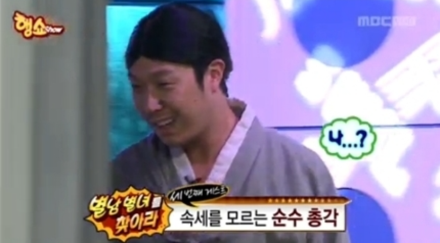
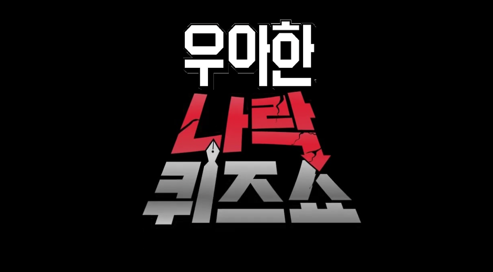
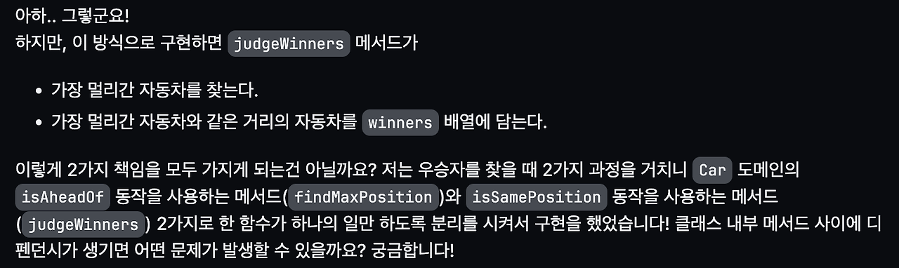
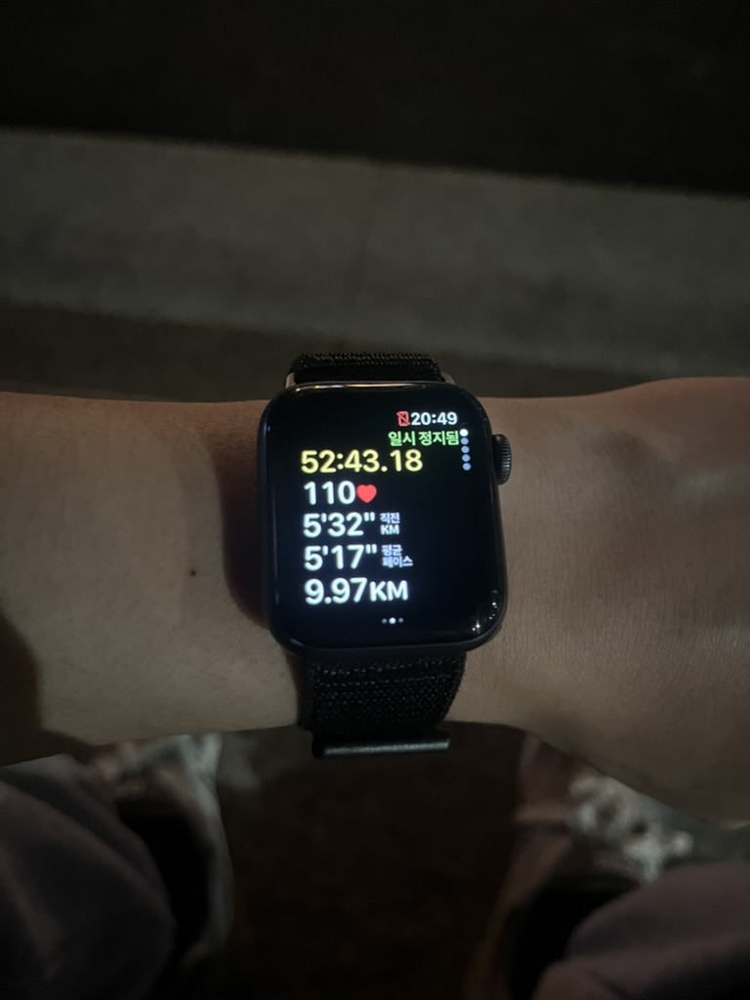

우테코를 위해 부산에서 서울로 올라온 건 2/5 였다. 지금 서울에 올라온지 딱 한 달 정도가 됐다. 3주차가 지난 시점에서 1, 2 주차를 돌아보자면 정말 혼란 그 자체였다. 낯을 정말 많이 가리는 성격에(~~MBTI 중 I의 비중이 제일 높다..~~),기존에 살던 곳에서 500KM이나 떨어진 곳에, 새로운 사람들... 새로운 환경에 적응해보기 위해서 몸부림을 쳤던
기억이 제일 강하다. 거기다가 갑자기 연극이라뇨?

## 연극

우테코를 시작하기 전, 연극의 존재는 이전 기수분들의 블로그를 읽으며 이미 알고 있었다. 하지만, 연극의 존재를 미리 알고 있다는 것이 연극을 준비하는데는 아무런 도움이 되지 않았고 오히려 올게 왔구나.. 하는 생각을 했다. 이전 기수분들의 블로그를 읽을 때는 '에이...이걸 진짜 한다고? 설마~' 라는 생각을 하며 블로그를 읽을 다음 기수분들을 위한 몰래카메라인 줄 알았지만 진짜 연극을 해야했다.

## 우아한 나락 퀴즈쇼

나의 연극조는 나(해리), 낙타, 포메, 해시 빙봉이였다. 모두가 내향인이였고 연극에 대한 걱정들이 엄청났다. 주제에 관한 얘기를 하던 중, 낙타가 피식대학의 나락 퀴즈쇼를 우테코 버전으로 만들면 어떨까 하는 의견을 제시했고 모두가 찬성해 우아한 나락 퀴즈쇼를 준비하게 되었다. 주제가 워낙 강력하고 형식이 짜여 있다 보니 주제가 정해지고 나서부터는 연극 준비가 수월하게 진행됐다. 나는 퀴즈쇼 진행자(김민수)의 역할을 맡게 되었다. 굉장히 많은 질문 후보들이 나왔지만 5분이라는 요구사항을 만족하기 위해서 4개의 질문만 준비하기로 했다. 선정된 질문들은

- 알맞은 우아한 테크코스 로고 고르기
- 가장 나이가 많아 보이는 코치 고르기
- 자바스크립트를 만든 사람 고르기
- 가장 첫인상이 별로였던 코치 고르기

들이였고, 과연 이 질문들을 해도 될까? 진짜 나락 가면 어떡하지? 라는 걱정을 했었다..
연극을 준비하면서 연극조 사람들과 슬라이드를 같이 만들고, 같이 연극을 걱정하면서 의견 공유도 많이 하고 많은 대화를 나누었고 이로 인해 빠르게 친해질 수 있었던 것 같다. 연극 당일 포메가 코로나에 걸려 같이 참여를 못하게 되어 너무 아쉬웠고, 연극 진행에 필요했던 코치들도 자리에 없어 더 많은 재미를 유도하지 못해서 아쉬었다. 하지만, 연극을 잘 마무리 했다는 것에 의미를 두고 싶다! 리허설, 최종 순위 모두 4위를 해서 나름 재밌는 연극을 한 것 같아 만족했다. 😊

연극은 몰래카메라가 아니라 진짜입니다. 이 글을 읽을지도 모를 우테코 7기분들 화이팅 하세요~!

## 페어 프로그래밍

연극을 준비하면서 온보딩 미션 [자동차 경주](https://github.com/woowacourse/javascript-racingcar)를 페어 프로그래밍으로 진행했다. 내 페어는 빙봉이였고 프리코스 때도 진행했던 미션이라, 각자 해당 미션을 어떻게 진행했고 무엇을 고민해봤는지에 대해 이야기를 나누었다. 각자 고민한 내용은 비슷했지만, 구현 방식에 차이가 있었고 "설득하고 설득 당하기" 대화를 하면서 내가 생각한 방식으로 이번 미션을 진행해보기로 했다. 15분 동안 네비게이터, 드라이버 역할을 번갈아 가며 진행하려 했지만 처음이다보니 시간을 재는 것도 까먹고 각 역할을 어떻게 수행해야되는지에 대한 감이 없어 한 명이 계속 네비게이터를 하거나, 드라이버를 하고 있는 상황도 발생했다. 페어 프로그래밍 경험이 처음이라 너무 어색했지만, 같이 기능 명세서를 작성하고 미션을 해결하기 위한 고민을 공유하는 경험은 정말 재밌었다. ([PR](https://github.com/woowacourse/javascript-racingcar/pull/260))

첫 페어 프로그래밍을 끝내고, "우테코 미션을 진행하면서 페어 프로그래밍을 계속해서 하게 될 텐데, 어떡하면 이 시간을 더 잘 활용해 볼 수 있을까?"에 대한 고민을 했었다. 이 고민은 포비가 해줬던 말을 통해서 바로 해결할 수 있었다.

> _페어 프로그래밍을 할 때, 아무말도 하지 않고 페어의 의견만 수용하면서 프로그래밍 하면 그건 본인 손해입니다. 모르는게 있으면 바로 질문하고, 반대되는 의견이 있으면 제시해보고 이렇게 해야 남는게 많을겁니다._

이 말을 듣고 나서 "이거다...!" 싶었다. 포비의 말을 듣고 앞으로 페어 프로그래밍 시간을 어떻게 활용할지에 대한 감이 잡혔다. 더 많이 소통하고, 더 많이 설득하고 설득당하는 자세로 페어 프로그래밍을 해야겠다고 생각했다.

2주차 [콘솔 기반 로또 게임](https://github.com/woowacourse/javascript-lotto)은 같은 데일리 조의 헤인과 진행했는데, 자동차 경주 미션 때 페어 프로그래밍보다 더 많은 이야기를 나눴다. 로또 미션을 진행하면서 TDD를 배울 수 있는 시간이 있었는데, 수업 시간이 끝나도 TDD가 무엇인지 와닿지 않았고 어떻게 해야할지에 대한 감도 잡히지 않았다. TDD에 대해서도 헤인과 이야기를 나눴는데 TDD가 무엇인지 잘 모르겠고, 와닿지도 않고, 필요한지 그렇지 않은지에 대해서도 잘 모르겠으니, TDD에 대해 나름대로 판단을 내려보기 위해 이번 미션을 완전 TDD로 구현해보자고 의견이 모아졌다. 미션을 진행하면서, 헤인과

- 상속과 조합의 차이는 무엇이고 왜 LMS에서는 조합을 권장하는지?
- 뎁스를 늘리더라도 최대한 함수의 동작을 순수하게 만드는 것이 좋은지?
- 상태를 가지고 있는 객체가 스스로 동작하며 객체끼리 메시지를 주고받게 하려면 어떻게 해볼 수 있을지?

위와 같은 주제로 많은 이야기를 나누었고, 3주차가 지난 시점에서 헤인과의 페어 프로그래밍을 되돌아봤을 때 미션을 진행하기 위한 코드를 짰던 시간들보다
이야기를 나누었던 시간이 더 강하게 기억에 남았다. ([PR](https://github.com/woowacourse/javascript-lotto/pull/282)) 콘솔 기반 로또 게임 미션이 종료된 후 상속과 조합의 차이에 대해서 더 이해해보고싶어, 공부를 하고 내용을 기록했다!

- [상속과 조합의 차이 이해해 보기](https://hwinkr.github.io/inheritance-vs-composition)

## 리뷰를 대하는 자세

페어 프로그래밍 미션을 제출하면, 현업자 분들께 리뷰를 받을 수 있었다. 미션을 진행하면서, 내 코드를 완벽하게 짠 후 제출하고 싶은 욕심이 있었다. 하지만, 3주차가 지난 시점에서는 완벽하고 모두가 만족하는 코드를 짜는 것은 사실상 불가능에 가깝기 때문에 완벽하게 짜기 위한 고민을 하기보다는 요구사항들을 잘 만족하기 위한 고민을 하는 것이 미션을 통한 성장에 훨씬 도움이 될 것이라고 생각하게 되었다. 그래서 리뷰어에게 PR을 날릴 때, 이번 미션을 진행할 때 한 고민들을 최대한 드러내고 매듭짓지 못한 의문들에 대한 의견을 묻고자 했다.
자동차 미션을 진행할 때는

- getter를 어디까지 지양해야 하는지?
- 유효성 검증은 어느 영역에서 해야 하는게 좋을지?

로또 미션을 진행할 때는

- 뎁스를 줄이기 vs 뎁스를 포기하더라도 순수함수를 지양하기
- 상속 vs 조합

에 대한 의견을 물었다. 리뷰어의 답변들을 통해서 의문들을 어느정도 해결할 수 있어서 좋았다. 코드에 대한 리뷰를 받을 때도, 무조건적으로 리뷰어의 의견을 수용하기 보다 내 생각을 적극적으로 제시해 더 많은 의견을 통해 더 많은것을 얻고자 했다!

확실히 리뷰에 대한 내 생각을 적극적으로 얘기하면서 리뷰어와 더 많은 대화를 할 수 있었고, 많은 것을 얻을 수 있었던 것 같다.
앞으로 미션이 끝나고 리뷰를 요청할 때도 지금까지의 미션을 진행하면서 했던 것 처럼

- 미션을 진행했을 때 했던 고민 드러내기
- 매듭짓지 못한 의문이 있다면 적극적으로 질문하기

이 2가지 자세로 리뷰를 요청해봐야겠다.

## 5기분들과의 대화

로또 미션을 진행하던 중, 5기 크루분들이 캠퍼스에 방문해 대화해볼 수 있는 기회가 생겼다. 여러 얘기들을 해주셨지만 공통적으로

1. 미션에만 제대로 집중해도 얻을 수 있는 것들이 굉장히 많을 것
2. 레벨 1이면, 자바스크립트만 깊게 학습해도 충분할 것

위와 같은 말씀을 해주셨다. 추가로, 5기 크루 분들과 대화를 나누면서 이 때 까지 내가 객체지향 프로그래밍과 함수형 프로그래밍을 너무 이분법적으로 생각하고 있었음을 깨닫게 되었고, 레벨 1에서 객체라는 키워드가 많이 나오는 만큼 나도 객체에 대해서 제대로 알아보고자 `객체지향의 사실과 오해`를 읽고있다!

## 뚝섬 러닝

올 해 목표 중 하나는 10KM 마라톤 대회에 참가하는 것이다. 연습을 하기 위해서 1주차는 8KM, 2주차는 10KM을 달렸다.(3주차 주말에도 달렸다) 내가 왜 달리기에 관심을 가지고 대회까지 준비하게 되었는지에 대한 이야기는 추후에 하고자 한다.
