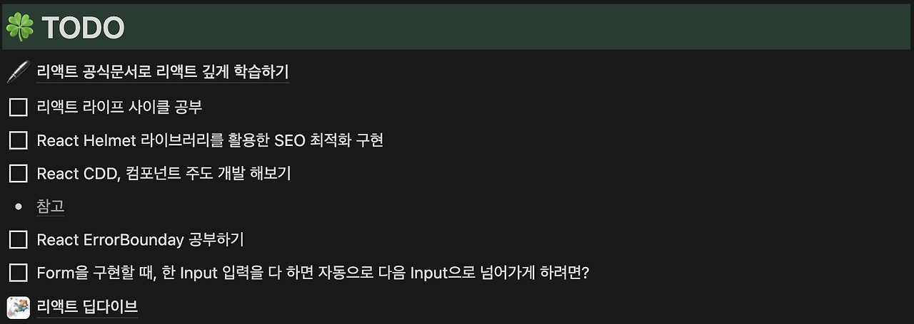
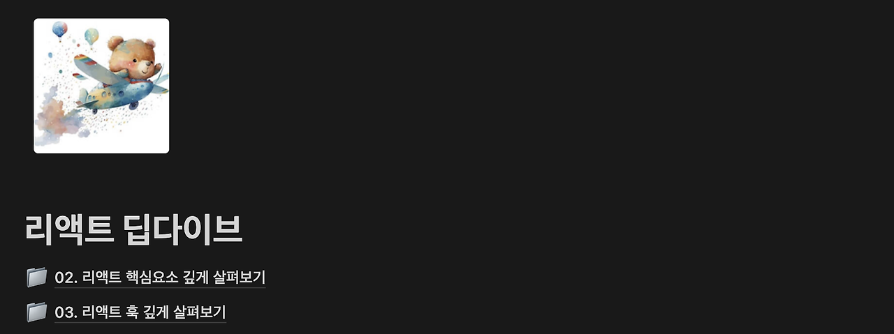
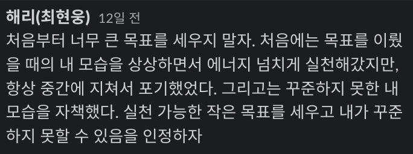
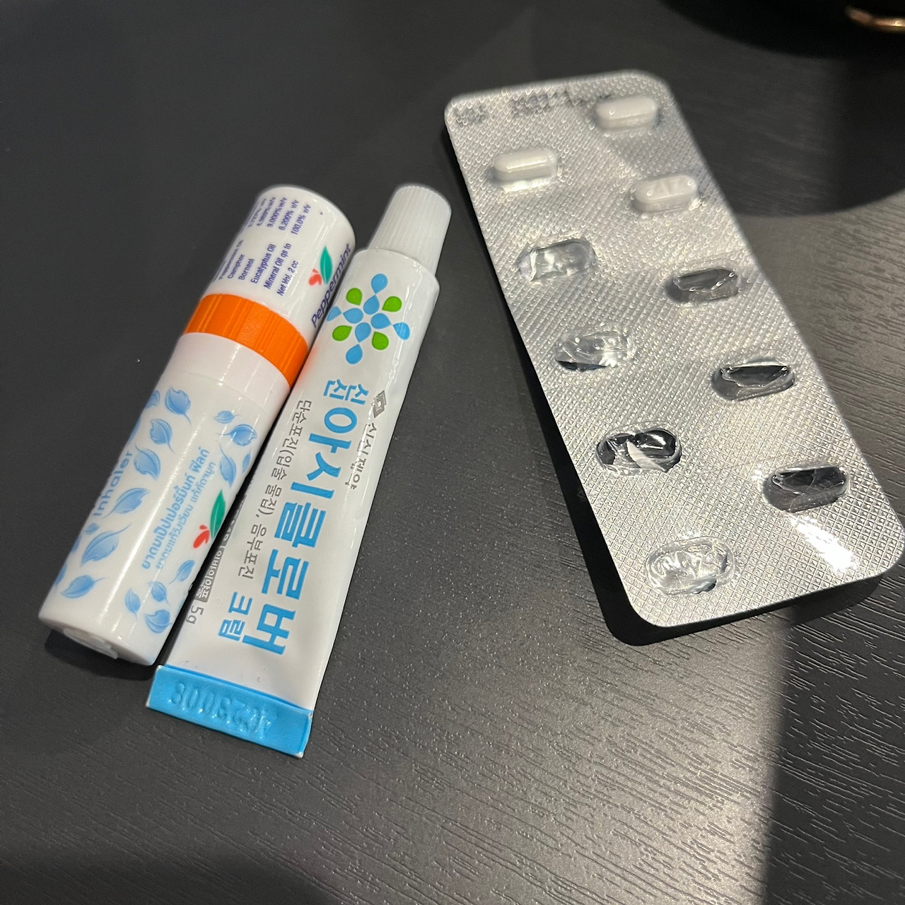

## 3주차

웹 기반 로또 게임
헤인과의 페어 프로그래밍이 끝난 후, step2로 넘어가면서 콘솔 기반이 아닌 웹 기반으로 로또 게임을 구현해야했다. 프리코스와 자동차 경주, 로또 미션 step1 까지는 모두 콘솔 기반이였는데 처음 웹 기반 미션으로 넘어가면서 오랜만에 DOM을 다뤄야했기에 어떻게 해야할지 막막했다.

막막하니 처음부터 차근차근 LMS에 있는 학습 목표와 요구 사항들을 읽으며 내가 해야할 일에 대해서 정리해보기로 했다.

### 로또 미션의 학습 목표

- UI, 도메인을 분리해볼 수 있는 설계를 고민하고, 목적에 맞게 객체와 함수를 활용한다.
- 단위 테스트를 기반으로 점진적인 리팩터링을 한다.

핵심은 도메인과 UI를 모듈화해서 관심사를 분리해보는 연습인 것 같았다. 이 연습을 해보기 위해서 LMS에서도 나와있는 step1에서 구현한 도메인 로직을 수정하지 않는 것을 목표로 잡고 미션을 진행했고, 미션이 끝난 후 다시 돌아보니 도메인 로직을 하나도 수정하지 않았던 것을 확인할 수 있었다.  
나름 관심사 분리를 잘한 것 같아 만족했다. 😊 도메인 로직과 UI 로직을 분리하는 것은 프리코스의 공통 피드백에서도 확인할 수 있었던 내용이였고 지금까지 미션을 진행하면서 내가 내린 나름대로의 결론은 아래와 같다.

### 1. 도메인

> "도메인은 문제를 해결에 대해 고민하며, 해결책을 만든다."

이번에 진행한 로또 미션을 예로 들자면, 로또 게임이 해결해야 하는 문제는 "사용자가 일정 금액만큼 로또를 구매했을 때, 총 당첨금과 수익률은 얼마인가?"로 정리해볼 수 있다. 도메인은 **이 문제를 해결하는데 집중**한다.

- 로또 구입 금액으로 몇 장의 로또를 생성할 수 있는지 판단한다.
- 1 ~ 45 사이의 랜덤 숫자 6개를 뽑아 로또 한장을 생성한다.
- 당첨 번호, 보너스 번호를 바탕으로 로또 한장의 등수를 결정한다.
- 등수에 맞는 상금을 더한 후, 수익률을 계산한다.

이렇듯, 도메인은 로또 게임이 해결해야하는 문제에만 집중한다. 도메인이 제시하는 **문제 해결책이 어디서 어떤 방식으로 사용될지는 도메인의 관심사가 아니다.** 따라서, UI가 콘솔에서 웹으로 변경되는 것은 도메인의 관심사가 아닌 UI의 관심사이기 때문에 UI만 수정하면 되는 것이다.

### 2. UI

> "UI는 도메인의 문제 해결책을 사용한다."

문제의 해결책만 존재하고, 사용할 수 없다면 프로그램이 완성되지는 못할 것이다. 이 때, UI는 사용자가 도메인이 제시하는 문제 해결책을 사용할 수 있도록 연결해주는 역할을 한다. UI는 문제 해결책을 어떻게 사용할 수 있도록 할 것인지와 문제 해결의 결과를 어떻게 보여줄 것인지에 집중한다.

- 로또 구입 금액을 어떻게 입력 받을 것인지 (Console, HTML input)
- 발급된 로또들은 어떻게 보여줄 것인지 (Cosole, HTML ul li)
- 당첨 번호, 보너스 번호는 어떻게 입력 받을 것인지 (Console, HTML input)
- 총 당첨금, 수익률은 어떻게 보여줄 것인지 (Console, modal)

이렇듯, UI는 도메인이 제시하는 문제 해결책을 어떻게 사용할 것인지에만 집중한다. **어떤 방식으로 문제를 해결하는지에 대한 방법을 고민하는 것은 UI의 관심사가 아니다.** 오직 도메인이 알려주는 문제 해결의 결과만 받아서 사용하면 되는 것이다. 도메인과 UI의 관심사를 분리하는것에 대한 내가 내린 나름대로의 결론은 위와 같다.

😊 추가로, 이번 미션에서 DOM을 다뤄보면서 했던 고민들도 [PR](https://github.com/woowacourse/javascript-lotto/pull/314)을 날릴 때 리뷰어에게 내 고민을 공유했다! 미션을 진행하면서 잊었던 개념들이나 잘 모르고있던 부분을 정리하고 기록했다.

- HTMLCollection vs NodeList
- HTML id vs class

## 레벨 1 유연성 강화 목표 : "꾸준하지 못할수도 있음을 받아들이기"

3주차 소프트 스킬 교육 시간에는 **유연성 강화**에 대한 내용으로 수업이 진행되었다. 수업 하루 전, 데일리 미팅 시간에 크루들과 온보딩 미션을 하면서, 우테코 이전의 나의 모습을 돌아보며, 지원서의 실패 경험을 돌아보았을 때..

- 나에게 가장 부족했거나 아쉬웠던 점은?
- 어떻게 하면 더 좋은 방향으로 바꿀 수 있었을까?

에 대한 내용을 바탕으로 이야기를 나누었다. 스스로 생각했을 때, 부족했던 모습과 아쉬웠던 모습들을 누군가에게 얘기해본 경험이 거의 없다보니 어떻게 말해야할지도 모르겠고 부끄러운 감정이 들었다.(부족한 모습들은 보여주고 싶지 않아 숨기는것에 익숙해졌기 때문에...) 하지만, 걱정과는 달리 막상 이야기를 해보니 그렇게 부끄럽지는 않았던 것 같다. 레벨마다 유연성 강화 목표를 세우고, 유연성 강화 스터디를 통해 크루들과 함께 각자의 유연성 강화 활동에 대한 피드백을 주고받는 스터디를 진행하는 방식으로 유연성 강화 수업이 진행 되는데, 크루들과 나눈 이야기를 바탕으로 레벨 1 유연성 강화 목표를 **꾸준하지 못할수도 있음을 받아들이기**로 정했다.

나는 운동하는 것, 몸 쓰는 것을 굉장히 좋아한다. 그래서, 군대에 있을 때는 특별한 훈련이 없는 날에는 매일 운동을 했고 전역을 하고나서도 일주일에 5번 이상은 항상 헬스장에 가서 운동을 했고, 서울에 올라온 지금도 시간을 내서 맨몸 운동을 하고 있다. 또, 10KM 마라톤 대회에 나가기 위해서 매 주 한강에 가서 달리기도 하고 있다. 꾸준히 무언가를 하고 있는 것 같음에도 불구하고 내가 꾸준하지 못할수도 있음을 받아들이기를 목표로 설정한 이유는 어느 순간부터, **꾸준함에 대한 강박을 느낀다**는 것을 알게되었기 때문이다. 내가 강박을 느끼고 있는 것 같다고 생각하게 된 근거들은 아래와 같다.

- 운동 또는 학습이 재미가 없다고 느낀날이 많아졌다.
- 운동 또는 학습에 대한 성취감이 급격하게 떨어지고 있었다.
- 운동 또는 학습에 대한 목적 의식이 흐릿해지고 있었다.

내가 꾸준하게 하고 있는 행동들이 어느 순간 **당연하게 해야하는 것으로 자리 잡았기 때문에** 당연한 일을 해가는 것에 대한 재미도, 성취도 느끼지 못하기 시작한 것이다. 특히 학습에 관해서는 이런 감정들이 유독 심하게 느껴졌었다. 전역을 하고 복학을 한 후 머릿속으로 "코딩을 잘하고 싶다"라는 생각으로 연구실에 들어갔고, 특별한 일이 없는 날에는 대부분 연구실에서 공부를 하며 시간을 보냈다. 덕분에 학부생으로써 굉장히 좋은 성적을 받고, 가족과 친구들의 칭찬도 많이 받았지만 좋은 성적을 받은것에 대한 기쁨도 그렇게 크게 느껴지지 않았고 "이제 다음엔 뭘 해나가지?"에 대해 생각하며 다음 계획을 세웠던 것 같다. 어느 날, 연구실에서 공부를 하고 있던 중 "내가 언제까지 매일 여기 와서 이러고 있어야 하는거지?", "내일도 오늘처럼 이러고 있겠지..?"와 같은 생각을 하게 되었다. 지칠만큼 지쳤으며 번아웃이 온 것이다. 학습에 대한 재미, 성취감, 목적의식 모두 흐릿해지고 있었던 것이다. **꾸준함을 무기로 갖고 있긴 했지만, 그 무기를 어떻게 써야하는지에 대해서는 전혀 알지 못한 상태**로 학습을 해갔던 것이였다. 지금 생각해보면 고등학생 때나, 수능을 다시 준비하던 시절 모두 연구실을 다니며 느꼈던 감정들과 비슷한 감정을 느꼈던 것 같다.

우테코에서의 학습, 앞으로의 학습에서는 비슷한 감정들을 더이상 느끼고 싶지 않았기 때문에 나름대로 내가 번아웃을 겪게되는 이유를 정리해보았다.

### 1. 크고 막연한 목표

학습에 있어서 목표가 너무 컸다. 위에서 "코딩을 잘하고 싶다"라는 생각으로 연구실에 들어갔다고 했는데, 이 목표자체가 너무 크고 너무 모호하다. 목표가 클수록 장기전이 되는데, 나는 이 때까지 목표의 크기와 상관없이 항상 단기전 경기를 치르는 선수처럼 살았던 것 같다. 또, 목표가 너무 모호하면 그 목표를 세분화하기가 너무 힘들다. "코딩을 잘하고 싶다"라는 너무 모호한 목표를 세우니 일단 연구실에 가긴 가는데 연구실에 있는 시간을 어떻게 활용할지에 대해서 잘 몰랐었다.  
(~~일단 간다. 가면 뭐라도 하겠지~~)




"리액트를 잘하고 싶어" 리액트 공부를 하기 위한 계획을 세웠었다. 계획을 세운지는 6개월 정도 된 것 같다. 하지만, 위 사진에서도 확인할 수 있듯이 아직까지 체크표시를 한 계획이 하나도 없다.(~~이 정도면 그냥 게으른거 아닌가?ㅋ~~)  
리액트 딥다이브도 2장만 공부하고 어렵기도 하고 막대한 양 앞에서 그만 포기를 해버렸던 것 같다. 이렇듯, 지금까지 학습에 있어서 내 목표는 너무 크고 너무 모호했다.

### 2. 너무 큰 기대치

목표를 너무 크게 잡는 것과 결이 비슷한 이야기지만, 지금까지 스스로에 대한 기대치가 너무 높았던 것 같다. 스스로에게 항상 꾸준하고 항상 잘하는 모습을 기대하다보니 이럴수도 있고 저럴수도 있는 유연한 사고를 하지 못한 채 강박 속에서 고통을 받았던 적도 많았다. [이 글](https://eopla.net/magazines/12608#)을 읽으면서 지금이라도 스스로에 대한 기대치를 조금 낮춰보고자 한다.

꾸준함에 대해서 더 유연한 사고를 가지기 위해서 레벨 1의 목표를 "꾸준하지 못할수도 있음을 받아들이기"로 잡았다



## 오늘은 여기까지만 달리죠

주말에는 항상 러닝을 하기에, 3주차 주말에도 한강에 가서 러닝을 했다. 이 때까지는 항상 저녁에 러닝을 했었는데 3주차 날씨가 유독 추웠기에 해가 떠 있는 낮에 한강에 갔다. 하지만, 낮에도 정말 춥고 바람이 많이 불었고 심지어 뛰는 방향 반대로 바람이 정말 심하게 불어서 속도도 나지 않았다. 그리고, 그 동안의 맨몸 운동과 8KM 과 10KM을 뛰면서 몸에 피로가 많이 쌓였는지 컨디션도 정말 별로였다. 한마디로 모든 환경이 오늘 내가 달리지 말라고 말하는 것 같았다. 3KM가 지나고 나서부터는 그만 달리고 싶다는 생각만 하게 되었다. 원래라면 10KM을 채워야한다는 강박 속에서 어떤 환경이든 끝까지 달렸을 것 같은데 "오늘이 내 마지막 러닝도 아닐텐데 이렇게 까지 해야할까?"라는 생각이 들어 같이 달리는 누나한테 3KM 지점에서 다시 돌아가자고 했고 목표를 채우지는 못했다. 오늘 10KM을 채우지 못한것에 대해서 너무 많은 생각은 하지 않기로 했고, 오히려 다음 주에 더 잘 뛰기 위해 쉬는시간을 가진다고 생각했다. 4주차 달리기는 매우 좋은 컨디션으로 만족할만한 러닝을 했다. 😊

## 4주차

### 지니와의 메타인지 말하기 시간

4주차 월요일에는 [메타인지 말하기](https://github.com/woowacourse/woowacourse-docs/blob/main/studylog/meta-speech.md) 시간이 있었다. 내 페어는 지니였고, 2분 30초 시간을 재고 돌아가며 말하고 5분씩 질문을 주고받았다.

- 나(해리): HTMLCollection vs NodeList
- 지니 : [DOM 요소를 숨길 수 있는 다양한 방법들](https://velog.io/@jinyoung234/%EC%9A%94%EC%86%8C%EB%A5%BC-%EC%88%A8%EA%B8%B0%EA%B8%B0-%EC%9C%84%ED%95%9C-%EB%8B%A4%EC%96%91%ED%95%9C-%EB%B0%A9%EB%B2%95%EB%93%A4-with-Lotto-%EB%AF%B8%EC%85%98)

내가 말하는 차례가 됐을 때, NodeList의 절반까지만 설명하고 시간이 종료되어버렸다... 나의 학습 내용을 모두 설명하기에 2분 30초라는 시간은 생각보다 짧았다. 말할 내용을 미리 정리해보고, 시간을 재면서 간단명료하게 학습 내용을 전달할 수 있도록 연습해봐야겠다. 지니는 DOM 요소를 숨길 수 있는 방법들을 학습하면서 웹 접근성에 대해서도 학습했었고, 지니의 학습 내용 설명을 통해서 알지 못했던 웹 접근성에 대한 내용들도 새롭게 알 수 있었다.

- 시간에 맞게 분량을 조절하자!(2분 30초)
- 글을 미리 써오는 것도 좋을거 같다!
- 기술의 출발점을 앞에 말해보는 것도 좋을거 같다!

메타인지 시간이 끝난 후 위와 같은 피드백을 주고받았다!

### 봄이 좋냐?



나에게 봄은 정말 오지 않았으면 하는 계절이다...
심한 꽃가루 알러지와 환절기 때마다 떨어지는 면역력으로 인해서 입술포진이 올라오기 때문이다. 약과 연고를 일주일 간 병행한 덕분에 증상이 심하게 나타나지는 않았지만, 꽃가루 알러지 예방을 위해 먹는 약의 부작용 중 하나가 심한 피로감을 주는 것이라서 집중하기가 쉽지 않다. 그래도 하루종일 눈이 가렵거나 재채기를 하는 것 보다 피로감을 얻는 것이 더 나으니까~!

### 점심 뭐 먹지 페어 프로그래밍

4주차 미션 점심 뭐 먹지의 페어는 해시였다. 점심 뭐 먹지 미션의 학습 목표는

- 전체 애플리케이션을 컴포넌트 단위로 모듈화한다.
  - UI를 컴포넌트 단위로 생각하고 개발하는 연습을 해본다.
  - 재사용할 수 있는 컴포넌트를 고민해본다.
- Typescript의 기본 문법을 익히며 필요성을 경험한다.

였다. 리액트를 사용하면서 프로젝트를 진행했을 때 컴포넌트를 만들어보았지만 컴포넌트가 무엇인지, 컴포넌트 단위로 개발을 하면 어떤점이 좋은지에 대해서 깊게 고민해본 적은 없는 것 같았다. 이번 미션의 목표가 **컴포넌트 단위로 생각해보기**인 만큼 내가 생각하는 컴포넌트는 무엇이고, 컴포넌트 단위로 나누었을 때 어떤 점이 좋은지에 대해 고민해보고 싶었다. 고민 후, 나름대로의 결론을 내렸다.

### 컴포넌트를 나눈다는 것은 책임을 나눈다는 것

전체 UI를 컴포넌트 단위로 생각해보고 나누었을 때,

> "컴포넌트를 나눈다는 것은 책임을 나누는 것과 같지 않을까?"

라는 생각을 하게 되었다. 그렇다면 각 컴포넌트가 가지는 작은 책임은 UI를 그리는 책임과 특정 이벤트가 발생했을 때 특정 행동을 하는 책임 2개를 가진다고 생각했다.

```text
- 상태 : 컴포넌트가 그리는 UI
- 동작 : 특정 이벤트(click, change)에 대한 액션
```

상태와 동작으로 구분했을 때, 위와 같이 정리해볼 수 있었고 컴포넌트는 전체 애플리케이션을 구성하는 작은 객체가 될 수 있다고 생각했다. 또, 컴포넌트내에서 도메인 로직을 사용해서 새로운 UI를 그리기 위한 데이터를 받아오기도 하니 컴포넌트는 **하나의 작은 컨트롤러**의 역할을 한다고 결론을 내리게 되었다.
정리하자면 나름대로의 내 결론에서

- **컴포넌트는 하나의 작은 컨트롤러**이다.
- 전체 애플리케이션을 **컴포넌트 단위로 생각하고 나눈다는 것은 책임을 나눈다는 것이다.**

## 소파의 이벤트 설명

주말에 잠실 캠퍼스에서 공부를 하고 있던 중, 소파가

> "나 이벤트 완벽 이해함"

라며 나를 찾아왔다. 마침 나도 모던 자바스크립트 딥다이브의 이벤트 부분을 읽고 있던터라 소파와 소규모 메타인지(?) 시간을 가졌다. 소파와 이야기를 하면서 이 때까지 캡쳐링, 버블링에 대해서 완전히 잘못 알고 있었음을 알게 되었다. `addEventListener`를 통해서 특정 이벤트에 대한 핸들러(액션)를 등록할 때, 캡쳐링은 기본적으로 false인 것은 알고 있었지만 이 **false의 의미가 캡쳐링이 완전히 발생하지 않는다**라고 알고 있었다.

하지만, 이벤트 자체는 항상 캡쳐링부터 시작해서 이벤트가 발생한 타겟까지 흐르고 다시 버블링이 되어 흘렀고, 언제 핸들러(액션)가 등록이 되는지를 중심으로 캡쳐링과 버블링을 이해해야했다. 소파의 설명을 모두 이해한 후, "그럼, 이벤트는 항상 흐르고 핸들러(액션)은 그 흐름위에 타는거네?"라고 정리했었는데 소파가 그게 맞다며 이벤트를 이해하기 위해 했던 이틀간의 노력이 방금 내가 말한 한 문장으로 정리된다고 말했다..ㅋㅋㅋ

소파랑 이벤트에 대한 이야기를 하면서 내가 그동안 이해했다고 생각했던 것이 정확하지 않았던 것을 알게 되었고, 잘못알고 있던 내용을 바로잡으면서 이 시간이 정말 재밌다고 느껴졌다. 이게 포비가 말했던 "프로그래밍을 학습의 도구로 삼고, 학습에 대해 즐거움을 느끼는 경험을 하는것"이 아닐까? 라는 생각을 하며 4주차를 마무리했다! 소파의 이벤트에 관한 학습 기록은 [여기](https://velog.io/@ss0526100/JS-%EC%9D%B4%EB%B2%A4%ED%8A%B8%EC%99%80-%EC%95%A1%EC%85%98)에서 확인할 수 있다~!👍
