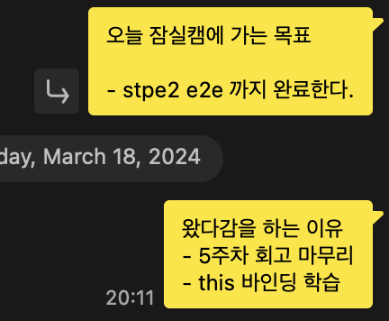

## 한 주의 시작, 유연성 강화 스터디

매주 월요일 데일리 미팅은 레벨1에서 정한 유연성 강화 목표에 대해서 연극조와 이야기를 나누는 방식으로 진행된다. 3~4 주차 회고에서 확인할 수 있듯, 나의 레벨1 유연성 강화 목표는 **꾸준함에 대한 강박을 좀 내려놓고, 꾸준하지 못할수도 있음을 받아들이는 것**이였다. 나의 유연성 강화 목표에 대해서 생각해볼 수 있는 상황을 생각해보고, 그 상황에 대해서 스스로 돌아보고 크루들의 피드백을 받는다. 이번에 내가 생각해본 상황은 **운동 계획 변경을 결심한 순간**이였다. 지난 회고에서도 언급했듯이, 나는 운동을 정말 좋아해서 주 4일은 미리 짜놓은 루틴대로 홈트를 하고 주말 중 하루는 한강에 가서 러닝을 한다.

하지만, 홈트와 러닝을 둘 다 하는 날은 없어서 평일 5일 중 4일은 맨몸 운동을 해야 했는데 점점 미션과 개인 공부를 하느라 집에 도착하는 시간이 늦어졌고, 운동까지 하고 잔다면 수면 시간이 굉장히 늦어져 다음날 컨디션에도 영향을 주게 되었다. 다음날 좋은 컨디션도 유지하고 싶었고, 운동도 계속 하고 싶어서 조율이 필요하다고 생각했다. 지금은 우테코에 집중하고 싶은 마음이 조금 더 강해 운동 루틴을 수정하기로 했는데 집에 도착해서 더도 말고 덜도 말고 딱 턱걸이 100개만 제대로 하고 자는 것으로 수정했다. "운동에 조금 더 많은 시간을 쓸 수 있는 상황이 언젠가는 생기지 않을까~?"라고 생각하며 현재 상황에 맞게 유동적으로 계획을 조절하게 되었다.

매일 "어떻게 하면 유연성 강화 목표를 더 잘 달성할 수 있을까"를 생각하지는 않지만, 내가 설정한 계획을 수정해야 하는 상황이 생기면 의식적으로 "조금 더 유연하게 생각해볼까?"를 머릿속으로 떠올리는 것 같다. 혼자 하는 것이 아니라 연극조 크루들에게 피드백을 받으며 내가 잘 하고 있는지를 확인할 수 있고 크루들에게 피드백을 해주며 피드백을 잘 전달하기 위한 고민을 해보는 연습도 할 수 있어서 유연성 강화 스터디는 나에게 정말 의미 있는 활동인 것 같다!

## 점심 뭐 먹지 미션 회고 (반성...)

점심 뭐 먹지 미션을 진행할 때, 웹 컴포넌트를 사용했었다. 로또 미션에서 콘솔에서 웹으로 UI가 변하면서 DOM을 조작했어야 했는데, 여기서 나름대로의 불편함을 느껴 웹 컴포넌트를 사용해보면 내가 느낀 불편함들을 해결할 수 있지 않을까 하여 사용하게 되었다. 나름대로 잘 사용해서 미션을 진행하고, PR도 잘 날렸다고 생각했는데 미션 피드백 시간에 코치들이 해준 얘기와 크루들과 대화를 나눠보면서 내가 **이번 미션의 학습 목표와는 맞지 않는 고민들을 한 것**을 알게 되었다. 점심 뭐 먹지 미션의 학습 목표를 상기해보면

- 어플리케이션을 컴포넌트 단위로 모듈화하여 개발
  - UI를 컴포넌트 단위로 생각하고 개발하는 연습
  - 재사용할 수 있는 컴포넌트를 고민해보기
- TypeScript의 기본 문법을 익히며 필요성을 경험

위와 같다. 하지만, 지금 생각해보면 나는 컴포넌트 단위로 생각해보는 것을 빌미로 웹 컴포넌트를 사용해서 로또 미션에서 느낀 **개인적인 불편함**을 해소해보고자 했다. 로또 미션과 점심 뭐 먹지 미션은 **학습 목표가 다른 별개의 미션**인데 로또 미션의 느꼈던 불편함을 점심 뭐 먹지 미션에서 해소해보려고 시도한다...? 방향성이 많이 어긋난 생각이였던 것 같다. 그리고 컴포넌트 단위로 더 잘 모듈화 하고 재사용할 수 있는 컴포넌트는 무엇이 있고 어떻게 만들 수 있을까를 고민하기 보다는 처음 사용해보는 웹 컴포넌트를 공부하거나 이벤트를 주고 받는 방법에 대해 고민하는데 더 많은 시간을 사용한 것 같다. PR 메시지에도 학습 목표와 관련된 고민을 드러내는 이야기는 거의 없고, 새로운 기술 도입의 배경과 트러블 슈팅에 관한 내용만 있었다. ([PR](https://github.com/woowacourse/javascript-lunch/pull/122#event-12085423630)).

만약 웹 컴포넌트 기술을 컴포넌트를 더 잘 모듈화하고 **재사용 가능한 컴포넌트를 만들어보기 위한 도구로써 활용했다면** 즉, **학습 목표를 더 잘 달성해보기 위한 도구로써 활용했다면** 얻어가는 것이 많았을 것 같은데 이번 미션에서는 학습 목표의 방향과 어긋난 고민을 많이 한 것 같아서 아쉬움이 많이 남았었다. 한편으로는 이번 회고와 반성을 통해서 "현재 내 고민이 학습 목표의 방향성과 일치하는 고민인가?"를 의식적으로 생각해보자는 결심을 하게 되었기 때문에 오히려 좋아~ 라고 생각하고 다음 미션에 적용해보기로 했다. (레벨 1에서 이걸 깨달은게 어디냐~)  
주말에 잠실캠에 가서 점심 뭐 먹지 미션 step2를 마무리 하던 중 렌더링 효율과 관련된 고민을 했었는데 지금 이 고민은 학습 목표와 전혀 관계가 없는 고민인 것 같아서 빠르게 치워버렸다..ㅋㅋㅋㅋ

## 선수타

수요일에는 5기 FE 선배님들과 선수타를 가졌다. 5기 분들이 우테코 생활을 어떻게 했었는지에 대한 얘기를 들을 수 있었고, 6기 생활을 어떻게 하면 좋을지에 대한 간단한 조언도 들을 수 있었다. 공통적으로,

- 남들에게 설명하면서 공부하는 것
- 같은 분야를 공부하는 크루들이 모여있는 훌륭한 환경을 적극 활용하여 개발 관련 잡답 즐겨보기
- 우테코에서만 할 수 있는 활동을 해보기

등에 대한 조언을 해주셨다. 슬랙에 `블로그-포스팅-스터디`를 만드신 선배분의 발표가 가장 기억에 남았는데, 진행했던 스터디 이름이 잘 기억 나지는 않지만 크루들끼리 특정 시간에 특정 행동을 릴레이 방식으로 해야만하는 스터디가 매우 재밌고 흥미로워보였다. 개발 관련 스터디만 하는게 아니라 여러 유형의 스터디를 하면 우테코 생활을 더 재밌고 유익하게 할 수 있겠구나하고 생각했다..ㅋㅋㅋ 기록의 중요성도 강조해주셨는데, 기억보다는 기록을 하기 위해서 블로그-포스팅-스터디를 만드셨다고 한다. 현재 나도 이 스터디에 참여해서 열심히 회고를 작성하고 있다(?). 우테코에 오기 전 까지는 이렇게까지 열심히 회고를 하지 않은 것 같은데 매일 많은 정보가 들어오고, 하루의 구성이 거의 비슷하고 어제와 이틀 전이 잘 구분이 안가기 시작하면서 기록이 정말 중요하겠다고 깨달은 후 나름대로 열심히 기록과 회고를 하고있다. 선수타가 끝나고 선배님들과 따로 이야기를 나누는 시간을 가졌다. 이야기가 끝나고 내용을 정리해보니 우테코가 강조하는 내용과 이어져 정말 놀랐었다.

- 잡담

제일 처음 점심 뭐 먹지 미션에 대해 나름대로 반성한 경험에 대해 이야기를 나누면서, 로또 미션을 진행하면서 느꼈던 불편함은 **나 혼자 결론지은 불편함**이였다는 것을 알게 되었다. 주변 크루들에게 다가가서 불편함에 대해 얘기해보는 시간을 가졌더라면 내 생각이 달라질 수 있었고 불편함에 대한 결론이 **웹 컴포넌트를 사용해보자가 아닐수도 있었다.** 앞으로는 혼자 생각하고 결론을 짓기 보다는 내 생각과 생각을 통한 나름대로의 결론을 크루들에게 다가가서 얘기해보고 다른 크루들도 나와 같은 생각인지, 다르다면 그 크루는 어떻게 생각하는지에 대해서 이야기 해보는 시간을 많이 가져야겠다.

- 몰입

우테코 생활을 하면서 내가 지금 우테코에 몰입을 하고 있는 것인지, 매몰되어 있는 것인지 헷갈리는 순간들이 있었다. 뭐든지 과하면 안좋은 결과를 초래할 수 있고, 몰입과 매몰은 정말 한끗차이인 것 같다고 생각해 같이 이야기를 나눈 선배님에게도 혹시 현재 나와 같은 고민을 한 적이 있는지에 대해서 물었고 선배님은 "몰입과 매몰을 나누는 기준을 우테코 미션으로 잡아보는 것은 어떤가요?"라고 대답해주셨다. 정말 괜찮은 접근 방법이다! 미션에서 주어지는 학습 목표에 대한 고민을 **너무 과하게하거나 방향성이 어긋나는 것 같은 고민을 하고 있다면 그건 어쩌면 매몰되어 있는것인지도 모른다.** 앞으로 페어 프로그래밍으로 미션을 진행하거나, 혼자 step2를 진행할 때도 의식적으로 미션을 기준으로 내가 지금 잘 몰입하고 있는지, 매몰되어 있는지에 대해서 생각해봐야겠다.

- 경험

5주차는 조금 혼란스러웠던 것 같다. 1~2주차 회고에서 언급했던 익숙지 않은 환경으로 인한 혼란스러움보다는 미션을 잘못 대하고 있는 것 같다는 생각으로 인한 혼란스러움이였다. 이에 대해서도 얘기를 해주셨는데 지금 내가 느끼는 혼란스러움들은 모두 경험이고, 이런 경험들도 나중에 피가되고 살이되니 경험을 쌓고 성장하고 있는 과정이라고 생각하라고 말씀해 주셨다.

선수타 시간을 통해서 앞으로 어떻게 우테코 생활을 할지에 대한 인사이트를 얻은 것 같아서 너무 좋은 시간이였다. 😊

## todo-mate

저번 주 목요일부터 크루들과 함께 todo-mate를 하고있다. todo-mate는 계획을 공유하고 상대방의 계획에 대한 반응을 남길 수 있는 앱인데, J인 나로써는 너무 좋고 유용할 것 같아서 같이 하고있다!

다른 크루들은 오늘 어떤 계획을 가지고 캠퍼스에 오는지 알 수 있고, 반응도 남길 수 있어서 정말 재밌게 하고있다. 유연성 강화 스터디든, todo-mate든 확실히 혼자보다는 같이 하는게 훨씬 재밌고 오래할 수 있는 것 같다.

## 왔다감 고정멤버

어느 순간부터 캠퍼스 왔다감 고정 멤버가 되었다.(지토썬해...)  
늦게까지 남아서 공부를 하며 다른 데일리 조 크루들과 이야기할 수 있는 시간이 많이 생겨 빠르게 친해진 것 같아서 좋았다. 한편으로는 왔다감 멤버가 되는 것에 익숙해지면서 **"맹목적으로 11시까지 캠퍼스에 남아있게되지는 않을까?"에 대한 걱정**도 생겼다. 정규 시간이 끝난 뒤에도 5시간 동안이나 캠퍼스에 남게 될 텐데, 길다면 긴 이 시간을 어떻게 잘 활용하고 집중의 비중을 높일 수 있을까에 대한 고민을 했다. 일단 지금은 이 고민을 해결하기 위해서 **오늘 내가 정규 시간이 끝난 뒤에도 남기로 한 이유와 목적을 글로 적는 것을 해보는 중이다.** "오늘 내가 ~~해야 하니 남아야지"하며 생각만 하는 것 보다 글로도 옮겨 적으면서 한번 더 리마인드를 해보고 있다. 이 방법이 괜찮은 방법인지는 잘 모르겠으나 어느 정도 효과는 있는 듯하다.

위 사진 처럼 카톡 나에게 보내기를 하거나 노션에 정말 간단하게 정리 중이다. 왔다감을 하는 크루들끼리 데일리 미팅을 하며 11시까지 남는 목적을 공유해보는 시간을 가지는 것도 생각해봤는데 하루에 2번 데일리 미팅을 하는 것은 체력적으로 힘들 것 같다는 생각이 들어 보류중이다. 뭐 좋은 방법 없을까~?

## 마니또

지난 주 금요일(3/8) 데일리 마스터였던 빙봉이 마니또 게임을 준비해왔다. 게임 규칙은 아래와 같았다.

- 마니또에게 1주일 동안 잘해주기(마니또 몰래 특별한 미션(?) 하나 수행하기)
  - DM 보내기
  - 크루 닉네임으로 2행시 짓기
  - 크루에게 손 편지 작성하기
  - 크루 초상화 그리기
  - 금요일 족발 회식 때 마니또 공개!

나는 일주일 동안 마니또에게 위 사진 처럼 2행시를 전달 받고, 단백질 음료수도 선물 받았다. 위 선물을 받기 전 수야에게 DM을 받아서 수야라고 생각하고 있었는데 뭐지? 혼란스러웠다..ㅋㅋㅋ 하지만 내 마니또가 실수를 하는 바람에 누가 내 마니또인지 알 수 있었다. 우리 데일리 조의 크루들은 대부분 도시락을 싸오고 점심을 같이 먹는다. 점심을 같이 먹다가 해시가 똑같은 음료수를 꺼내 먹으면서 "실수했다.."라고 말해버려 내 마니또가 누구인지 바로 알게되었다. 그런데 공개 전 티를 내면 재미가 없으니 모르는 척 하기로 했다...밥을 먹을 때 고개를 숙여야하니 숙이면서 티가 나지 않게 웃었다..ㅋㅋㅋㅋㅋ (해시 땡큐!)

나의 마니또는 헤인이였고 미션은 손편지 작성하기였다. 손편지를 쓰기로 결정한 날 좋은 글을 읽어 응원의 말과 함께 해당 글의 내용을 공유했다. 그리고 헤인이 자리에 없을 때 젤리와 함께 몰래 올려놓았다. 빙봉이 재밌는 게임을 준비해와서 일주일 동안 내 마니또가 누구인지, 어떻게 마니또에게 안들키고 미션을 수행할 수 있는지에 대한 재밌는 고민을 했던 것 같다. 빙봉 아이디어 굿~👍

## 회원증

회원증을 보니 다시 한번 내가 우테코 크루라는 것을 실감할 수 있었고, 데일리 조와 모여서 다같이 회원증 사진도 찍었다. 앞으로도 열심히 해보자~😊
