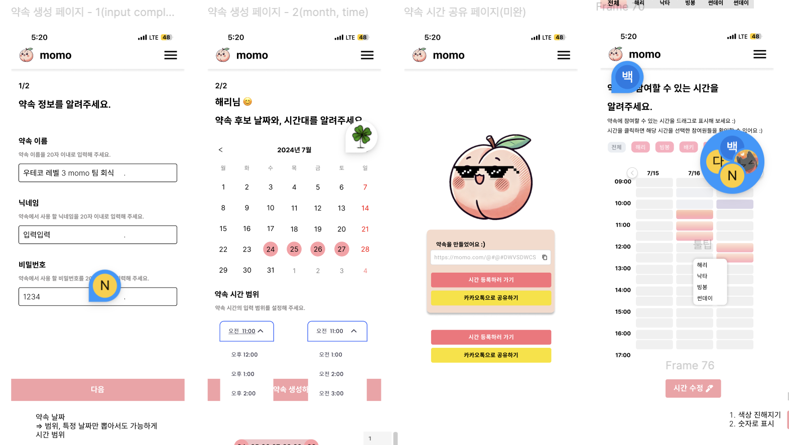
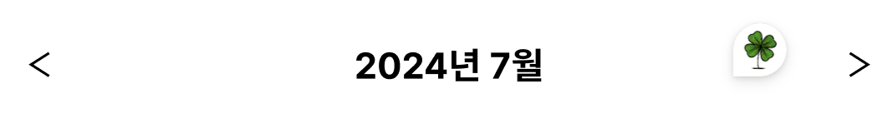
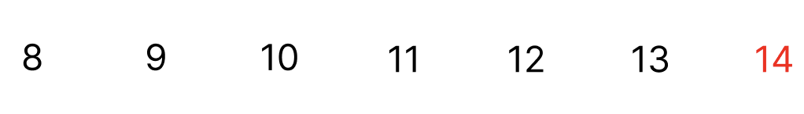
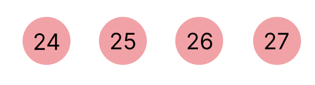
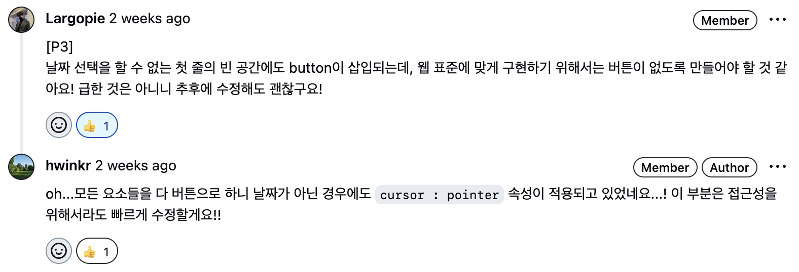
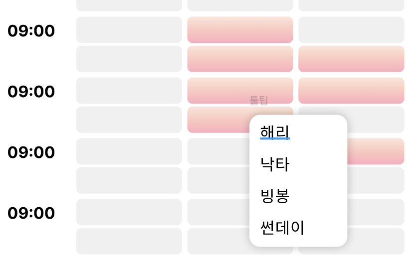
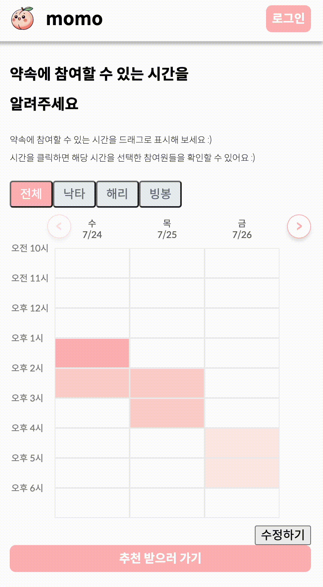
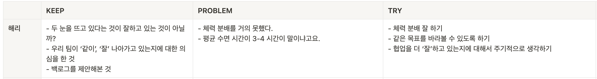
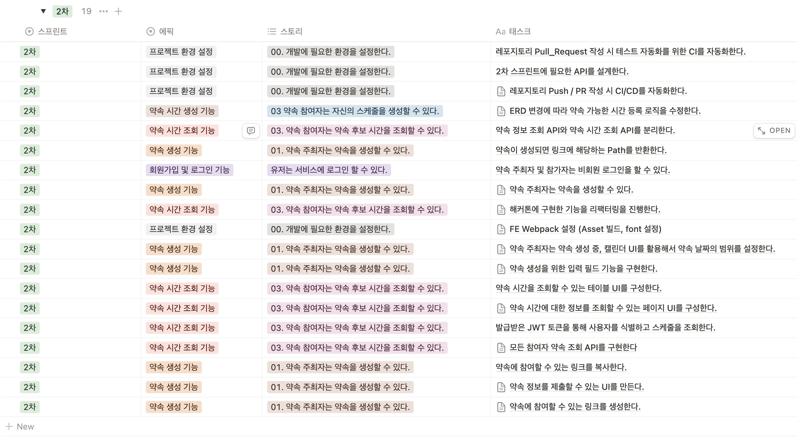
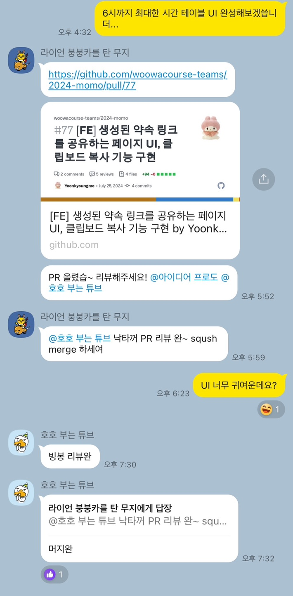

## 디자인을 하자

1차 스프린트와 해커톤이 끝난 후, 본격적으로 개발을 시작하기 전 1차 스프린트에서 해야했던 설정 중 남아 있던 설정들을 했다.

- 테스트 환경 설정(RTL, Storybook)
- 폴더구조 절대경로 설정
- 웹팩(webpack) 환경에서 이미지(asset)들을 사용할 수 있도록 설정
- 서비스에서 사용 할 폰트 설정
- 프론트엔드 팀 코드 리뷰 문화 결정

위 작업들을 모두 하니, 어느새 한 주가 모두 끝나버렸다. (~~큰일이야...~~) 우테코 미션은 대부분 `package.json` 설정이 되어 있는 상태였기 때문에 프로젝트 환경 설정에 신경을 쓰기 보다는 미션에서 주어지는 문제를 '잘' 해결하는 것에 신경을 써야했다. 하지만 레벨 3 프로젝트를 진행하면서 부터는 아예 비어있는 폴더, 파일들을 채워가야 했다. `npm init` 부터, 프로젝트를 진행하기 위한 의존성들을 추가하고 동작을 확인하는 것 까지 모든 것에 신경을 써야했다. 설정을 하고 동작을 확인하고 다음으로 넘어가는 것이 아닌, 설정을 하는 과정에서 설정 파일의 특정 속성이 왜 필요하고, 어떤 역할을 하는 것인지 의문을 가지고 그 의문을 해결하기 위해 이것저것 알아보니 시간이 정말 많이 지났다. 설정의 모든 속성을 이해하는 것이 문제 해결을 잘 하고, 서비스를 잘 만드는 것이라고는 할 수 없겠지만 처음부터 설정을 하다보니 중간중간 궁금증이 생겼고 속성들을 알아가는 것이 재밌어서 계속 알아보려고 했따. 팀원들도 나와 비슷한 성향이라서 모든 속성들을 다 함께 탐구하느라 1차 스프린트에 프로젝트 환경 설정을 마쳐야 했는데, 모든 설정을 끝내니 어느새 2차 스프린트의 첫 주가 지나버렸다. (~~공원이 차라리 대학원에 가는 것이 어떻냐고도 했었다...ㅋㅋ~~)

2차 스프린트에서는 사용자에게 다음과 같은 경험들을 제공하기로 했다.

### 약속 주최자는 약속을 생성할 수 있다.

약속 주최자는 약속을 생성한 후, 약속 참여자들을 해당 약속에 초대할 수 있는 경험을 제공하기로 했다. 약속을 생성할 때는

- 약속 이름
- 약속 주최자의 정보 (닉네임, 비밀번호)
- 약속 날짜의 범위 ex) 07/22 ~ 07/26
- 약속 시간의 범위 ex) 오전 10시 ~ 오후 6시

위 정보들을 받기로 했으며, 약속 정보들을 입력하고 약속을 생성하면 참여자들을 초대할 수 있는 링크를 생성해주기로 했다.

### 약속 주최자, 참여자 모두 약속 시간 현황을 조회할 수 있다.

약속 주최자와 초대 링크를 받은 참여자들이 약속 시간 현황을 조회할 수 있는 경험을 제공하기로 했다. 해커톤에서는 약속에 참여하는 사람을 1명으로 가정하고, 참여할 수 있는 시간을 표시, 수정, 공유할 수 있도록 했다면 이번 스프린트에서는 약속에 참여하는 n명의 사람들 모두에게 참여할 수 있는 시간을 표시, 수정, 공유할 수 있도록 해줘야 했다.

### 약속 주최자, 참여자들은 1명에 대한 시간만 조회할 수 있다.

우리 서비스의 핵심, 해결하려고 하는 문제에 대해서 다시 한 번 언급하자면, '실제로 만남을 갖기 전 결정해야 하는 요소들을 빠르게 결정할 수 있도록 돕는 것'이다. 만남을 갖기 전 결정해야 하는 요소를 시간, 장소 크게 두 가지로 다시 나눴고 현재는 시간과 관련된 의사 결정 문제를 해결하고 있다. '빠르게 결정할 수 있도록 돕는 것'이 핵심이기 때문에, 어떻게 하면(HOW?) 더 빠르게 결정할 수 있도록 도와줄 수 있을까에 대해서 회의에서 이야기를 한 결과, 약속에 참여하는 전체 n명 중 특정 1명이 선택한 시간을 보여준다면 도움을 줄 수 있을 것 같다는 이야기가 나왔다. 링크를 전달받은 사용자 입장에서 생각해 보면, 약속에 참여하는 사람 중 유독 심리적으로 가까운 사람이 있을 것이고 전체 현황이 다 궁금하기 보다는 그 사람이 선택한 시간을 우선적으로 궁금해할 수도 있을 것이라는 생각에서 출발한 아이디어였다. 그래서 1명에 대한 시간만 필터링해서 보여줄 수 있는 기능이 있다면, 의사 결정을 더 빠르게 할 수 있도록 도와줄 수 있을 것이라고 결론을 내리고 기능을 추가하기로 했다.

이제 프로젝트를 위한 환결 설정이 다 끝났고, 2차 스프린트에서 무엇을 해야 할 지도 결정이 났는데... 피그마가 백지였다. 머릿속으로는 어떤 기능들을 개발해야 할지에 대한 그림은 그려졌는데, 막상 눈 앞에 보이는 것이 아무것도 없으니 개발을 시작하기가 어려웠다. 마침 공원이 열어준 휘뚜루마뚜루 디자인 수업에서 피그마 활용법에 대해서 어느 정도 알게 되어서 그 날 밤 프론트 팀원들과 함께 2차 스프린트 개발에 필요한 만큼만 디자인을 했다.



2차 스프린트에서 제공해줘야 하는 경험 목록들을 바탕으로 약속 생성 페이지, 약속 조회 페이지를 만들었고 특정 약속 참여자들 필터링하기 위한 버튼도 추가했다. 디자인이 끝난 다음 날, 백엔드 팀원들과 전체 회의를 했고 디자인을 바탕으로 API 엔드포인트, 데이터 스키마(생김새)등등 기능을 만들어가기 위한 이야기를 나눴다. 이 때, 프론트든 백엔드든 상관없이 눈에 보이는 무언가라도 있어야 이야기가 좀 통한다고 느꼈다. 흰 화면에서 서로의 머릿속에 있는 페이지나 컴포넌트들을 이야기했을 때만 해도, 상대방이 어떤 이야기를 하는 것인지 이해가 되지 않을때가 있었는데 완벽하지는 않지만 어느 정도 디자인이 된 화면을 손으로 가르키면서 의견을 말하니 확실히 이해가 잘 되었다. 백엔드 팀원들도 눈에 보이는 화면이 어느 정도는 있어야 API 설계를 할 때 도움이 된다고 말하기도 했었다.

## 달력을 만들자

만들어진 피그마 디자인 시안을 바탕으로 낙타, 빙봉과 어떤 페이지, 컴포넌트를 개발해야 할 지에 대해 이야기를 나눴고,

- 컴포넌트

  - 약속을 생성하는데 필요한 입력 필드 컴포넌트
  - 날짜를 입력하는데 필요한 달력(DatePicker) 컴포넌트
  - 약속 생성, 수정, 등록에 사용되는 버튼 컴포넌트
  - 약속 시간 조회 페이지에서 특정 참여자를 필터링 할 수 있는 탭 버튼 컴포넌트

- 페이지
  - 약속 생성 페이지
  - 약속 시간 조회 페이지

위와 같이 나눌 수 있었다. 나는 우선 달력 컴포넌트 개발을 맡았다. 달력 컴포넌트를 개발할 때, '달력 컴포넌트를 만드는 것'을 문제로 정의하고 레벨 2에서 배운 핵심 사고 방식인 '결국 내가 뭘 하려고 하는 것인가?'를 적용했다. 아래는 달력을 만들어 갈 때 과정을 정리한 내용이다 :)

### 이 이슈에서 결국 내가 하려고 하는 것?

여러 날짜가 선택 가능한 달력 UI를 구성하기.

### 핵심을 1줄로 정리하기

사용자는 달력 UI에서 선택하고 싶은 여러 날짜를 선택할 수 있다.

달력 UI 요구 사항 더 세밀하게 분석해봤을 때, 다음과 같이 정리할 수 있다.

### 달(Month)



달(Month) UI는 다음과 같은 역할을 수행해야 한다.

- 사용자가 선택한 현재 달(month)을 `YYYY년 MM월로` 표시한다.

  - 년(year) 정보는 4자리 숫자로, 월(month) 정보에서 1의 자리 숫자 앞에 `0` prefix를 사용하지 않는다.

- `<`, `>` 버튼을 클릭하여 현재 달을 변경할 수 있다.

  - `momo` 에서 사용하는 달력에서는 과거의 달(month)로 이동할 수 없도록 한다.

- 현재 달(month)의 상태에 따라서 날짜(Day) 정보가 변경되어야 한다.

### 날짜(Day)



날짜(Day) UI는 다음과 같은 역할을 수행해야 한다.

- 자바스크립트의 `Date` 객체를 사용하여 해당 달(Month) 정보에 맞는 날짜 정보들을 표시해야 한다.

  - 요일을 표현하는 UI를 구현한다.

- 일요일과 공휴일은 빨간색으로 표시해야 한다. 아래와 같은 형태로 구성해야할 듯 하다.

```tsx
<Day isHoliday={true or false} />
```

### 클릭 이벤트 처리



- 사용자가 날짜를 클릭하면 해당 날짜의 배경 색을 accentColor로 변경한다.

```jsx
<Calendar accentColor="#123456" />
```

- 달력 UI를 사용하는 측에서 관리하는 클라이언트 상태에 해당 날짜를 포함시킨다.

```jsx
const selectedDates = ["2024-07-23", "2024-07-24", , , ,]
```

위와 같이 정리를 하니 내가 무엇을 해야 하는지 확실히 정의를 내리고 작업을 시작할 수 있었다. 달(month)를 변경시키는 작업은 꽤 난이도가 있다고 생각해, '현재 `momo` 달력은 7월 밖에 보여주지 않는다'라고 가정한 후 7월 달력이라도 동작하는 것을 확인하기로 했다. 동작을 확인한 후 다음, 이전 달로 넘어가는 기능을 추가했다. 7월의 시작일이 1일이라서 1일이 시작일이 아닌 달에 대한 예외 처리를 생각하지 않았었는데, 8월로 넘기자마자 실제 달력과 내 달력이 다른 문제가 발생했었다...ㅠ

이 문제를 해결하기 위해서 자바스크립트의 Date 객체를 활용해서 달(month)의 첫 번째 요일에 해당하는 인덱스 + 달의 마지막 날짜를 더한 만큼 슬롯을 생성하고 해당 슬롯의 갯수 만큼 반복문을 돌면서 인덱스가 첫 번째 요일에 해당하는 인덱스보다 작으면 빈 칸을 출력하고 그렇지 않으면 날짜를 출력하도록 했다. 처음에는 빈 칸도 `button` 태그를 사용하고 내용만 채우지 않는 방식을 사용했는데 낙타의 코드 리뷰를 통해서, 웹 접근성을 높이기 위해서는 실제로 클릭할 수 없는 요소에만 `button` 태그를 사용하는 것이 좋다는 것을 알게되었다!



```jsx
return isDate ? (
  <button key={dateString} onClick={() => onDateClick(dateString)} css={s_daySlotButton}>
    <span css={[s_daySlot(isHoliday), s_selectedDaySlot(isSelectedDate)]}>{date}</span>
  </button>
) : (
  <div key={dateString} css={s_daySlotButton}></div>
```

그래서 날짜를 표시해야 하는 경우에만 `button` 태그를 사용하도록 했다. [PR](https://github.com/woowacourse-teams/2024-momo/pull/68)

## 시간 조회, 수정 페이지 구현

해커톤에서 약속 참여자를 1명이라고 가정했다면, 2차 스프린트에서는 n명 참여자들의 약속 현황을 조회하고 특정 참여자의 시간만 조회할 수 있도록 해야했다. 시간을 조회, 공유, 수정하는 기능은 해커톤에서 정의한 우리 서비스의 가장 핵심이 되는 기능이었고 어느 정도 구현이 되어있는 기능이었기 때문에 1명에서 n명으로 달라진 상황에 대해서만 처리해주면 됐다. 사용자가 전체 참여자들을 조회하는 경우와 특정 참여자를 필터링해서 조회하는 경우, 데이터를 다른 형태로 전달받기로 백엔드 팀원들과 결론을 내렸다.

- 전체 참여자

```
{
  "data": {
    "schedules": [
      {
        "date": "2024-07-24",
        "time": "13:00",
        "attendeeNames": ["해리", "낙타", "빙봉"]
      },
      {
        "date": "2024-07-24",
        "time": "14:00",
        "attendeeNames": ["낙타", "빙봉"]
      },
      ,,,
    ]
  }
}
```

전체 참여자를 조회하는 경우에는 특정 시간을 선택한 참여자들의 이름을 배열로 전달해주기로 했다. 이렇게 배열로 전달해준 이유는, 3차 스프린트에서 특정 시간을 클릭하면 해당 시간을 선택한 사용자들을 툴팁 UI 형태로 보여주기로 했기 때문이다.



- 특정 1명의 참여자

```
{
  "data": {
    "attendeeName": "해리",
    "schedules": [
      {
        "date": "2024-07-25",
        "times": ["12:00", "13:00", "14:00"]
      },
      ,,,
    ]
  }
}
```

특정 1명의 참여자를 조회하는 경우에는 참여자 이름과, 해당 참여자가 선택한 시간을 배열로 담아서 전달받기로 했다.

해당 기능을 구현하기 위해서,

- 약속 참여자들의 이름을 하나의 탭 버튼으로 만들고 해당 버튼을 클릭할 때마다 현재 참여자를 변경
- 참여자가 달라질 때마다 서버에 해당 참여자의 시간 정보를 가져오는 API를 요청

위 사고 흐름을 거쳤다.

```tsx
<section css={s_attendeesContainer} aria-label="약속 참가자들 정보">
  <button css={s_tabButton(selectedAttendee === '')} onClick={() => handleAttendeeChange('')}>
    전체
  </button>
  {meetingAttendees.map((attendee) => (
    <button
      key={attendee}
      css={s_tabButton(selectedAttendee === attendee)}
      onClick={() => handleAttendeeChange(attendee)}
    >
      {attendee}
    </button>
  ))}
</section>

->

const { data: meetingSchedules } = useQuery({
  queryKey: [QUERY_KEY.meetingSchedules, selectedAttendee],
  queryFn: () => handleGetMeetingSchedules({ uuid, attendeeName: selectedAttendee }),
  staleTime: 0,
});
```

전체 코드는 아니지만, 로직의 핵심만 코드로 나타내 보자면 위와 같다.



## 2차 데모데이 준비...해치웠나?

지금까지 2차 데모데이를 준비하면서 어떤 일(WHAT?)을 했는지 나열했다. 이 일들이 과연 척척 잘 되었는가에 대해서 이야기 해보자면 **전혀 그렇지 않았다**라고 할 수 있다.

### 잠을 잡시다!



2차 데모데이가 끝나고 KPT 회고를 했는데, 내용의 절반이 수면에 관한 이야기이다. (~~좀 처참하다...ㅋㅋ~~) 회고 제일 첫 부분에 1차 스프린트에서 다 하지 못한 프로젝트 설정을 하느라 2차 스프린트의 첫 주를 써버렸다고 했었다. 매 스프린트마다 2주가 주어지는데 설정에 1주일을 더 썼다는 것은 위에서 언급한 기능 구현들을 1주일 아니 5일만에 했다는 뜻이 된다. 디자인에 1일을 썼고, 금요일 데모데이는 사실 상 개발을 하는 날이 아니니 실제로 2주동안 개발을 한 날은 화, 수, 목 3일이었다. 3일 안에 낙타, 빙봉 그리고 나는
<br/>

- 약속 생성 페이지 구현
- 약속 링크 공유 페이지 구현
- 약속에 참여하지 위한 로그인 기능 구현
- 약속 조회 페이지 생성 및 특정 참여자 약속 참여 시간 필터링 기능 구현
- 위 모든 기능에 대한 API 연결

회고를 하는 지금에도 어떻게 해냈는지...
코치님들께서는 구현적인 부분, 기술적인 부분에 대해서 칭찬을 해주셨는데 3일동안 3-4시간을 자면서 구현했다고 말씀 드리면 칭찬을 다시 회수하시지 않을까...생각했다. 3일안에 다 구현을 못할 것 같아, 낙타, 빙봉은 여기서 걷어낼 수 있는 부분은 걷어내자고 했지만 나는 생각보다 어렵지 않은 기능들이라 충분히 할 수 있다고 의견을 냈다. 2차 스프린트에서 구현하기로 한 기능들이라 해야할 것 같다는 생각으로부터 비롯된 의견이었다. 레벨 2에서는 개발과 일상을 구분하고 일상을 잘 느끼기 위한 노력들을 했는데, 마감 기한이 다가오니 레벨 2에서 연습한 유연함이 사라져버렸다. 결국 내 의견을 수용해줘서 위 모든 기능들을 구현하기로 했고, 막상 해보니 3일안에 해내기에는 벅찬 기능들이었다. 그래서 수면을 줄여가며, 퇴근을 해도 게더에 모여서 함께 개발을 진행했다. 피로가 누적되다 보니 데모데이 당일에 낙타, 빙봉의 컨디션이 정말 좋지 않았고 괜히 나 때문에 그렇게 된 것 같아 정말 미안했다...😭 적당한 열정이 장기적인 관점에서는 더 좋다고 느꼈다.

### 백로그를 활용해 봅시다!

나를 포함한 팀원들 모두가 바빠지면, 각자의 작업에 집중하느라 자연스럽게 다른 팀원들이 현재 어떤 작업을 집중해서 하고 있는지 잘 알기가 힘들다는 생각이 들었다. 그래서 2차 스프린트 1주차 주말에 팀원들 모두가 백로그를 잘 활용해보면, 서로의 작업에 대해서 빠르게 파악을 할 수 있을 것 같다는 생각을 했다. 2주차 월요일에 백로그 템플릿을 만들어서 팀원들에게 공유했고, 한 번 사용해보자는 제안을 했다. 팀원들이 흔쾌히 나의 의견을 수용해줘서 고마웠다!



내가 제안한 백로그 템플릿은 위와 같다.

- 에픽 : 에픽은 여러개의 스토리로 나뉠 수 있는 대규모 작업이다. 추상화 단계가 가장 높게 표현된다.
- 스토리 : 사용자 관점에서 표현한 기능에 대한 설명이다.
- 태스크 : 사용자에게 특정 스토리를 제공해주기 위해서 어떤 작업(WHAT?)을 해야하는지 세분화해서 작성한다. 추상화 단계가 가장 낮게 표현된다.

내가 제안한 백로그 템플릿은 프론트엔드, 백엔드 구분 없이 전체 팀 단위로 작성하는 것이었고 사용자에게 특정 경험을 제공해주기 위해서 우리 팀 전체가 어떤 노력을 하고 있는지를 빠르게 파악할 수 있다는 장점이 느껴졌다. 물론 단점도 있었다. 1개의 작업을 시작하면, 이슈를 파고 작업이 끝나면 PR Description도 작성하는데 백로그까지 작성한다면 글 작성에 너무 많은 시간을 사용하게 된다는 것이다. 하지만, 백로그에는 특정 작업(태스크)를 어떻게 진행했는지에 대해 기록하거나 트러블 슈팅을 기록하는 연습장으로 활용할 수 있기 때문에 다른 사람들이 어떻게 작업을 진행했는지 자세히 알고 싶다면 해당 백로그 페이지를 방문하면 소통이 더 쉬워질 수 있다고 생각했다. 앞으로 남은 스프린트 기간에도 적극적으로 활용해 봐야겠다.

### 업무 알람 자동화를 해봅시다!



2차 스프린트를 준비하면서 특정 작업이 마무리 되어 PR을 날리거나, 코드 리뷰(Changes Request)를 하면 카톡으로 연락을 주고 받았다. 매 번 이렇게 연락을 주고 받는 것이 너무 불편하다고 생각해, 다음 스프린트부터는 슬랙 or 디스코드의 웹 훅(Web Hook)을 활용해서 특정 작업에 대해 알람이 오도록 해야겠다고 느꼈다. (~~내 카톡을 불태울 수 없다...~~)

## 2차 스프린트를 진행하면서...

2차 스프린트를 진행한 2주동안 꽤 많은 것을 느꼈다.

- 팀원 전체가 문제를 해결하는 방법들에 대해 의견이 정리 되었고, 기능이 도출되면, 다음 이야기를 하기 위해서 가장 작은 버젼의 디자인이라도 필요하다는 것. 즉, 눈에 보이는 것도 소통에 많은 영향을 준다는 것

- 급박한 상황이 오면 유연함이 점점 없어진다는 것. 이건 개발에만 해당되는 내용이 아니라 앞으로 살아가면서 정말 많이 느낄 것 같다.

- 장기전에는 적당한 열정이 필요하다는 것

- 나를 제외한 7명의 팀원들이 현재 무엇을 하고 있는지 모두 파악하기는 힘들지만, 필요할 때 빠르게 찾아볼 수 있는 방법을 고민해본 것

- 업부 알람 자동화가 정말 필요하다는 것

그냥 '음... 이런 것 느꼈군!'하고 넘기지 않고 개선하기 위해 의식적으로 노력하며 3차 스프린트를 맞이해 봐야겠다 :)
