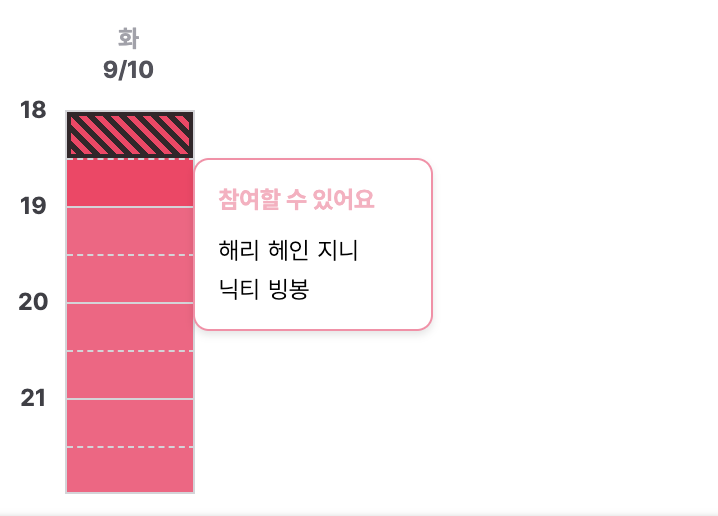
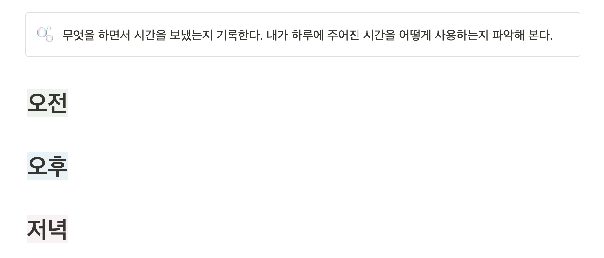
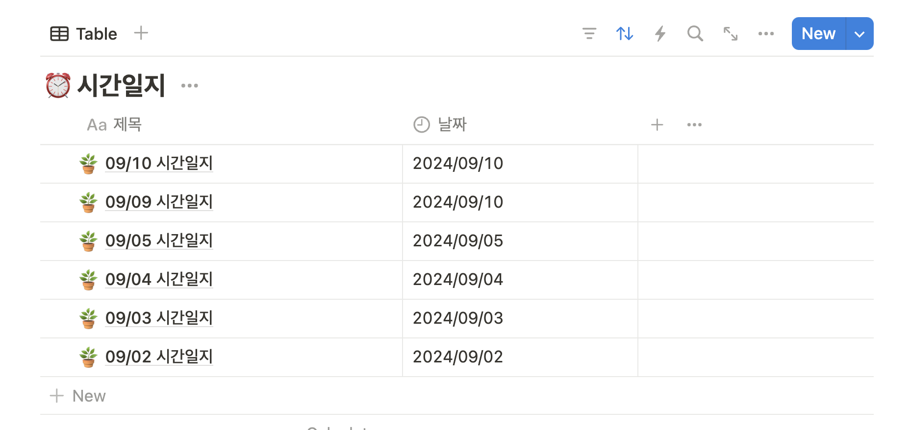
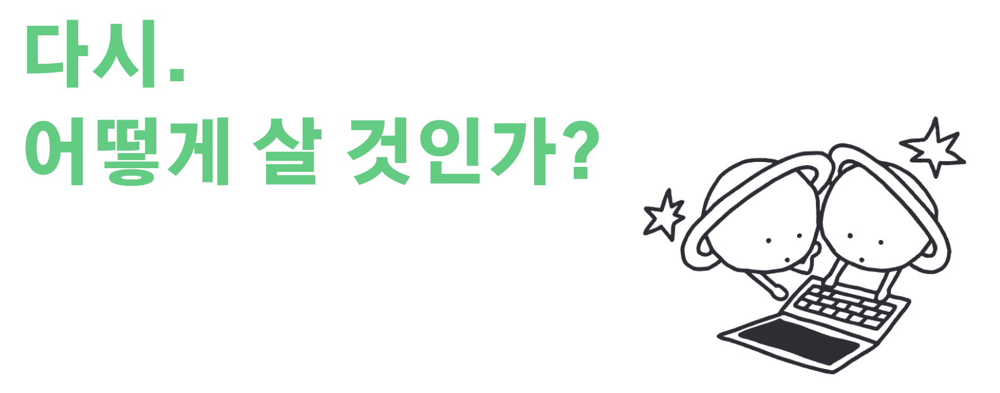
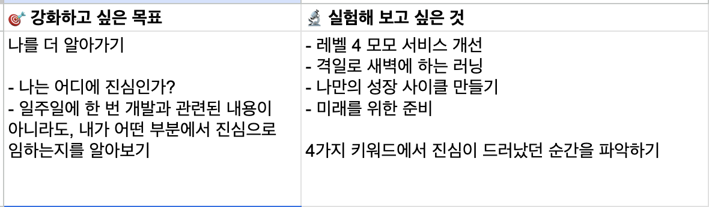
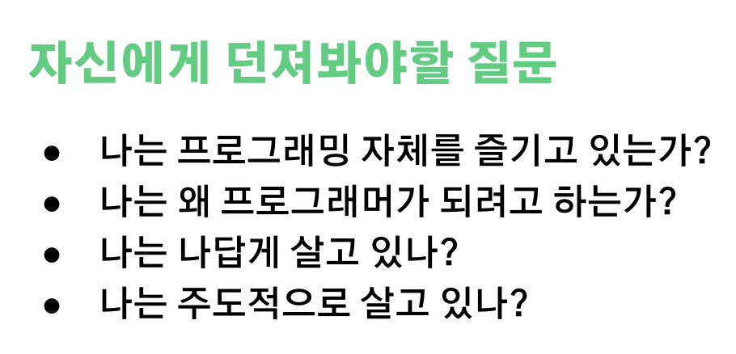

# 레벨 3에서 얻은 것에 관하여

레벨 3 방학(8/26-9/2) 동안, 정말 푹 쉬었다. 레벨 4가 분명히 더 바빠질 것이고, 슬슬 취업 준비로 인해서 몇 배는 더 정신 없을 것이라는 생각이 들어서 일어나서 돌아다니는 시간보다 누워 있는 시간이 더 많다고 느낄 만큼 정말 푹 쉬었다. 그래도 레벨 3에 모모 서비스를 만들면서 내가 어떤 것들을 얻었는지 키워드라도 정리해 보는 시간을 가졌다.

### 1. 약속 날짜 범위를 생성할 수 있는 캘린더 UI를 구현했다.

캘린더 UI를 제공해서 날짜 범위를 선택할 수 있도록 했던 의도는 **사용자가 날짜를 쉽게 선택할 수 있도록 하기 위해서**라고 할 수 있겠다. 날짜를 직접 입력하는 것 보다, 달력을 보면서 날짜만 클릭하면 선택되도록 하는 것이 더 편할것이라고 생각했다.

대부분의 숙박 서비스나 날짜를 선택해야 하는 서비스들은 모두 캘린더 UI를 활용하고 있는 것을 파악할 수 있었다. 라이브러리를 사용하지 않고, 레벨 2에서 배운 사고 방식을 활용해서 캘린더 UI를 하나의 작은 문제를 해결한다는 생각으로 구현했다. 이 후 스토리북 환경에서 팀원들이 UI를 확인할 수 있도록 했다.

UT(Usability Test), 런칭데이에서 연속된 긴 날짜 범위를 선택해야 하는 경우 모든 날짜를 모두 클릭해야 하는 것이 조금 불편하다는 피드백이 있어 레벨 4에서 해당 피드백을 반영해 볼 생각이다.

### 2. 약속 시간을 선택할 때, 데스크탑 & 모바일 환경 모두 드래그해서 시간을 선택할 수 있도록 했다.

드래그를 통해서 시간을 선택할 수 있도록 하는 기능의 의도는 약속을 주최하는 사람, 약속에 참여하는 사람 모두 시간을 편하게 표시할 수 있도록 하기 위해서이다. 최대한 편하고 빠르게 시간을 선택하도록 하는 것이 우리 서비스가 해결해줘야 하는 문제였다. 시간을 선택하는 방법에 대해서 팀원들과 정말 많이 이야기를 나누었고, 드래그가 가장 적합한 해결 방법이라고 결론지었다.

[레벨 3 해커톤](https://hwinkr.github.io/woowacourse-level-3-hackathon-retrospect/)을 했을때, 이 기능을 구현했다. 모모 서비스에서 가장 먼저 구현한 기능, 해커톤에서 밤을 새면서 구현했던 기능이라는 점에서 의미가 있는 기능인 것 같다.

해당 기능 구현을 했을 때, 아쉬운 점은 테스트 코드를 작성해 보지 못했다는 것이다. 아직 해당 기능을 스토리북, RTL, Cypress 중 어느 도구를 활용해서 테스트하면 좋을지 결론내리지 못했다 :(

### 3. 특정 시간을 선택한 사용자 목록을 툴팁 UI를 활용해서 보여주도록 했다.

툴팁 UI를 제공하기로 결정한 기능의 의도는 다음과 같다. 모모(모두 쉽게 모이자, 모모!) 서비스는 약속 시간을 결정하는데 까지 오래 걸린다는 것을 문제를 해결하려 한다.

- 즉, **약속 시간 의사 결정을 빠르게 하는 것을 도와주는 서비스**이다.
- → 어떤 요소들이 빠르게 약속 시간을 결정하는데 도움을 줄 수 있을지에 대해 팀원들과 이야기를 나눴다.
- → 약속 참여자들에게 약속 시간과 관련된 많은 정보들을 보여줄 수 있으면 사용자들은 빠르게 의사 결정을 할 수 있을 것이라는 가설을 세웠다.
- → 해당 가설이 옳았는지 확인해 보기 위해서 약속 후보 시간의 범위 중 특정 시간을 클릭하거나(모바일), 마우스를 올리면(데스크탑) 해당 시간을 선택한 사용자들을 보여주는 기능을 제공해 보자는 의견이 나왔다.

재공해 볼만한 가치가 있는 UI라 생각되어, 툴팁 UI를 구현했다. 한 번도 구현해 보지 않은 UI라 정말 많은 어려움을 겪었고, 구현 중간중간 버그도 많이 생겨서 구현하느라 정말 애를 많이 썼다. 구현한 후, 스토리북을 활용해서 팀원들에게 컴포넌트 사용법과 해당 컴포넌트의 기능에 대해서 소개했다.

런칭데이에 코치 솔라에게 하나의 시간 셀(30분)을 선택한 사용자들의 목록을 보여주는 것에서 시간의 범위로 보여주는 것으로 개선되면 더 사용성이 좋을 것 같다는 피드백을 받았다. 오…정말 좋은 피드백인 것 같지만 구현을 어떻게 해야할 지 감도 잡히지 않아서 반영 우선순위가 낮은 피드백으로 정리했다…😅

### 4. 재사용할 수 있는 텍스트 컴포넌트를 만들었다.

UT(usability test)를 진행한 후, 피드백 받은 내용들을 적용하기 위해서 피그마 디자인을 개선했다. 개선 후, 재사용할 수 있는 텍스트들이 많은 것 같아 재사용성이 있는 하나의 텍스트 컴포넌트를 만드는 과정을 경험했다. 블로그에서도 확인할 수 있다

### 5. 프론트엔드 리소스 배포를 자동화했다.

우테코를 시작하기 전에는 aws amplify를 사용했기 때문에 cd(continuos deploy) yml 파일을 생성할 필요 없었지만 모모 서비스를 만들 때는 aws s3, cloudfront를 사용해야 했다. 수동으로 배포하는 것에 불편함을 느껴 배포 자동화를 위한 스크립트를 작성하고, yml 파일 내부 코드들을 이해해 보는 시간을 가졌다.

### 6. 웹팩을 활용해서 로컬에서 https로 실행할 수 있는 방법에 대해서 알게 되었다.

사파리 환경에서 특정 기능을 테스트 하다 사파리 브라우저는 http 환경에서 클라이언트와 서버가 쿠키를 주고 받을 수 없다는 것을 알게 되었고, 쿠키를 주고 받기 위해서 웹팩을 활용해 로컬에서 https 환경을 만들 수 있는 방법에 대해서 학습하고 적용했다. 해당 내용은 정리중이다.

### 7. 디스코드 + yml 파일을 활용해 작업 현황 알람 자동화를 진행했다.

카톡으로 업무 현황을 공유하는 것보다는

> 누군가 특정 작업을 다 하면 알람을 주는 것이 좋지 않을까?

라는 생각이 들어 작업 현황을 빠르게 공유할 수 있도록 디스코드 웹 훅을 활용해서 알림 자동화 작업을 진행했다.

하나의 서비스를 만들면서 개인적으로 느낀점도 기록해 본다.

1. 서비스에서 **개발자체가 차지하는 영역**은 생각보다 작다.
2. 일에서 **컴팩트**는 중요하다.
3. 같은 개발을 하는 사람들이라도 생각은 정말 다양하고 다르다.
4. 사용자는 개발자의 의도대로 사용하지 않는 경우가 더 많다.

# 시간에 관하여

방학 마지막 날, 유튜브 영상을 뭐 볼지 내리다가 해당 영상을 발견하게 되었고 홀린듯이 시청했다. 췌장암 판정을 받고 6개월 정도 남은 한 미국 대학 교수의 연설 영상이다. 이 교수는 시간에 대해서 이야기 하고 있다.

- https://www.youtube.com/watch?v=y2a3lLjjTGI&t=10s

영상에 나오는 교수는 삶이 180일 정도 남았다. 내 삶이 언제쯤 끝날지 아는 사람이 시간에 대해서 이야기를 하니 더 인상 깊었다.

> _사람들은 돈에 대해서는 정말 꼼꼼하게 관리를 하지만, 시간에 대해서는 돈 만큼 관리하지 않는다._

정말 공감되는 말이다. 무엇이든 미친듯이 꼼꼼하게 관리하면 너무 피곤해지고, 예민해진다. 돈과 시간에 대한 관리 또한 마찬가지일 것이다. 하지만, 돈에 비해 상대적으로 시간에 대해서 더 관대하게 관리한다는 것에 공감되는 이유는 무엇일까. 아마 대부분의 사람이 그렇게 살아가기 때문일 것이다. 시간의 가치는 돈의 가치보다 월등히 높고 내가 보낸 오늘은 다시는 돌아오지 않는다는 것을 알지만, 삶에 치이다보면 간과하기 쉬운 명제인 것 같다. 나도 그렇게 사는 듯하다. 시간보다는 돈을 더 꼼꼼하게 관리하려고 하는…? 가계부도 쓰지만 정작 내가 내 시간을 어떻게 쓰고 있는지에 대해서는 기록을 하지 않는다. 해당 영상에서 교수는

> 내 1시간의 가치를 돈으로 환산한다면 과연 얼마가 될까?

에 대해서 물어보기를 권장한다. 해당 영상은 `시간 관리` 에 대한 강의는 아니며, 그저 삶이 얼마남지 않은 사람의 인생 조언이다. 소중한 나의 시간을 더 효율적으로 사용하고, 더 많은 일을 해결함으로써 더 행복한 삶으로 나아갈 수 있는 방법에 대한 조언이다.

인생에서 가장 큰 목표가 즐거움이 되어야 행복한 삶을 살게될 수 있다는 조언을 해준다.

> 즐겁지 않은 일을 굳이 왜 해야 할까요?

에 대한 질문도 던진다. 레벨 1에서 공원과 면담했던 내용이 떠올랐다. 무엇이 됐든 그 일을 오래, 지속적으로 하려면 우선 즐거워야 한다는 것. 레벨 3에서는 확실히 즐거움을 잃어버렸기에 이렇게 살고 싶지는 않다는 생각을 하면서 캠퍼스에 출근을 한 날들이 많아졌다. 일상 속 즐거움도 잘 느끼지 못했고, 점점 예민해지고 있다는 것을 느꼈고 심지어 주변 사람들에게 화가 많아진 것 같다는 이야기도 들었다. 즐거움에 대한 조언을 잠시 잊고 살았다.

다시 돌아와서, 해당 교수는 틀에 박힌 소리일 수도 있다고 하면서 다음 이야기를 꺼낸다.

> 성공한 사람이 시간 관리를 잘 하는것이 아니라, 시간 관리를 잘 하는 사람이 성공한다.

시간 관리를 잘 하기 위해서는 자기 자신을 잘 아는 것이 중요하다고 말한다. 어떤 집단에 속하게 되면, 분명 나보다 뛰어나다고 느껴지는 사람들이 많고 우테코에 와서도 많이 느끼고 있다. 그렇다면 내가 이 사람들이랑 함께하기 위해서 나는 어떤 것을 해야 하는지를 아는것이 중요하다.

> ‘난 여기서 어떤 행동을 해서 내 가치를 끌어올릴 수 있을까?’

에 대한 고민을 해보는 것이 중요하다. 시간 관리를 잘 하기 위해선 목표, 우선순위, 계획이 매우 중요하다고 말한다.

## 목표

내가 어떤 ‘일’을 한다고 할 때, 일을 하면서 가장 중요한 생각은

> 내가 지금 이 일을 `왜` 하고 있는가?

이다. 이 부분은 정말 간과하기 쉽다. 많은 선배 개발자, 테크 리드, 코치분들도 모두 특정 기능을 개발할 때 해당 기능을 만드는 이유와 의도에 대해서 굉장히 많이 강조를 하는데 실제로 개발을 하다보면 마감 기한과 트러블 슈팅들에 치여서 잊기 쉬운 질문이 되버린다. **왜 하는지도 모르면서 그저 투두 리스트를 채우지는 말자.**

앞으로 특정 기능을 구현하거나 피그마에서 디자인을 하게 된다면

- 왜 이 기능을 구현하는지? 해당 기능의 의도는 무엇인지?
- 이 기능이 정말 중요한 기능인지? 사용자에게 서비스의 가치를 전달하는데 한 발짝 더 나아갈 수 있을지?
- 왜 이 디자인을 하는지? 이 디자인으로 전달하려는 UI/UX는 무엇인지?

에 대해서 스스로에게 물어보고 시작하자. **이 질문에 대해서 정답을 찾을 필요는 없다고 생각한다.** 정답은 실제 사용자에게 서비스를 만들어서 제공하기 전 까지는 **아무도 모른다.** 그럼에도 이 질문을 해보는 것이 중요한 이유는 **내가 인지를 하고 개발을 시작하는 것의 가치가 엄청나게 크기 때문**이다. 그리고 내가 하는 일, 만들어야 하는 기능, 디자인의 진짜 목표는 무엇인지와 이 일을 해냈을 때 나에게 어떤 도움이 되는지를 알고 시작하면 일을 하는 중간중간 내가 올바르게 하고 있는 것이 맞는가에 대한 의심을 하는 가능성이 줄어들게 될 것이다. 특히 스스로에 대한 의심이 많고 이유가 없으면 행동으로 옮기고 싶지 않아하는 나에게는 정말 중요한 질문이 될 것 같다.

레벨 3에서는 이유를 잊은 채 개발하는 순간들이 많았다. 많이 잤다하면 4-5시간, 데모데이 전 날에는 2시간 정도, 서비스 런칭 날에는 40분 정도 밖에 자지 못했고 체력적으로 지친 것이 자연스럽게 나의 정신력에도 영향을 주게 되었다. 충분한 수면 시간을 확보한 후 다시 내가 좋아하는 사고 방식으로 개발을 시작해 보자 :)

이유를 안다면 자연스럽게 목표는 따라오지 않을까? 😊

목표와 관련된 이야기 말고도 시간 관리와 관련된 많은 이야기들을 해주신다. 계획을 세우는 방법, 우선 순위를 정하는 방법에 대해 조언해 주신다. 영상을 시청한 후 영상에서 전달하고자 하는 메시지를 **내 삶에 적용해볼 수 있는 것은 없을까**에 대해서 고민하고 액션 플랜을 세워봤다. 하루에 내가 시간을 어떻게 보내고 있는지에 대한 **시간 일지**를 작성해보는 것이다.

## 시간 일지 작성해 보기

내가 하루에 시간을 어떻게 보내고 있는지에 대한 **시간 일지**를 작성해 본다. (`시간을 어떻게 썼는지 알아가는 과정 === 나를 알아가는 과정`)

- 점심을 먹고난 후, 오전에 무엇을 했는지
- 저녁을 먹고난 후, 오후에 무엇을 했는지
- 잠에 들기 전, 저녁에 무엇을 했는지

결국, **유한한 나의 시간을 더욱 더 쓸모있게 사용하기 위한 노력**이라고 할 수 있겠다.

노션 템플릿을 만들고 캠퍼스에 출근하면 **mm/dd 시간일지**를 제목으로 하는 페이지부터 생성했다. 보통 일기를 쓰면 자기 전에 작성하는데 너무 정신없는 날이라면 오늘 무슨일들이 일어났는지 조차 기억하기 어려워 하루를 돌아보기 힘들었던 적이 많았다. 오전, 오후, 저녁으로 구분된 내용을 채우면서 느낀 것은 얼마 지나지 않은 일에 대해 작성하는 것이기 때문에 정말 생생하게 기록을 할 수 있다는 것이다.

좋은 인사이트를 주는 영상을 보고, 좋은 계획을 세운 것 같아 만족하며 작성중이다. 영상에서 교수님은 한 달에 한 번 자신의 영상을 시청할 것을 권장한다. 아이폰 **미리 알림** 앱을 사용해서 매달 1일 마다 해당 영상을 시청하고 내가 시간 관리를 지난 달 보다 잘 했는지를 생각해 볼 예정이다.

# 다시 시작한 러닝

4월달 쯤이였나, 햄스트링 부상을 겪은 날 달리다가 햄스트링이 찢어지는 고통이 느껴졌다. 쿠션이 없는 뉴발 993을 신고 달리다가 햄스트링이 크게 다친 후, 달리기가 무서워서 4개월 정도를 쉬었다 그 뒤로 달리는게 조금 무서워졌다. 그래서, 햄스트링 재활을 하기 위한 특별한 노력도 하지 않으며 그저 걷기를 반복했다. 잘못된 자세로 달리는 것이 정말 큰 문제라는 것을 깨달을 수 있었다.

한동안 계속 달리지 못하다가 러닝화를 사고 난 후 다시 달리기 시작했다. 보통 누나와 함께 달리는데 내가 달리지 못한 사이에 누나는 정말 많이 성장해 있었다. 15KM을 5:30 페이스로 달리는…

달리기에서 인생의 가치에 대해서 정말 많이 배울 수 있는 것 같다. 무언가를 꾸준하게 한다면 눈부신 성장은 가능하다. 2월달에 처음 같이 달리기 시작했을 때만 해도 누나는 항상 나의 뒤에 있었고, 중간에 지쳐서 걷는 날이 많았다. 하지만, 이제는 내가 누나 뒤에서 달리며 누나를 따라가지 못해 달리기를 중간에 멈추고 있다. 지금은 누나에게 오래 달리기 위한 자세를 추천 받고, 달리기를 잘 알려주시는 유튜버도 추천받고 있다.

누나에게 배운 올바른 자세, 꾸준함으로 올해 안에 통증을 느끼지 않으면서 10KM을 달려보는 것을 목표로 세워본다!

# 레벨4 OT

레벨 4 개강 날, OT가 있었다. 레벨 4 생활 가이드, 학습 목표를 공유해 주셨다. OT 내용 중, 포비의

> 다시, 어떻게 살 것인가?

라는 주제로 말씀해주신 부분이 인상깊었다.

> 대량 생산의 시대가 끝나고 인공 지능 시대가 도래하고 있다. 어떻게 사는 삶이 경쟁력 있는 삶인가?

위 질문에 대한 포비의 생각을 말씀해 주셨다. 협력, 소통, 비판적 사고, 자신만의 생각, 색깔, 개성, 그리고 소프트웨어에 대한 진정성 등 많은 키워드들이 나왔다. 나는 여기서 진정성이라는 단어에 이끌렸다.

> 나는 어떤 부분에 진정성을 느끼면서 살아가고 있을까?

에 대해서 생각해봤다. 가장 가까운 레벨 3에서 진정성이 드러난 순간들을 떠올려 봤다.

- 우리 서비스가 해결하려고 하는 문제가 진짜로 해결할 필요성이 있는 문제인지 의심했던 순간
  - 빙봉에게 내 고민을 말한 후, 빙봉과의 대화를 통해 내 의심을 덜어냈다.
  - 의심을 덜어내니 자연스럽게 진심으로 모모 서비스를 만들어 가고 있다는 것을 느꼈다.
- 비슷한 문제를 해결하려고 하는 다른 서비스들을 항상 브라우저 탭에 올려놓고, 시간이 날 때마다 참고도 하고 비교도 해봤던 순간
- 해결하려고 하는 문제는 다르지만 우리가 제공해야 하는 기능들을 우선적으로 제공하고 있는 다른 서비스들을 항상 브라우저 탭에 올려놓고, 참고하려고 했던 순간
- 팀 내부에서 **공유**가 잘 되지 않는 것 같아서 백로그 문화를 제안해 봤던 순간
- 작업을 더 효율적으로 진행할 수 있도록 디스코드를 활용한 알람 자동화를 구축하려 했던 순간
- 버튼의 위치나 사용자에게 전달하는 텍스트들에 대해서 고민했던 순간

등등 생각보다 많은 부분에서 내 진정성이 드러났던 것 같다.

레벨 4에서 나는 개발을 하면서, 살아가면서 어떤 부분에서 진성성이 드러나는지 알아보고 싶어 팀 내에서 진행하는 유강스(유연성 강화 스터디)에서 관련된 목표를 정했다.

그리고 포비는 위 이미지의 질문들에 답 해보는 것도 중요하다고 말씀해 주셨다. 정말 답하기 어려운 질문이지만, 답을 해야만 하는 질문이기도 하다. 개발자로 살아가지 않더라도 3, 4 번째 질문은 고민해봐야 하는 질문이다. 어쩌면 저 질문에 답을 하기 위해서 살아가고 있는 것이 아닌가 하는 생각이 들기도 한다.

# 레벨4 첫 수업 : 프론트엔드 웹 성능 최적화

프론트엔드 영역에서 할 수 있는 웹 성능 최적화를 주제로 레벨 4 첫 수업이 시작됐다. 수업에서 최적화와 관련된 정말 다양한 키워드들이 나왔다.

- Lighthouse `95점` 이상
- Home 페이지에서 불러오는 스크립트 리소스 크기 `< 60kb`
- 히어로 이미지 크기 `< 120kb`
- `프랑스 파리`에서 `Fast 3G` 환경으로 접속했을 때 Home 두 번째 이후 로드시 `LCP` < 1.2s
  - `WebPageTest`에서 Paris - EC2 Chrome CPU 6x slowdown Network Fast 3G 환경 기준으로 확인
- Chrome CPU 6x slowdown Network Fast 3G 환경에서 화면 버벅임 최소화
  - `Dropped Frame` 없음. `Partially Presented Frame` 최소화.

자 여기서 내가 아는 단어가 뭘까? Home…? ~~아는 단어가 Home 밖에 없어서 집에 가고 싶었다 ㅋㅋ~~

수업이 끝난 후, 정말 멍했었다. 어디서 부터 어떻게 시작해야 성능을 최적화 할 수 있는 것인지 감도 잡히지 않았다. 캠퍼스를 돌아다니면서 다른 크루들의 반응을 살폈다.

> 방금 뭐가 지나간거야…?

다른 크루들의 반응도 비슷했다. 현재 만들고 있는 서비스에서 성능 최적화에 대한 필요성을 느껴서 시작한 작업이 아니라 미션을 위해서 성능 최적화를 해야 한다는 것도 어려움이 느껴진 부분 중 하나였다. 하지만, 나중에 언젠가는 서비스의 규모가 커질 때, 성능 최적화를 해야 할 필요성이 느껴졌을 때 어떤 부분을 개선할 수 있을지, 어떻게 개선할 수 있을지 파악하는 방법을 미리 한 번 배워본다는 느낌으로 미션을 진행하고자 했다. 실제로 이번 미션의 학습 목표이기도 했다.

> _이 수치를 완벽히 맞추기 위한 미션이 아니라, 개선 방법들을 한번씩 직접 경험해보기 위한 미션이랍니다. 🙂_

미션을 진행하면서 웹팩 공식문서를 정말 많이 읽었다. 기존에는 웹팩과 같은 번들러는 충돌 없이 효율적으로 모듈 시스템을 사용하도록 해주고 하나의 파일로 합쳐주는 기능을 제공해주는 이점 때문에 사용하는 것이라고 알고 있었다. 공식문서를 읽고

- 요청 크기를 줄이기 위해서, js 파일의 크기를 줄이고 난독화
- 요청 크기를 줄이기 위해서, css 파일의 크기를 줄이는 플러그인 제공
- 프로덕션에서 필요하지 않은 의존성을 tree-shaking
- 이미지 크기를 최적화할 수 있는 플러그인 제공

등 성능 최적화를 위한 많은 기능을 웹팩에서 제공해주고 있다는 사실을 새롭게 알게되었다. 번들러 도구를 사용하는 이유를 더 다양한 관점에서 파악해볼 수 있는 의미있는 학습이었다. 추가로 HTTP Cache 개념과, CDN, Reflow를 발생시키는 css 속성과 그렇지 않은 css 속성을 비교해볼 수 있었다.

미션을 시작할 때만 해도, 어떻게 미션을 진행할지 감이 전혀 잡히지 않았는데 나중에 할 수도 있는 일을 당황하지(?)않고 할 수 있도록 미리 배워본다는 느낌으로 미션을 대하니 많은 키워드들을 학습할 수 있었다. 미션을 진행했던 방법들은 나중에 한 번에 정리해놔야겠다.

1주차 회고 끗~
