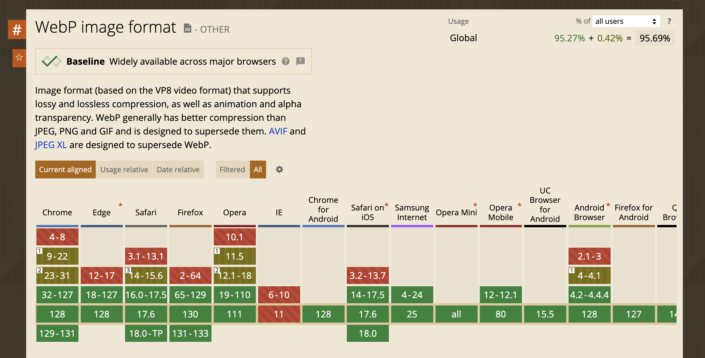
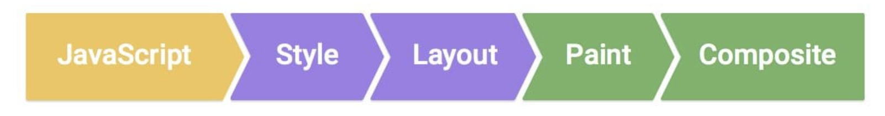
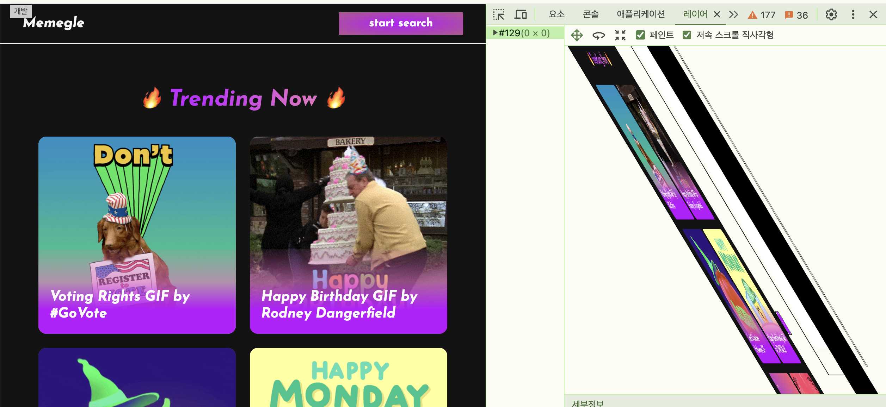
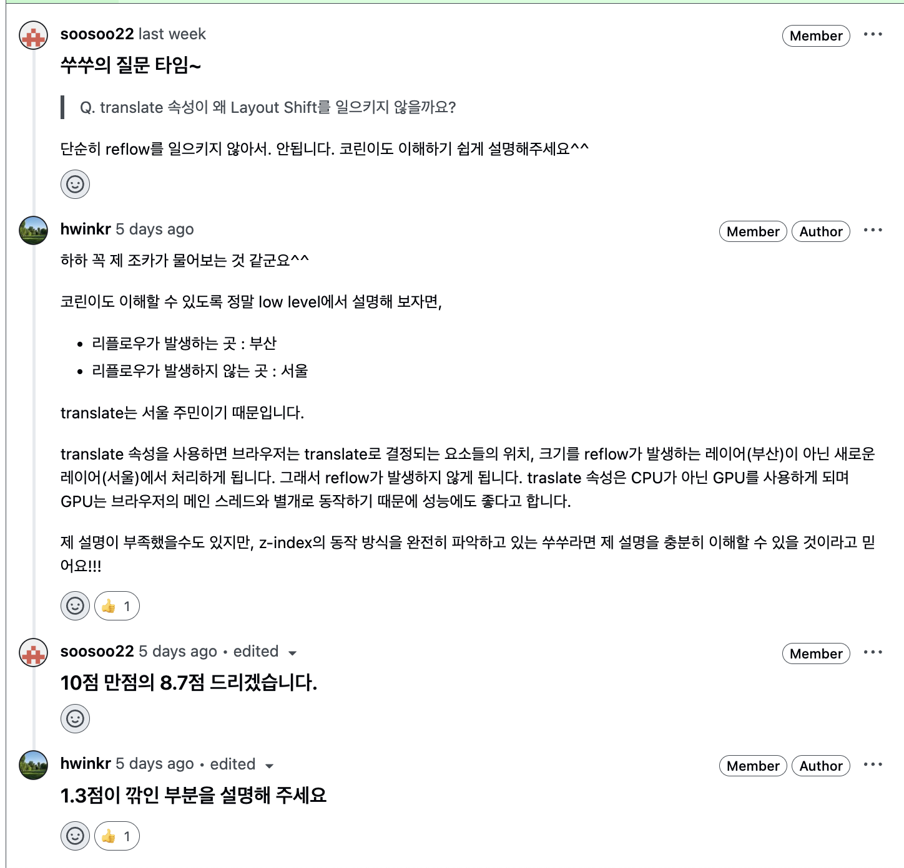
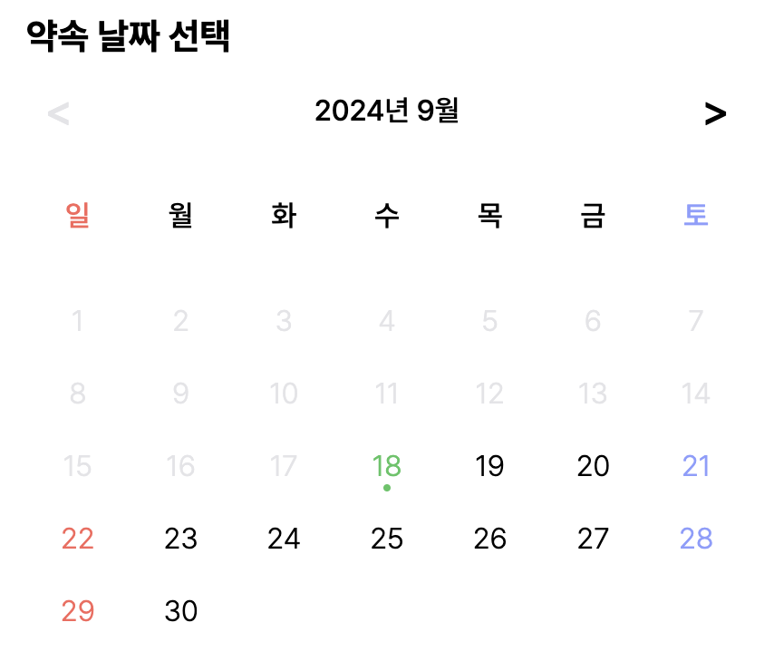
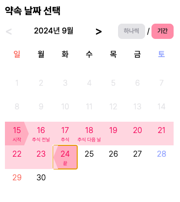
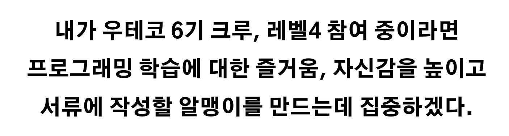
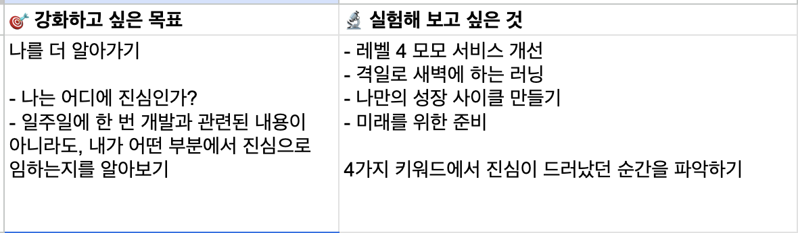

## 쑤쑤와 즐거운 피드백 주고받기

- https://github.com/woowacourse/perf-basecamp/pull/151

레벨 4 미션은 레벨1, 2 미션과 다르게 크루들과 서로 미션 피드백을 주고 받는다. 나의 성능 개선 미션의 리뷰어는 동갑내기 친구 쑤쑤였다. 쑤쑤가 리뷰어가 된 것을 보고 재밌게 피드백을 주고받을 생각만 했었는데 쑤쑤의 피드백이 정말 날카로웠다.

### react-icons 라이브러리 사용에 대하여

> _@react-icons/all-files 라이브러리를 사용하면 번들 사이즈를 더 줄일 수 있는데 사용해 보는 것은 어떨까요?_  
> _react-icons 라이브러리를 사용했을 때, 트리 쉐이킹 관련 이슈가 있는데 완벽하게 해결되지는 않은 것 같아요._

- https://github.com/react-icons/react-icons/issues/154
- https://github.com/react-icons/react-icons/issues/289

미션에서는 `react-icons` 라이브러리가 의존성에 추가되어 있었다. 웹팩 프로덕션 빌드에서 트리 쉐이킹을 자동으로 해주기 때문에 아이콘 번들 사이즈 최적화를 위한 추가적인 작업은 하지 않기로 결정했었다. 쑤쑤는 나의 의견에 대해서 위와 같은 피드백을 주었고,

- 조금이라도 번들 사이즈를 더 줄일 수 있다는 장점
- 현재 사용하고 있는 라이브러리가 가지고 있는 번들 사이즈 관련 불안정성

위 두 근거를 바탕으로 `@react-icons/all-files` 라이브러리를 설치하는 것으로 피드백을 반영했다.

### Suspense 위치에 대하여

```tsx
// App.tsx

<Router>
  <Suspense fallback={<div>loading...please wait...</div>}>
    <NavBar />
    <Routes>
      <Route path="/" element={<Home />} />
      <Route path="/search" element={<Search />} />
    </Routes>
    <Footer />
  </Suspense>
</Router>
```

기존에는 Suspense의 위치를 모든 컴포넌트를 감싸는 것으로 결정했었다. `Layout Shift` 현상을 최소화하기 위한 결정이었다. 쑤쑤는 이에 대해 다음과 같은 피드백을 해줬다.

> _NavBar와 Footer는 Home이나 Search보다 빠르게 로드되니까 Suspense로 감싸게 되면 오히려 렌더링이 늦어지는 단점이 존재할 것 같은데 해리는 어떻게 생각하시나요?  
> 혹시 Layout Shift 때문에 NavBar와 Footer도 Suspense로 감싸신 거라면 Layout Shift가 일어나지 않게 로딩 화면이 화면 전체를 차지하게 만들면 일어나지 않아요._

반영할 만한 가치가 있는 피드백이었다. 만약 위와 같은 구조로 App 컴포넌트를 구성하게 된다면 Home 페이지를 구성하기 위해 다운받아야 하는 스크립트의 크기가 큰 경우에 `NavBar`, `Footer` 컴포넌트가 렌더링 될 준비가 되었음에도 로딩 화면이 봐야 하는 문제가 생긴다. NavBar, Footer 컴포넌트는 사용자가 어떤 페이지에 있던 항상 보여야 하는 컴포넌트이므로 Suspense로 감싸지 않기로 결정했다. 그리고, **Layout Shift 현상도 최소화 하기 위해서 로딩 화면에 height 속성을 주기로 했다.**

```tsx
<Router>
  <NavBar />
  <Suspense
    fallback={<div style={{ width: "100vw", height: "100vh" }}>Loading...</div>}
  >
    <Routes>
      <Route path="/" element={<Home />} />
      <Route path="/search" element={<Search />} />
    </Routes>
  </Suspense>
  <Footer />
</Router>
```

### 리소스 파일 확장자에 대하여

리소스 파일 크기 관련 최적화를 위해서 기존 png, gif 확장자를 가졌던 리소스들을 모두 webp로 변경했었다. png, gif 모두 webp 확장자로 변경할 수 있어 리소스 크기를 줄일 수 있었고, 웹팩 설정으로 번들링 작업을 할 때, 한 번에 webp로 변환할 수 있는 편안함도 있었기 때문이었다.

```js
generator: [
  {
    preset: "webp",
    implementation: ImageMinimizerPlugin.sharpGenerate,
    options: {
      encodeOptions: {
        webp: {
          quality: 80,
          lossless: false,
        },
      },
    },
  },
]
//...
```

위와 같이 웹팩 설정을 하면 webp 파일을 의존성으로 가질 때 번들링의 결과가 저장되는 dist 폴더에 webp 파일들로 자동으로 변환된다. 이에 대해 쑤쑤는 다음과 같은 피드백을 줬다.

> _png, gif 모두 webp로 변환하셨는데 최신 브라우저에서는 webp를 모두 지원하지만 사파리 옛날 버전과 같이 webp를 지원하지 않는 경우가 은근히 있더라고요. `picture` 태그 관련 내용도 참고해 보시면 좋을 것 같아요!_

대부분의 브라우저와, 브라우저의 버젼에서 webp 확장자를 지원해 주기 때문에 모든 리소스 확장자를 webp로 바꿔도 괜찮을 것 같다고 생각했었다. 하지만 [Can i Use](https://caniuse.com/)에 들어가서 지원 범위를 직접 확인해 보니, webp를 지원해주지 않는 브라우저 버젼도 꽤 많은 것을 확인할 수 있었다.



더 많은 버젼을 지원해 주기 위해서라도 picture 태그를 사용해서 webp 확장자를 지원해 주지 않는 브라우저 버젼은 jpg 이미지를 다운로드 받을 수 있게 해주는 것으로 개선했다. png, jpg 중 어떤 확장자를 사용할지도 고민을 했었는데,

> 3. **_Are you optimizing a photo, screenshot, or a similar image asset? Use JPEG, lossy WebP, or AVIF._**
>
> _JPEG uses a combination of lossy and lossless optimization to reduce file size of the image asset. Try several JPEG quality levels to find the best quality versus file size tradeoff for your asset._  
> _Lossy WebP or lossy AVIF are great JPEG alternatives for web-quality images, but be aware that lossy mode discards some information to achieve smaller images. This means that select colors may not be the same as an equivalent JPEG._
>
> 🔗: https://web.dev/articles/choose-the-right-image-format#features_of_different_raster_image_formats

> **_무손실 압축 vs. 손실 압축_**  
> _JPEG와 PNG 중 무엇을 선택할지 고민된다면 먼저, 각 파일 포맷의 압축 방식을 고려하는 것이 좋습니다._ _JPEG는 세부 정보가 많고 색상이 풍부한 고품질 디지털 사진을 효율적으로 저장하도록 설계되었습니다. 온라인에서 간편하게 공유하고 업로드하도록 대용량 이미지를 작은 파일 크기로 압축합니다. 그 대신 단점도 있습니다._
>
> _JPEG는 손실 압축 방식을 사용하므로 파일이 압축될 때 이미지의 일부 데이터가 영구적으로 삭제됩니다. 파일을 편집하고 저장할 때마다 더 많은 데이터가 손실되기 때문에 시간이 지나면 파일의 품질이 더욱 저하됩니다. 이 때문에 일부 전문 포토그래퍼는 비압축 [RAW 파일](https://www.adobe.com/kr/creativecloud/file-types/image/raw.html)을 사용합니다._
>
> _이와 달리, PNG 파일은 무손실 압축 방식을 사용하므로 이미지가 압축될 때 손실되는 데이터가 없습니다. 아무리 파일을 편집하고 저장해도 이미지 품질이 유지되고 이미지가 흐려지거나 왜곡되지 않으므로, 선명한 로고나 수치가 많이 포함되는 그래프에 적합합니다_
>
> 🔗: https://www.adobe.com/kr/creativecloud/file-types/image/comparison/jpeg-vs-png.html

위 내용들을 참고해서 jpg 파일 확장자는 손실 압축 방식을 사용하기 때문에 이미지 크기 최적화에는 jpg가 좋다는 것과, 투명도를 제공해 줄 필요가 없다면 jpg 사용을 권장한다는 것을 알게되었다. 성능 최적화 미션인 만큼 jpg를 사용하는 것으로 결정했다. 기존에는 두 파일 확장자의 차이를 잘 몰랐지만, 피드백을 반영하면서 새로운 내용을 학습할 수 있었다.

gif도 기존에는 webp 확장자로 변경해서 최적화를 하려고 했으나 파일의 크기를 줄인 gif를 사용하는 것으로 결정했다. 성능 최적화를 해야했던 서비스는 인기있는 gif들을 보여주고, 검색할 수 있는 기능을 제공하는 서비스이다. 검색 결과로 나오는 리소스들의 확장자도 모두 gif이다.

- 홈 페이지에서 제공되는 리소스들만 webp로 제공하는 것은 리소스의 통일성에 어긋나는 듯하다.
- 사용자가 특정 gif가 마음에 들어서 다운로드 받으려고 했을 때, 다운로드의 결과가 webp, webm, mp4면 당황스러움을 느낄 수 있을 것 같다. (이 의견은 낙타의 의견이었는데, 상당히 공감되는 의견이었다. 낙타 짱~)

두 근거를 바탕으로, 파일의 크기를 조금이나마 줄인 gif를 사용하는 것으로 결정했다.

```js
new ImageMinimizerPlugin({
  minimizer: {
    implementation: ImageMinimizerPlugin.sharpMinify,
    options: {
      encodeOptions: {
        gif: {
          colors: 64,
          effort: 10,
          dither: 0,
          interFrameMaxError: 8
        },
      //...
```

### Layout shift 현상에 대하여

Layout shift 현상이란, 갑작스럽게 화면의 레이아웃이 변경되어 사용자 경험을 저해하는 현상을 말한다. 해당 현상을 개선하기 위해서 reflow를 발생시키지 않는, css 속성을 사용했다.

```tsx
useEffect(() => {
  if (cursorRef.current) {
    cursorRef.current.style.top = `${mousePosition.pageY}px`;
    cursorRef.current.style.left = `${mousePosition.pageX}px`;
    cursorRef.current.style.transform = `translate(${mousePosition.pageX}px, ${mousePosition.pageY}px)`;
  //...
```

> _Q. translate 속성이 왜 Layout Shift를 일으키지 않을까요?
> 단순히 reflow를 일으키지 않아서. 안됩니다. 코린이도 이해하기 쉽게 설명해주세요^^_

쑤수는 내 PR을 읽은 후, 더 자세한 답변을 해주기를 부탁했다. 쑤쑤에게 답변을 하기 위해서 왜 translate 속성이 reflow를 일으키지 않는지 자세하게 학습해 보는 시간을 가졌다.



[이미지 출처](https://web.dev/articles/rendering-performance?hl=ko)

> _웹 페이지에 무언가를 표시하기 위해서 브라우저는 위 이미지와 같은 순차적 단계를 거칩니다. 그리고 각 단계는 아래와 같이 정리할 수 있습니다._
>
> 1. _스타일: 요소에 적용되는 스타일을 계산_
> 2. _레이아웃: 각 요소의 도형과 위치를 생성_
> 3. _페인트: 각 요소의 픽셀을 [레이어](https://web.dev/articles/animations-overview?hl=ko#layers)에 채우기_
> 4. _합성 화면에 레이어를 그리기_
>
> _이 4단계를 브라우저의 **렌더링 파이프라인**이라고 합니다. 이미 로드된 페이지에서 항목에 애니메이션을 적용할 때는 **이러한 단계를 다시 수행해야 합니다**. 이 프로세스는 애니메이션을 실행하기 위해 변경해야 하는 단계에서 시작됩니다. 앞서 언급했듯이 이 단계는 **순차적**입니다. 예를 들어 레이아웃을 변경하는 항목에 애니메이션을 적용하는 경우 페인트 및 합성 단계도 다시 실행해야 합니다. 따라서 레이아웃을 변경하는 항목에 애니메이션을 적용하는 것은 합성만 변경하는 항목에 애니메이션을 적용하는 것보다 비용이 많이 듭니다._
>
> 🔗: https://web.dev/articles/animations-overview?hl=ko#pipeline

레이아웃이 변경되면 생각보다 훨씬 더 많은 리소스가 필요하게 된다. 크기가 변하는 애니메이션이라면 크기가 변할 때, 주변 도형의 위치도 함께 계산해야 하기 때문이다. 서로에게 영향을 주는 레이아웃 변경이 발생한다면 위 4가지 단계를 모두 실행해야 하기에 리소스가 상당히 많이든다.

> _Chrome DevTools에서 스타일 패널을 아래로 스크롤하여 키프레임을 찾을 수 있습니다. 여기서 transform를 사용하여 요소의 위치를 변경하고 회전하여 애니메이션이 생성된 것을 확인할 수 있습니다. transform 속성은 애니메이션 가이드에 설명된 속성 중 하나입니다. 브라우저가 레이아웃 또는 페인트 작업을 실행하지 않습니다 (애니메이션 속도가 느려지는 주요 원인)._
> 🔗: https://web.dev/articles/animations-examples?hl=ko#how_it_works

`transform` 속성은 브라우저가 리페인트, 리플로우 작업을 건너뛸 수 있도록 해준다. 그 이유는 top, left와 같은 속성은 CPU하는 것과 달리, `transform` 속성은 GPU가 처리하게 된다. GPU는 그래픽 처리에 최적화되어 있고, 브라우저의 메인 스레드와 달리 병렬로 작업할 수 있기 때문에 애니메이션에 사용하기 적합하다.

> **_레이어 강제 생성_**
>
> [일부 애니메이션이 느린 이유는 무엇인가요?](https://web.dev/articles/animations-overview?hl=ko)에 설명된 대로 새 레이어에 요소를 배치하면 브라우저에서 요소를 다시 페인트할 필요 없이 나머지 레이아웃을 다시 페인트할 수 있습니다.
>
> 🔗: https://web.dev/articles/animations-guide?hl=ko#force

> **레이어란 무엇인가요?**  
> _애니메이션 처리되거나 전환될 항목을 새 레이어에 배치하면 브라우저는 해당 항목만 다시 페인트하면 되고 다른 항목도 다시 그릴 수 없습니다. 함께 이동할 수 있는 많은 요소를 포함하는 레이어라는 Photoshop의 개념에 익숙할 것입니다. 브라우저 렌더링 레이어도 이 아이디어와 비슷합니다._  
> 🔗: https://web.dev/articles/animations-overview?hl=ko#layers

`transform` 속성을 사용하게 되면 브라우저는 새로운 레이어를 생성해서 해당 스타일을 적용하게 된다. **reflow → repaint가 일어나는 레이어와 다른 레이어에서 애니메이션을 처리하기 때문에 해당 과정을 건너뛸 수 있게 된다.** 즉, CPU가 하는 일이 적어진다.



직접 개발자 도구의 성능 탭 → 레이어에서도 확인을 해보면 애니메이션을 처리하기 위해서 새로운 레이어를 생성하는 것을 확인할 수 있었다.



나의 답변이 완벽하다고 생각했는데, 쑤쑤는 1.3점이나 깎아버렸다…😢

## 레벨 4 첫 번째 미션을 통해서 얻은 것

레벨 4 첫 번째 미션 소개를 할 때만 해도, 내가 아는 키워드가 하나도 없었다. 하지만 미션을 진행하면서 웹 성능을 개선하기 위해서 어떤 액션들을 할 수 있는지에 대해 충분히 파악할 수 있었다. 간단하게 얻은 것들을 정리해 보면 아래와 같다.

- 웹 성능 === 로딩 성능 + 렌더링 성능이다.
  - 로딩 성능: 파일 크기 줄이기, 필요한 것만 요청하기, 같은 건 매번 새로 요청하지 않기
  - 렌더링 성능: 최소한의 변경만 일으키기, 변하는 곳에만 변화를 주기
- 개발자 도구와 친해졌다.
  - 네트워크 탭을 조금 더 자세하게 볼 수 있게 되었다.
  - 특정 파일이 언제 다운로드 되고, 다운로드 되는데 까지 얼마나 걸리는지 파악할 수 있는 방법을 터득했다.
  - 성능 탭에서 특정 서비스의 성능을 측정할 수 있게 되었다.
  - 레이어 도구를 알게되었다.
- `성능 최적화` 라는 단어가 이전 만큼은 낯설지 않게 되었다.
- MDN, web.dev과 같은 공신력 있는 사이트들에서 정보를 찾는 것에 조금은 익숙해졌다.

## 모모: 달력 UI 피드백 반영하기

웹 성능 개선 미션을 진행하면서, 모모 서비스 피드백을 반영하는 작업도 병행했다.

레벨 3 런칭 데이에 약속을 생성할 때, 사용되는 달력 UI에 대해서 다음과 같은 피드백이 있었다.

- 오늘을 더 확실하게 표현해 줬으면 좋겠다. (초록색 점이 있으니, 선택된 줄 알았다.)
- 공휴일도 표시해 줬으면 좋겠다. (공휴일을 확인하러 다른 서비스의 달력을 확인하러 가야한다.)
- 연속된 날짜를 생성할 때, 모든 날짜를 하나씩 선택하는 것은 불편하다.

모두 반영할 만한 가치가 있는 피드백이었다. 무엇보다 내가 만든 UI에 대해서 바로 옆에서 피드백을 받으니 반영하고 싶다는 생각이 확고하게 들었다.



피드백을 받으면서 추가로 고려했던 아래와 같은 요소들도 고려했다.

- 기간으로 선택하는 경우, 시작과 끝을 텍스트로 표시해주면 더 좋지 않을까?
- 서로 바라보는 삼각형을 사용해서 기간이라는 것을 더 강조해 주면 좋지 않을까?

해당 요소들을 구현한 후, 피드백 반영이 완료된 달력 UI는 아래과 같다.



모모 서비스를 만들어 가는 것에 재미를 느끼니 피드백을 반영하는 것도 재미있게 느껴졌다. 불편함을 해결해 줄 수 있는 사고들을 코드로 녹여내고 결과에 대해 피드백을 받는 이 과정도 재밌다. [달력 PR](https://github.com/woowacourse-teams/2024-momo/pull/346#issuecomment-2351456499)에서 자세한 내용을 확인할 수 있다.

## 모모: 약속 생성 UI 흐름에 퍼널 패턴 도입하기

현재 모모에서는 약속을 생성하려면 다음과 같은 입력들을 받고있다.

- 약속 이름
- 약속 주최자 닉네임, 비밀번호
- 약속 날짜 범위, 약속 시간 범위

그리고, 모두 하나의 페이지에서 스크롤을 통해 아래로 내려가면서 입력을 받고있다. 모모 서비스는 모바일 우선 서비스이고 모바일의 경우 키보드가 화면 영역을 차지하게 된다. 해당 문제를 해결하기 위해서 다음과 같은 생각을 했다.

> 사용자는 현재 입력해야 하는 필드에 집중할 수 있도록 해볼까?
> 스크롤 없이 버튼을 통해서 페이지를 넘나들게 하면 어떨까?
> 모바일 키보드가 입력해야 하는 필드를 가리지 않도록 하면 좋지 않을까?

위와 같은 가설들을 실제로 코드로 구현해 보기 위해서 [토스ㅣSLASH 23 - 퍼널: 쏟아지는 페이지 한 방에 관리하기](https://www.youtube.com/watch?v=NwLWX2RNVcw&t=519s) 영상을 참고해서 약속 생성 흐름에 퍼널 패턴을 도입해 보기로 했다. 전역 상태 관리 라이브러리를 활용해도 되지만 약속 생성만을 위해서 도입하는 것이 과하다고 생각했다. 지역 상태를 사용하면서도 페이지를 넘나들며 상태를 관리하는 것에 매력을 느껴 퍼널 패턴을 선택했다.


위 영상과 같이 버튼으로 이동하면서 약속을 단계별로 생성할 수 있게 되었다. 초기 버젼을 구현했고,

- 다음, 약속 생성 버튼 바텀에 고정하기
- 모바일 키보드위에 버튼이 올라올 수 있도록 하기

와 같은 디자인 디테일을 추가로 챙길 예정이다.

## 우아한 사혼의 면접 스터디

레벨 3 과정에서 얻은 것들에 대해 서로 면접 형식으로 인터뷰해 보는 시간에

> _두괄식으로 말해보는 연습을 해보면 좋을 것 같아요._

라는 피드백을 받았었다. 기술 면접도 미리 대비해 보고, 받았던 피드백도 반영해 보기 위해 레벨 1 데일리 조 몇몇 크루들과 지니와 함께 면접 스터디를 하기로 했다. ([깃허브 링크](https://github.com/woowacourse-study/2024-woowa-sahon-interview-study))

잘 진행될지는 모르겠지만, 강제성이 조금이라도 있어야 하는 나로써 정말 유용한 시간이 될 것 같다.

## 레벨 4, 잊고있던 재미를 찾는 중



위 이미지는 포비가 레벨 4 OT에서 해주셨던 말씀이다. 이번 주는 프로그래밍 자체에 대한 즐거움을 많이 느낄 수 있었던 한 주였다. 성능 최적화 작업을 직접 해보고 결과를 비교하고, 친한 크루와 티키타카 피드백을 주고받고, 서비스에 대한 피드백을 반영해 보고, 퍼널 패턴을 도입해서 UI의 흐름을 변경해보는 과정이 어려웠지만 너무 재밌었다. 특히 퍼널 패턴을 적용했을때는 너무 어려워서 아직 실력이 부족한 것 같다는 생각을 많이 했지만, 어쨌든 만들어냈다.

왜 이렇게 즐거움을 많이 느낄 수 있었는가에 대해서 생각해 보면, **충분한 수면 시간이 보장되었기 때문**인 것 같다. 나는 정말 수면 시간에 많은 영향을 받는다. 요새 확신하고 있다. 많이 자기 위해서라도 일을 컴팩트하게 해야한다는 생각을 하고 있는 요즘이다. 또 다른 이유는 **미래에 대해서 너무 많은 생각을 하지 않고있기 때문인 것 같다.** 취업이 빨리 되면 좋고, 자리도 빨리 잡으면 좋겠지만 이게 최종 목표는 아니기에 너무 나를 몰아붙이지 않으려고 하고 있다. (~~해양어선은 없어요~~~)

> 좀 늦게하면 어떤가?

이런 생각들을 바탕으로 생활하니, 미션이나 서비스 개선 작업에 자연스럽게 몰입하게 되었고, 즐거움을 느끼고 있다.



레벨 4 유강스에 대해서도 생각해 보면, 레벨 4 모모 서비스 개선에 내 진심이 드러났다. 개선을 하면서

> 조금만 더 개선해 보면 진짜 서비스 괜찮을 것 같은데?

라는 생각을 하고있다.

2주차 회고 끗~
